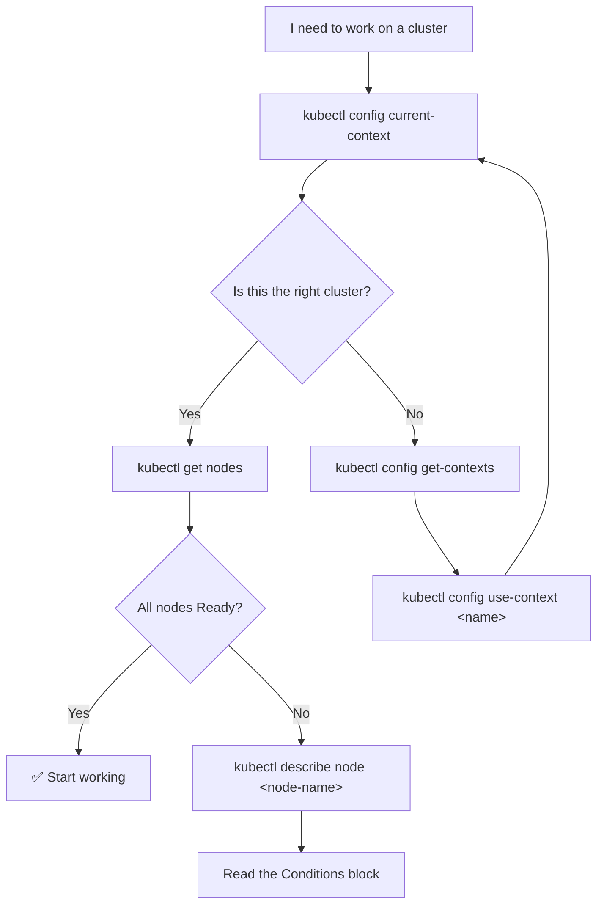

# ☸️ 01 · Cluster & Context

**Before you can run any other command, kubectl must know *which cluster* to talk to and *as whom*. That is what a context is.**

---

## 🧠 Mental Model

kubectl is just an HTTP client. Everything it knows lives in one file: `~/.kube/config`.

```text
Cluster        (where is the API server?)
   +
User           (what credentials do I use?)
   +
Namespace      (which slice do I work in?)
   =
CONTEXT        (kubectl talks to exactly one at a time)
```

Switching clusters is not reconnecting — it is **pointing at a different entry in one file**.

```text
~/.kube/config
├── clusters:   prod-eks, staging-eks, minikube
├── users:      prod-admin, dev-readonly
└── contexts:   prod   = prod-eks    + prod-admin    + namespace: default
                stage  = staging-eks + dev-readonly  + namespace: apps
                local  = minikube    + minikube      + namespace: default
                              ▲
                    current-context points at one of these
```

---

## Command Syntax

```bash
kubectl cluster-info                 # where am I connected?
kubectl config <subcommand> [args]   # everything about kubeconfig
```

---

## 🔍 I want to know where I am connected

```bash
kubectl config current-context
```

🟢 **Purpose:** Prints the name of the context kubectl is using right now.

**Use when:** *Always.* Before any destructive command, before any incident work, before you trust output. This is the single most under-used command in Kubernetes.

```bash
kubectl cluster-info
```

🟢 **Purpose:** Shows the API server URL and core service endpoints.

**Use when:** Confirming the cluster is reachable at all, or checking you're pointed at the URL you expect.

Sample output:

```text
Kubernetes control plane is running at https://ABC123.gr7.eu-west-1.eks.amazonaws.com
CoreDNS is running at https://ABC123.gr7.eu-west-1.eks.amazonaws.com/api/v1/namespaces/kube-system/services/kube-dns:dns/proxy
```

---

## 🔍 I want to see my clusters and contexts

```bash
kubectl config get-contexts
```

🟢 **Purpose:** Lists every context in your kubeconfig. The `*` marks the active one.

```text
CURRENT   NAME       CLUSTER       AUTHINFO      NAMESPACE
          local      minikube      minikube
*         prod       prod-eks      prod-admin    default
          stage      staging-eks   dev-readonly  apps
```

```bash
kubectl config get-clusters
kubectl config get-users
```

🟡 **Purpose:** List just the cluster entries or just the credential entries.

```bash
kubectl config view
```

🟡 **Purpose:** Prints the merged kubeconfig, with secrets redacted.

```bash
kubectl config view --minify
```

🟡 **Purpose:** Shows *only* the current context's cluster, user, and namespace. Far more readable than the full dump when you just want to check where you are.

```bash
kubectl config view --raw
```

🔴 **Purpose:** Prints the config **including credentials**, unredacted.

> ⚠️ **Production Impact** — `--raw` writes client certificates and tokens to your terminal, where they land in scrollback, screen shares, and shell logs. Never run it in a recorded session or paste its output anywhere.

---

## 🚀 I want to switch clusters

```bash
kubectl config use-context <context-name>
```

🟢 **Purpose:** Makes that context the active one. All subsequent commands hit that cluster.

```bash
kubectl config use-context prod
kubectl config current-context     # verify it took
```

> 💡 Get in the habit of pairing them. `use-context` then `current-context` costs one second and prevents the classic "I ran that against prod" incident.

---

## 🚀 I want to change my default namespace

```bash
kubectl config set-context --current --namespace=<namespace>
```

🟢 **Purpose:** Stops you typing `-n <namespace>` on every command for the rest of the session.

Breakdown:

```text
config set-context   → modify a context entry
--current            → the one I'm using now (don't name it)
--namespace=apps     → set its default namespace
```

Verify:

```bash
kubectl config view --minify | grep namespace
```

Full namespace coverage → [02 · Namespaces](02-namespaces.md)

---

## 🚀 I want to add, rename, or remove a context

```bash
kubectl config set-context <context-name> \
  --cluster=<cluster-name> \
  --user=<user-name> \
  --namespace=<namespace>
```

🟡 **Purpose:** Creates or updates a context by combining an existing cluster and user.

```bash
kubectl config rename-context <old-name> <new-name>
```

🟡 **Purpose:** Renames a context. Useful because cloud tools generate hostile names like `arn:aws:eks:eu-west-1:123456789012:cluster/prod`.

```bash
kubectl config rename-context \
  arn:aws:eks:eu-west-1:123456789012:cluster/prod \
  prod
```

```bash
kubectl config delete-context <context-name>
kubectl config delete-cluster <cluster-name>
kubectl config unset users.<user-name>
```

🟡 **Purpose:** Remove stale entries.

> ⚠️ **Production Impact** — these edit `~/.kube/config` in place. They don't touch the cluster (nothing is destroyed remotely), but a mistake means re-fetching your credentials. Back the file up first: `cp ~/.kube/config ~/.kube/config.bak`.

---

## 🔍 I want to inspect the cluster's nodes

```bash
kubectl get nodes
```

🟢 **Purpose:** Lists the machines running your workloads and whether they are `Ready`.

```bash
kubectl get nodes -o wide
```

🟢 **Purpose:** Adds internal/external IP, OS image, kernel version, container runtime, and kubelet version.

**Use when:** Checking version skew across a node group, or finding a node's IP.

```bash
kubectl describe node <node-name>
```

🟡 **Purpose:** The deep view of one node — capacity, allocatable resources, current allocation percentages, taints, conditions, and every Pod running on it.

**Use when:** A Pod is stuck `Pending`, a node looks unhealthy, or you're investigating resource pressure.

Full node lifecycle → [14 · Node Operations](14-node-operations.md)

---

## 🔍 I want to check control-plane health

```bash
kubectl get --raw='/readyz?verbose'
```

🔴 **Purpose:** Asks the API server for a per-component readiness breakdown.

```text
[+]ping ok
[+]etcd ok
[+]poststarthook/start-kube-apiserver-admission-initializer ok
readyz check passed
```

**Use when:** Diagnosing a control plane you manage yourself. On EKS/AKS/GKE the control plane is the provider's responsibility and this is mostly informational.

```bash
kubectl get --raw='/livez?verbose'
kubectl get --raw='/healthz?verbose'
```

🔴 **Purpose:** Liveness and legacy health variants of the same check.

```bash
kubectl get componentstatuses     # or: kubectl get cs
```

⛔ **Deprecated since Kubernetes v1.19.** It reports on a control-plane layout that no longer reflects how modern clusters are built, and returns misleading results on managed clusters. Use `/readyz?verbose` above, or inspect control-plane Pods directly on self-managed clusters:

```bash
kubectl get pods -n kube-system
```

---

## 🔍 I want to know what this cluster supports

```bash
kubectl version
```

🟢 **Purpose:** Prints both client and server versions.

```bash
kubectl version --client
```

🟢 **Purpose:** Client only — works with no cluster connection.

> 💡 kubectl supports servers within **one minor version** either side of itself. A v1.35 client against a v1.31 server is outside the supported skew and may behave strangely.

```bash
kubectl api-resources
kubectl api-versions
```

🟡 **Purpose:** Every resource type and every API group/version this cluster serves — including CRDs added by operators like Istio, Argo, or cert-manager.

---

## 🐛 Troubleshooting

| Symptom | Command | What it tells you |
| --- | --- | --- |
| `The connection to the server ... was refused` | `kubectl config current-context` | You may be pointed at a stopped local cluster |
| `error: You must be logged in to the server (Unauthorized)` | `kubectl config view --minify` | Credentials expired — re-run your cloud login |
| Commands return objects you don't recognize | `kubectl config current-context` | **Wrong cluster.** Almost always this. |
| `Unable to connect to the server: dial tcp i/o timeout` | `kubectl cluster-info` | Network path / VPN / security group problem |
| Nodes show `NotReady` | `kubectl describe node <node-name>` | Read the `Conditions` block at the bottom |
| `error: exec plugin ... executable aws not found` `[EKS]` | `aws --version` | AWS CLI missing from PATH |

---

## 💡 Memory Trick

```text
WHERE am I?      →  kubectl config current-context
WHAT can I use?  →  kubectl config get-contexts
GO there         →  kubectl config use-context <name>
WHO is there?    →  kubectl get nodes
```

> **"Where, what, go, who."** Four commands, and you can safely land in any cluster.

---

## 🗺️ Diagram



---

## ⚠️ Common Mistakes

**Running a command without checking the context first.**
The number-one cause of Kubernetes incidents is a correct command run against the wrong cluster. `kubectl delete` doesn't ask twice.

**Assuming your namespace carried over.**
`use-context` switches namespace too — each context has its own. After switching clusters you may silently be in `default` rather than where you were.

**Editing `~/.kube/config` by hand.**
It's YAML, so it's tempting. But indentation errors break every kubectl command at once. Use `kubectl config set-context` / `delete-context` instead.

**Merging kubeconfigs by overwriting.**
Cloud CLIs *merge* into the existing file. Copying a colleague's config over yours destroys every other cluster you had. To use several files temporarily:

```bash
export KUBECONFIG=~/.kube/config:~/.kube/other-cluster-config
kubectl config get-contexts
```

**Trusting `kubectl get componentstatuses`.**
Deprecated and misleading. See above.

---

## 🔗 Related

| Task | Go to |
| --- | --- |
| Working within a namespace | [02 · Namespaces](02-namespaces.md) |
| Draining or tainting a node | [14 · Node Operations](14-node-operations.md) |
| Node CPU/memory usage | [13 · Resource Management](13-resource-management.md) |
| Getting an EKS kubeconfig | [16 · EKS Commands](16-eks-commands.md) |
| Context-switching tools (`kubectx`) | [15 · kubectl Productivity](15-kubectl-productivity.md) |

---

## 🎯 Interview Tip

**"What is a kubeconfig context?"**

> A named combination of a cluster, a user, and a default namespace. kubectl uses exactly one at a time — `current-context` — and all three parts must line up for a command to work. That's why "wrong credentials" and "wrong namespace" are really the same class of problem: the context was wrong.

**"How would you avoid running a command against the wrong cluster?"**
Strong answer: check `kubectl config current-context` before destructive operations, rename cloud-generated contexts to human names, use a shell prompt that displays the current context (`kube-ps1`, Starship), and keep production credentials in a separate kubeconfig selected via `KUBECONFIG` rather than merged into your daily file.

---

<!-- NAV-FOOTER -->
### 🧭 Navigation

| Previous | Up | Next |
| --- | --- | --- |
| [← Master Mind Map](../mindmaps/kubectl-master-mindmap.md) | [README](../README.md) | [02 · Namespaces →](02-namespaces.md) |
