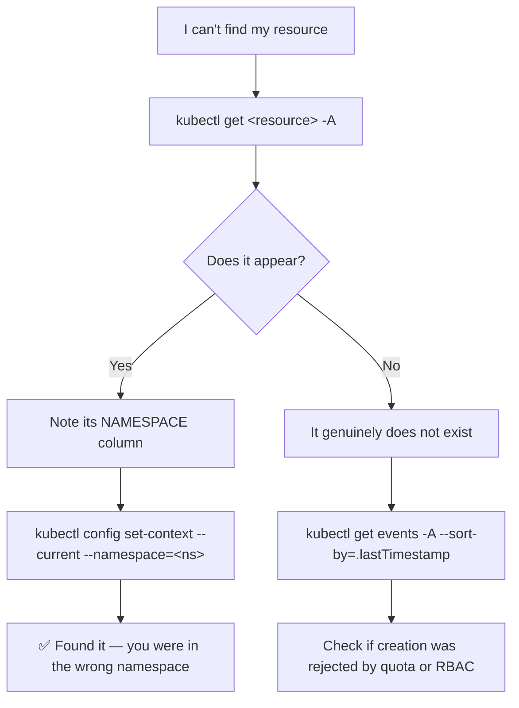

# 🗂️ 02 · Namespaces

**A namespace is a folder inside your cluster. Most "my resource has disappeared" problems are really "I'm looking in the wrong namespace".**

---

## 🧠 Mental Model

```text
CLUSTER
├── namespace: kube-system      ← Kubernetes' own components (don't touch casually)
├── namespace: default          ← where things land if you don't say otherwise
├── namespace: dev
│     ├── deployment/web
│     ├── service/web
│     └── configmap/web-config
└── namespace: prod
      ├── deployment/web        ← same name, different object, no conflict
      ├── service/web
      └── configmap/web-config
```

Two rules that explain almost everything:

1. **Names must be unique within a namespace, not across the cluster.** `deployment/web` can exist in both `dev` and `prod`.
2. **Some resources are not namespaced at all.** Nodes, PersistentVolumes, StorageClasses, ClusterRoles, and namespaces themselves are cluster-wide.

Check which is which:

```bash
kubectl api-resources --namespaced=true
kubectl api-resources --namespaced=false
```

---

## Command Syntax

```bash
kubectl <verb> <resource> -n <namespace>    # one namespace
kubectl <verb> <resource> -A                # every namespace
```

`-A` is short for `--all-namespaces`.

---

## 🔍 I want to see the namespaces

```bash
kubectl get namespaces
kubectl get ns              # short name
```

🟢 **Purpose:** Lists every namespace and its status.

```text
NAME              STATUS   AGE
default           Active   45d
kube-node-lease   Active   45d
kube-public       Active   45d
kube-system       Active   45d
prod              Active   12d
```

**The four that always exist:**

| Namespace | What lives there |
| --- | --- |
| `default` | Your objects, if you never specify a namespace |
| `kube-system` | CoreDNS, kube-proxy, CNI, metrics-server, cloud controllers |
| `kube-public` | Readable by everyone, even unauthenticated. Rarely used. |
| `kube-node-lease` | Node heartbeat objects. Never touch these. |

```bash
kubectl describe namespace <namespace>
```

🟡 **Purpose:** Shows labels, and any ResourceQuota or LimitRange applied to the namespace.

**Use when:** Your Pods are being rejected and you suspect a quota. → [13 · Resource Management](13-resource-management.md)

---

## 🔍 I want to see resources in a namespace

```bash
kubectl get pods -n <namespace>
```

🟢 **Purpose:** Lists Pods in one specific namespace instead of your current default.

```bash
kubectl get pods -A
```

🟢 **Purpose:** Lists Pods across every namespace. Adds a `NAMESPACE` column.

Breakdown:

```text
get pods   → retrieve Pod objects
-A         → from every namespace, not just the current one
```

**Use when:** Hunting for a Pod you can't find, or getting a whole-cluster health picture.

```bash
kubectl get all -n <namespace>
```

🟡 **Purpose:** Lists the *common* workload and networking resources in a namespace.

> ⚠️ **`kubectl get all` is a lie.** It does **not** return every resource. It covers roughly Pods, Services, Deployments, ReplicaSets, StatefulSets, DaemonSets, Jobs, and CronJobs. It **omits** ConfigMaps, Secrets, PVCs, Ingresses, ServiceAccounts, Roles, NetworkPolicies, and every CRD. Never use it to confirm a namespace is empty.

To genuinely enumerate everything in a namespace:

```bash
kubectl api-resources --verbs=list --namespaced -o name \
  | xargs -n 1 kubectl get --show-kind --ignore-not-found -n <namespace>
```

🔴 That is slow and chatty, but it is honest.

---

## 🚀 I want to create a namespace

```bash
kubectl create namespace <namespace>
```

🟢 **Purpose:** Creates it immediately.

Declarative equivalent — better for anything permanent:

```bash
kubectl create namespace <namespace> --dry-run=client -o yaml > namespace.yaml
kubectl apply -f namespace.yaml
```

```yaml
apiVersion: v1
kind: Namespace
metadata:
  name: prod
```

---

## 🚀 I want to work inside a namespace by default

```bash
kubectl config set-context --current --namespace=<namespace>
```

🟢 **Purpose:** Sets the default namespace for the current context. No more `-n` on every command.

Confirm:

```bash
kubectl config view --minify --output 'jsonpath={..namespace}'
```

Go back to default:

```bash
kubectl config set-context --current --namespace=default
```

> 💡 This is a *local* setting stored in your kubeconfig. It changes nothing in the cluster and affects nobody else.

---

## 🗑️ I want to delete a namespace

> ⚠️ **Production Impact** — deleting a namespace deletes **every object inside it**: Deployments, Pods, Services, Secrets, ConfigMaps, and PVCs. Depending on the reclaim policy, deleting PVCs can destroy the underlying disk and its data. There is no undo, no confirmation prompt, and no recycle bin.
>
> Before you run this, look at what you're about to destroy:
> ```bash
> kubectl get all -n <namespace>
> kubectl get pvc,secret,configmap,ingress -n <namespace>
> ```

```bash
kubectl delete namespace <namespace>
```

🔴 **Purpose:** Destroys the namespace and its entire contents.

---

## 🐛 Troubleshooting

### "My resource disappeared"

```bash
kubectl get <resource> -A | grep <name>
```

🟢 Searches every namespace. This resolves the majority of "it's gone" reports — it was never gone, you were in `default`.

### A namespace is stuck `Terminating`

This is the classic namespace problem. A namespace won't finish deleting while any object in it still has a **finalizer** that nothing is clearing — usually because the controller that owns that finalizer has been removed.

```bash
kubectl get namespace <namespace> -o json | jq '.status.conditions'
```

🔴 Shows exactly what is blocking. Look for `NamespaceFinalizersRemaining` and `NamespaceContentRemaining`.

Find the surviving objects:

```bash
kubectl api-resources --verbs=list --namespaced -o name \
  | xargs -n 1 kubectl get --show-kind --ignore-not-found -n <namespace>
```

Then fix the real cause — reinstall the missing controller, or delete the leftover CRs properly.

> ⚠️ **Production Impact** — the widely-copied "fix" of stripping finalizers via `kubectl replace --raw .../finalize` forces the namespace out of the API **while its child objects still exist**. That orphans cloud resources — load balancers, EBS volumes, DNS records — which keep costing money with nothing left to manage them. Treat it as a last resort, after you have identified and manually cleaned up what the finalizer was protecting.

### Quota rejections

```bash
kubectl describe namespace <namespace>
kubectl get resourcequota -n <namespace>
kubectl describe resourcequota -n <namespace>
```

🟡 If a namespace has a quota and you've hit it, new Pods are rejected at admission — the Deployment exists but no Pods appear. The reason is in the ReplicaSet's events:

```bash
kubectl describe replicaset -n <namespace>
```

---

## 💡 Memory Trick

```text
-n <namespace>   →  look in ONE
-A               →  look in ALL
(nothing)        →  look in the one your context points at
```

> **"n for one, A for all, nothing for the one you forgot you set."**

---

## 🗺️ Diagram



---

## ⚠️ Common Mistakes

**Thinking namespaces provide network isolation.** They do not. By default, a Pod in `dev` can reach a Pod in `prod` over the Pod network. Isolation requires **NetworkPolicies** — and those need a CNI that enforces them (Calico, Cilium; AWS VPC CNI needs the policy agent enabled).

**Using `kubectl get all` to verify a namespace is empty.** It omits Secrets, ConfigMaps, PVCs, Ingresses, and CRDs. See above.

**Putting everything in `default`.** It works until two teams pick the same name, or you need per-team quotas and RBAC — both of which are namespace-scoped.

**Deleting a namespace to "clean up" a stuck resource.** You will take out everything else living there too.

**Forgetting that cluster-scoped resources ignore `-n`.** `kubectl get nodes -n prod` returns all nodes; the flag is silently meaningless.

---

## 🔗 Related

| Task | Go to |
| --- | --- |
| Switching clusters | [01 · Cluster & Context](01-cluster-and-context.md) |
| Namespace quotas and limits | [13 · Resource Management](13-resource-management.md) |
| Namespace-scoped permissions | [11 · RBAC](11-rbac.md) |
| Cross-namespace DNS names | [06 · Services](06-services.md) |

---

## 🎯 Interview Tip

**"What problem do namespaces solve?"**

> Scoping. They give you name uniqueness per team or environment, and they're the unit that ResourceQuota, LimitRange, RBAC Roles, and NetworkPolicy all attach to. What they explicitly do *not* give you is network isolation or a security boundary between tenants — that needs NetworkPolicy on top, and for genuine hard multi-tenancy, separate clusters.

**Follow-up they like to ask:** *"Why is my namespace stuck in Terminating?"*
A finalizer on some object inside it hasn't been cleared, usually because its controller was uninstalled first. The right fix is finding that object and removing the controller's leftovers — not force-removing the finalizer, which orphans cloud resources.

---

<!-- NAV-FOOTER -->
### 🧭 Navigation

| Previous | Up | Next |
| --- | --- | --- |
| [← 01 · Cluster & Context](01-cluster-and-context.md) | [README](../README.md) | [03 · Pods →](03-pods.md) |
