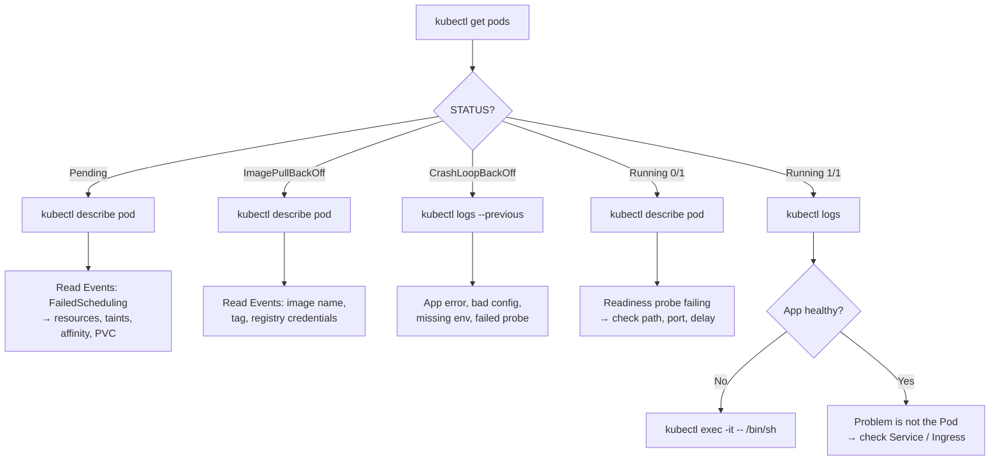

# 📦 03 · Pods

**The Pod is the atom of Kubernetes. Almost every debugging session starts and ends here.**

---

## 🧠 Mental Model

```text
POD  =  a wrapper around one or more containers that share:
        ├── an IP address        (containers reach each other on localhost)
        ├── storage volumes
        └── a lifecycle          (they live and die together)
```

The rule that explains most Pod behaviour:

> **Pods are disposable.** You almost never create one directly. A Deployment, StatefulSet, DaemonSet, or Job creates them for you and replaces them when they die.

```text
Deployment  →  ReplicaSet  →  Pod  →  Container(s)
   (what you write)          (what you debug)
```

So: you **manage** Deployments, but you **investigate** Pods.

---

## Command Syntax

```bash
kubectl <verb> pod <pod-name> [flags]
kubectl <verb> po  <pod-name> [flags]     # po = short name
```

---

## 🔍 I want to list Pods

```bash
kubectl get pods
```

🟢 **Purpose:** Pods in the current namespace.

```text
NAME                     READY   STATUS    RESTARTS      AGE
web-5d8f9c7b4d-2xk9p     1/1     Running   0             2d
web-5d8f9c7b4d-8mnqr     1/1     Running   3 (10m ago)   2d
```

**How to read it:**

| Column | Means |
| --- | --- |
| `READY` | `<containers ready>/<containers total>`. `0/1` means it started but isn't passing its readiness probe. |
| `STATUS` | Phase or failure reason. See [Failure States](../quick-reference/failure-states.md). |
| `RESTARTS` | How many times a container crashed and was restarted. **Anything above 0 deserves a look.** |
| `AGE` | Since the Pod was created — not since it last restarted. |

```bash
kubectl get pods -o wide
```

🟢 **Purpose:** Adds `IP`, `NODE`, `NOMINATED NODE`, and `READINESS GATES`.

**Use when:**
- Finding which node a Pod landed on
- Getting a Pod IP for network debugging
- Spotting that all your replicas are on one node

```bash
kubectl get pods -A
```

🟢 **Purpose:** Every namespace.

```bash
kubectl get pods --watch
kubectl get pods -w
```

🟢 **Purpose:** Streams changes live instead of printing once. Excellent during a rollout or while a Pod is starting.

```bash
kubectl get pods --show-labels
```

🟢 **Purpose:** Adds a `LABELS` column — essential when working out why a Service isn't selecting your Pods.

---

## 🔍 I want details about one Pod

```bash
kubectl describe pod <pod-name>
```

🟢 **Purpose:** The single most valuable Kubernetes command. Human-readable everything: containers, images, ports, env, volume mounts, probes, resource requests, conditions, and — at the bottom — the **Events**.

> 💡 **Read `describe` bottom-up.** The Events section at the end is where Kubernetes tells you in plain English what it tried and what went wrong. Scroll there first.

**Use when investigating:**

| Symptom | What to look for in `describe` |
| --- | --- |
| `ImagePullBackOff` | Events: `Failed to pull image` — registry, tag, or credentials |
| `CrashLoopBackOff` | `Last State: Terminated`, its `Reason` and `Exit Code` |
| `Pending` | Events: `FailedScheduling` — the reason is stated exactly |
| Failed probes | Events: `Unhealthy` with the probe type and response |
| Volume problems | Events: `FailedMount` / `FailedAttachVolume` |
| `OOMKilled` | `Last State: Terminated, Reason: OOMKilled` + the memory limit |

```bash
kubectl get pod <pod-name> -o yaml
```

🟡 **Purpose:** The raw API object, including `status` — every field Kubernetes knows.

**Use when:** `describe` summarised away the field you need, or you want to copy a working spec.

---

## 📜 I want application logs

```bash
kubectl logs <pod-name>
```

🟢 **Purpose:** Whatever the container wrote to stdout/stderr.

```bash
kubectl logs -f <pod-name>
```

🟢 **Purpose:** Follow live output. `Ctrl+C` to stop.

```bash
kubectl logs <pod-name> --previous
kubectl logs <pod-name> -p
```

🟡 **Purpose:** Logs from the **previous, crashed instance** of the container.

**Use when:** `CrashLoopBackOff`. The current container may have restarted seconds ago and printed nothing — the evidence is in the run that died. This one flag solves more crash investigations than anything else in this file.

```bash
kubectl logs <pod-name> -c <container-name>
```

🟢 **Purpose:** Picks a container in a multi-container Pod.

**Use when:** You get `Error from server (BadRequest): a container name must be specified`. List the containers first:

```bash
kubectl get pod <pod-name> -o jsonpath='{.spec.containers[*].name}'
```

```bash
kubectl logs <pod-name> --tail=100
kubectl logs <pod-name> --since=15m
kubectl logs <pod-name> --timestamps
```

🟡 **Purpose:** Limit by lines, limit by time, and prefix each line with a timestamp.

```bash
kubectl logs -l app=<label-value> --all-containers=true --max-log-requests=10
```

🟡 **Purpose:** Logs from **all Pods matching a label** at once. Far better than looping over Pod names when a Deployment has many replicas.

```bash
kubectl logs deployment/<deployment-name>
```

🟡 **Purpose:** Logs from one Pod of that Deployment (kubectl picks one). Handy shorthand; note it is *one* Pod, not all of them.

---

## 🐚 I want a shell inside the container

```bash
kubectl exec -it <pod-name> -- /bin/sh
```

🟢 **Purpose:** Interactive shell inside the running container.

Breakdown:

```text
exec         → run a command inside an existing container
-i           → keep stdin open (interactive)
-t           → allocate a TTY (so the shell behaves like a terminal)
--           → everything after this goes to the container, not to kubectl
/bin/sh      → the command to run
```

> 💡 The `--` matters. Without it, kubectl tries to parse the container's flags as its own.

```bash
kubectl exec -it <pod-name> -- /bin/bash
```

🟢 Use if the image has bash. Alpine-based images usually only have `/bin/sh`.

```bash
kubectl exec <pod-name> -- <command>
```

🟢 **Purpose:** Run one command, print the output, exit. No `-it` needed.

```bash
kubectl exec <pod-name> -- env
kubectl exec <pod-name> -- cat /etc/config/app.conf
kubectl exec <pod-name> -- ls -l /data
```

```bash
kubectl exec -it <pod-name> -c <container-name> -- /bin/sh
```

🟡 Multi-container Pod — pick which one.

### No shell in the image?

Distroless and scratch images have no `/bin/sh` at all. `exec` fails with `executable file not found`.

```bash
kubectl debug -it <pod-name> --image=busybox:1.36 --target=<container-name>
```

🔴 **Purpose:** Attaches a temporary **ephemeral container** to the running Pod, sharing its process namespace. You get busybox tools against a container that has none.

Stable since Kubernetes v1.25. Breakdown:

```text
debug                    → attach a debug container
--image=busybox:1.36     → the toolbox image to attach
--target=<container>     → share the process namespace of this container
```

```bash
kubectl debug <pod-name> -it --image=busybox --copy-to=<debug-pod-name>
```

🔴 **Purpose:** Makes a **copy** of the Pod to poke at, leaving the original untouched. Safer in production.

Full debugging workflow → [12 · Debugging](12-debugging.md)

---

## 🚀 I want to create a Pod

```bash
kubectl run <pod-name> --image=<image>
```

🟢 **Purpose:** Creates a single bare Pod. Nothing manages it — if it dies, it stays dead.

**Use when:** Testing. Never for real workloads.

```bash
kubectl run tmp-shell --rm -it --image=busybox:1.36 --restart=Never -- /bin/sh
```

🟡 **Purpose:** The throwaway debugging Pod. Gets you a shell inside the cluster network for DNS and connectivity tests, and deletes itself on exit.

```text
--rm              → delete the Pod when the session ends
-it               → interactive terminal
--restart=Never   → a bare Pod, not a Deployment
--                → everything after goes to the container
```

```bash
kubectl run <pod-name> --image=<image> --dry-run=client -o yaml > pod.yaml
```

🟢 **Purpose:** Generates the YAML instead of creating anything. The fastest way to learn manifest structure. → [15 · Productivity](15-kubectl-productivity.md#-generate-yaml-without-writing-yaml)

---

## 🌐 I want to reach a Pod from my laptop

```bash
kubectl port-forward pod/<pod-name> 8080:80
```

🟢 **Purpose:** Tunnels `localhost:8080` on your machine to port `80` in the Pod.

```text
8080  → port on YOUR machine
80    → port inside the POD
```

Then open `http://localhost:8080`.

**Use when:** Testing an app that has no Ingress, or bypassing the Service to check whether the Pod itself works.

```bash
kubectl port-forward svc/<service-name> 8080:80
```

🟢 Forward through a Service instead — the usual choice, since it survives Pod replacement.

> 💡 Forwarding to a **Pod** tests the Pod. Forwarding to a **Service** tests the Pod *and* the Service's selector. If Pod-forward works and Service-forward doesn't, your selector is wrong. → [06 · Services](06-services.md)

---

## 🏷️ I want to filter Pods

```bash
kubectl get pods -l app=<label-value>
```

🟢 **Purpose:** Only Pods with that label. This is exactly how Services find Pods.

```bash
kubectl get pods -l 'environment in (staging,production)'
kubectl get pods -l 'app=web,tier!=cache'
kubectl get pods -l '!canary'
```

🟡 Set membership, multiple conditions (AND), and "label absent".

```bash
kubectl get pods --field-selector status.phase=Running
kubectl get pods --field-selector status.phase!=Running
kubectl get pods --field-selector spec.nodeName=<node-name>
```

🟡 **Purpose:** Filter on object *fields* rather than labels. Only a limited set of fields is selectable, but these three are genuinely useful — the second one is "show me everything unhealthy".

```bash
kubectl label pod <pod-name> <key>=<value>
kubectl label pod <pod-name> <key>- 
kubectl annotate pod <pod-name> <key>=<value>
```

🟡 Add a label, remove a label (trailing `-`), add an annotation.

> 💡 **Labels are for selecting. Annotations are for storing.** If something needs to be found by a selector, it's a label. If it's metadata for humans or tools, it's an annotation.

---

## 🗑️ I want to delete a Pod

> ⚠️ **Production Impact** — deleting a Pod terminates its containers immediately after the grace period. If the Pod is managed by a Deployment, a replacement starts right away and this is a safe way to force a restart. If it is a **bare Pod**, or a **StatefulSet member holding data**, deletion is destructive.

```bash
kubectl delete pod <pod-name>
```

🟢 **Purpose:** Deletes it. A controller-managed Pod comes straight back with a new name.

```bash
kubectl delete pods -l app=<label-value>
```

🟡 Delete every Pod with a label.

```bash
kubectl delete pod <pod-name> --grace-period=0 --force
```

🔴 **Purpose:** Removes the Pod object from the API without waiting for the kubelet to confirm the containers stopped.

> ⚠️ **Production Impact** — this can leave containers still running on the node while Kubernetes believes they are gone. For a StatefulSet that means two Pods with the same identity writing to the same volume — data corruption. Only use it when a node is genuinely unreachable and you have confirmed the workload is not running.

> 💡 To restart an application, don't delete Pods — use `kubectl rollout restart deployment/<name>`. It respects your rolling-update strategy and keeps the app available. → [04 · Deployments](04-deployments.md)

---

## 🐛 Troubleshooting

```bash
kubectl get pods                                  # 1. what state is it in?
kubectl describe pod <pod-name>                   # 2. what did Kubernetes do?
kubectl logs <pod-name>                           # 3. what did the app say?
kubectl logs <pod-name> --previous                # 4. what did it say before it died?
kubectl exec -it <pod-name> -- /bin/sh            # 5. go look yourself
kubectl get events --sort-by=.lastTimestamp       # 6. cluster-level context
```

| Status | First command | Full detail |
| --- | --- | --- |
| `Pending` | `kubectl describe pod <pod-name>` | [Failure States](../quick-reference/failure-states.md#pending) |
| `ImagePullBackOff` | `kubectl describe pod <pod-name>` | [Failure States](../quick-reference/failure-states.md#imagepullbackoff--errimagepull) |
| `CrashLoopBackOff` | `kubectl logs <pod-name> --previous` | [Failure States](../quick-reference/failure-states.md#crashloopbackoff) |
| `OOMKilled` | `kubectl describe pod <pod-name>` | [Failure States](../quick-reference/failure-states.md#oomkilled) |
| `0/1 Running` | `kubectl describe pod <pod-name>` | Readiness probe failing |
| `Terminating` (stuck) | `kubectl describe pod <pod-name>` | Finalizer or a slow preStop hook |

---

## 💡 Memory Trick

```text
GET      →  DESCRIBE  →  LOGS  →  EXEC
Find it     Inspect it   Read it   Enter it
```

> Four commands, in that order, diagnose most Pod problems. If you only memorize one thing from this repository, memorize this line.

---

## 🗺️ Diagram



---

## ⚠️ Common Mistakes

**Forgetting `--previous` on a CrashLoopBackOff.** The current container has been alive for two seconds and logged nothing. The error is in the previous run.

**Creating bare Pods for real workloads.** `kubectl run` makes a Pod with nothing managing it. When its node dies, so does your app. Use a Deployment.

**Deleting Pods to restart an app.** It works, but it deletes all replicas at once if you use a label selector — an outage. `kubectl rollout restart` does it safely.

**Assuming `READY 1/1` means the app works.** It means the readiness probe passed. If the probe is `TCP :80`, it proves a port is open — not that your application is functioning.

**Confusing `RESTARTS` with `AGE`.** A Pod with age `10d` and 400 restarts has been broken for ten days.

**Using `-it` for non-interactive commands.** `kubectl exec <pod> -- ls` is fine and scriptable. `-it` on a non-TTY breaks in CI.

**Forgetting `--` before the container command.** Everything after `--` belongs to the container.

---

## 🔗 Related

| Task | Go to |
| --- | --- |
| Managing Pods properly | [04 · Deployments](04-deployments.md) |
| Why a Service can't reach the Pod | [06 · Services](06-services.md) |
| Env vars and mounted config | [07 · ConfigMaps & Secrets](07-configmaps-and-secrets.md) |
| Volumes that won't mount | [08 · Storage](08-storage.md) |
| The full debugging workflow | [12 · Debugging](12-debugging.md) |
| CPU/memory limits and OOMKilled | [13 · Resource Management](13-resource-management.md) |
| jsonpath and output formats | [15 · Productivity](15-kubectl-productivity.md) |

---

## 🎯 Interview Tip

**"Walk me through debugging a Pod that won't start."**

The answer they want is a *method*, not a list:

> `kubectl get pods` to read the status — that alone narrows it to a class of problem. Then `kubectl describe pod` and read the Events at the bottom, which usually name the cause outright: FailedScheduling, ImagePullBackOff, FailedMount. If the container started and died, `kubectl logs --previous` for the crashed instance. If I need to inspect the filesystem or DNS, `kubectl exec`, or `kubectl debug` if it's a distroless image with no shell.

**"Why is my Pod Running but not Ready?"**
The container process started, but the readiness probe is failing — so Kubernetes keeps it out of Service endpoints. Check the probe's path, port, and `initialDelaySeconds` in `describe`; a common cause is an app that takes longer to boot than the probe allows.

---

<!-- NAV-FOOTER -->
### 🧭 Navigation

| Previous | Up | Next |
| --- | --- | --- |
| [← 02 · Namespaces](02-namespaces.md) | [README](../README.md) | [04 · Deployments →](04-deployments.md) |
