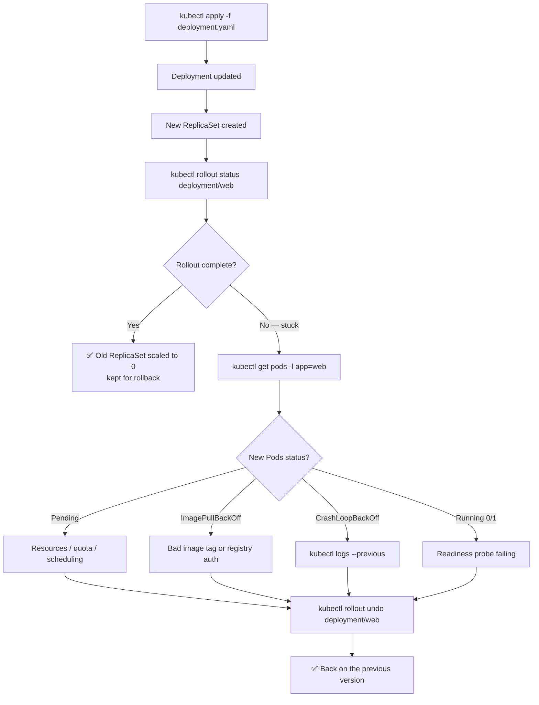

# 🚀 04 · Deployments

**A Deployment is how you say "keep N copies of this running, and change versions without downtime". It is the workload type you will use 90% of the time.**

---

## 🧠 Mental Model

```text
DEPLOYMENT          "I want 3 replicas of nginx:1.25"
     │              (you edit this)
     ▼
REPLICASET          "Ensure exactly 3 Pods matching this template exist"
     │              (created for you — one per version)
     ▼
   PODS             web-abc-1  web-abc-2  web-abc-3
                    (what actually runs; disposable)
```

**The key insight:** a rolling update is not Kubernetes editing your Pods. It is Kubernetes creating a **new ReplicaSet** and shifting replicas from the old one to the new one.

```text
Before:   ReplicaSet-v1  [███ 3 pods]     ReplicaSet-v2  [ 0 pods]
During:   ReplicaSet-v1  [██  2 pods]     ReplicaSet-v2  [█   1 pod ]
After:    ReplicaSet-v1  [    0 pods]     ReplicaSet-v2  [███ 3 pods]
                              ▲
                    kept, empty — this is what makes rollback instant
```

That leftover empty ReplicaSet is your undo button.

---

## Command Syntax

```bash
kubectl <verb> deployment <deployment-name> [flags]
kubectl <verb> deploy     <deployment-name> [flags]     # deploy = short name
```

---

## 🔍 I want to see my Deployments

```bash
kubectl get deployments
kubectl get deploy
```

🟢 **Purpose:** Lists Deployments and their rollout state.

```text
NAME   READY   UP-TO-DATE   AVAILABLE   AGE
web    3/3     3            3           5d
api    2/3     3            2           1h
```

**How to read it:**

| Column | Means |
| --- | --- |
| `READY` | `<ready pods>/<desired pods>` |
| `UP-TO-DATE` | Pods running the **latest** template |
| `AVAILABLE` | Pods that have been ready long enough to count |
| `AGE` | Since the Deployment was created |

> 💡 `READY 2/3` with `UP-TO-DATE 3` means: the new version is fully rolled out, but one Pod isn't healthy. `READY 3/3` with `UP-TO-DATE 1` means: a rollout is in progress.

```bash
kubectl describe deployment <deployment-name>
```

🟢 **Purpose:** Strategy, replica breakdown, the Pod template, and events. Shows `StrategyType`, `RollingUpdateStrategy` (maxUnavailable / maxSurge), and which ReplicaSet is currently `NewReplicaSet`.

```bash
kubectl get deployment <deployment-name> -o yaml
```

🟡 **Purpose:** The full object. Useful for copying a working spec or diffing against your Git manifest.

---

## 🔍 I want to see the chain

```bash
kubectl get deploy,rs,pods -l app=<label-value>
```

🟡 **Purpose:** Shows all three layers at once, filtered to one app. This is the fastest way to *see* the Deployment → ReplicaSet → Pod relationship in a live cluster.

```text
NAME                 READY   UP-TO-DATE   AVAILABLE
deployment.apps/web  3/3     3            3

NAME                            DESIRED   CURRENT   READY
replicaset.apps/web-6d4b8f9c7   3         3         3      ← current
replicaset.apps/web-5c9a7d2f1   0         0         0      ← previous, kept for rollback

NAME                  READY   STATUS    RESTARTS   AGE
pod/web-6d4b8f9c7-hk2ml  1/1  Running   0          10m
```

---

## 🚀 I want to create a Deployment

```bash
kubectl create deployment <name> --image=<image>
```

🟢 **Purpose:** Imperative creation. One replica, default everything.

```bash
kubectl create deployment web --image=nginx:1.25 --replicas=3 --port=80
```

🟢 With replicas and a container port declared.

**Generate the YAML instead — the better habit:**

```bash
kubectl create deployment web --image=nginx:1.25 --replicas=3 \
  --dry-run=client -o yaml > deployment.yaml
kubectl apply -f deployment.yaml
```

🟢 Now it's reviewable, versionable, and repeatable. See [`examples/deployment.yaml`](../examples/deployment.yaml).

```bash
kubectl apply -f deployment.yaml
```

🟢 **Purpose:** Create it if absent, update it if present. Safe to run repeatedly — this is the production path.

---

## 📈 I want to change the number of replicas

```bash
kubectl scale deployment/<deployment-name> --replicas=<n>
```

🟢 **Purpose:** Changes the replica count immediately.

```bash
kubectl scale deployment/web --replicas=5
```

```bash
kubectl scale deployment/<deployment-name> --replicas=<n> --current-replicas=<m>
```

🟡 **Purpose:** Only scales if the current count is `<m>`. A guard against racing with an autoscaler or another operator.

> ⚠️ **Production Impact** — scaling to `--replicas=0` stops the application entirely. It is a legitimate way to take something offline without deleting it, but it *is* an outage. Scaling *up* can exceed a namespace ResourceQuota or exhaust node capacity, leaving new Pods `Pending`.

> 💡 If an HPA manages this Deployment, manual scaling is temporary — the autoscaler will move it back. Check first: `kubectl get hpa`. → [13 · Resource Management](13-resource-management.md)

---

## 🔄 I want to deploy a new version

```bash
kubectl set image deployment/<deployment-name> <container-name>=<image>
```

🟡 **Purpose:** Updates the container image and triggers a rolling update.

```bash
kubectl set image deployment/web nginx=nginx:1.26
```

Breakdown:

```text
set image                  → change a container image
deployment/web             → in this Deployment
nginx=nginx:1.26           → the container NAMED "nginx" gets image "nginx:1.26"
```

> 💡 The left side is the **container name from the Pod template**, not the image name. They're often the same, which causes confusion. Find it with:
> ```bash
> kubectl get deployment web -o jsonpath='{.spec.template.spec.containers[*].name}'
> ```

**The declarative equivalent** — edit the image in your YAML, then:

```bash
kubectl apply -f deployment.yaml
```

🟢 Preferred for anything real. `set image` is fast but leaves your Git manifest lying about what's deployed.

```bash
kubectl edit deployment <deployment-name>
```

🟡 **Purpose:** Opens the live object in `$EDITOR`. Saving applies the change immediately.

> ⚠️ **Production Impact** — `edit` changes live state with no review and no record beyond the rollout history. Your Git manifest is now out of date, and the next `kubectl apply` will silently revert your change. Use it for emergencies and investigation, not for deploys.

---

## 📦 The `rollout` Family

This is the part of kubectl worth knowing cold.

### Did my deploy finish?

```bash
kubectl rollout status deployment/<deployment-name>
```

🟢 **Purpose:** Blocks and streams progress until the rollout completes or fails. Exits non-zero on failure — which makes it the right command for a CI pipeline.

```text
Waiting for deployment "web" rollout to finish: 1 of 3 updated replicas are available...
deployment "web" successfully rolled out
```

```bash
kubectl rollout status deployment/web --timeout=5m
```

🟡 Fail the pipeline rather than hang forever.

### What versions exist?

```bash
kubectl rollout history deployment/<deployment-name>
```

🟡 **Purpose:** Lists revisions. Each corresponds to a ReplicaSet.

```text
REVISION  CHANGE-CAUSE
1         <none>
2         <none>
3         <none>
```

```bash
kubectl rollout history deployment/<deployment-name> --revision=<n>
```

🟡 **Purpose:** Shows the full Pod template of one revision — what image and config that version actually used.

> 💡 `CHANGE-CAUSE` is empty unless you set it. Populate it with an annotation so history is readable:
> ```bash
> kubectl annotate deployment/web \
>   kubernetes.io/change-cause="upgrade nginx to 1.26" --overwrite
> ```

### Restart the app cleanly

```bash
kubectl rollout restart deployment/<deployment-name>
```

🟡 **Purpose:** Recreates every Pod using the **rolling update strategy** — no downtime, no manifest change.

**Use when:**
- Picking up a changed ConfigMap or Secret (Pods don't reload those automatically)
- Clearing a bad in-memory state
- Forcing a re-pull of a mutable tag like `:latest`

> 💡 This is the correct way to "restart an application". Deleting Pods with a label selector kills them all at once; `rollout restart` replaces them gradually and respects readiness probes.

### Undo a bad deploy

```bash
kubectl rollout undo deployment/<deployment-name>
```

🟡 **Purpose:** Rolls back to the previous revision. Fast, because the old ReplicaSet still exists — it just scales back up.

```bash
kubectl rollout undo deployment/<deployment-name> --to-revision=<n>
```

🟡 Roll back to a specific revision from `rollout history`.

> ⚠️ **Production Impact** — rollback reverts the Pod template only. It does **not** revert a database migration, a changed ConfigMap, or anything outside the Deployment. If your new version migrated the schema, rolling back the code can leave you worse off than before. Know what else changed.

> 💡 Rollback also puts your cluster out of sync with Git. Follow up by reverting the commit, or your next `apply` re-deploys the broken version.

### Pause and resume

```bash
kubectl rollout pause deployment/<deployment-name>
kubectl rollout resume deployment/<deployment-name>
```

🔴 **Purpose:** Pausing stops new rollouts being triggered, so you can make several changes (image, env, resources) and have them roll out as one update rather than three.

```bash
kubectl rollout pause deployment/web
kubectl set image deployment/web nginx=nginx:1.26
kubectl set resources deployment/web -c=nginx --limits=memory=512Mi
kubectl rollout resume deployment/web        # now one single rollout
```

> ⚠️ A paused Deployment ignores changes silently. Forgetting to resume means your "deploy" did nothing — a genuinely confusing outage. Check with `kubectl get deploy <name> -o jsonpath='{.spec.paused}'`.

---

## 🗑️ I want to delete a Deployment

> ⚠️ **Production Impact** — deleting a Deployment deletes its ReplicaSets and all their Pods. The application goes down immediately. It does **not** delete the Service, ConfigMaps, Secrets, or PVCs it used — those are separate objects and will be left orphaned.

```bash
kubectl delete deployment <deployment-name>
```

🟡

```bash
kubectl delete -f deployment.yaml
```

🟡 **Purpose:** Deletes exactly what that file created. Cleaner than naming objects, because the file is the record of what belongs together.

---

## 🐛 Troubleshooting

### The rollout is stuck

```bash
kubectl rollout status deployment/<deployment-name>   # 1. confirm it's stuck
kubectl get pods -l app=<label-value>                 # 2. what state are new Pods in?
kubectl describe deployment <deployment-name>         # 3. deployment-level events
kubectl describe pod <new-pod-name>                   # 4. the real reason
kubectl logs <new-pod-name>                           # 5. app-level reason
```

| Deployment symptom | Likely cause | Check |
| --- | --- | --- |
| `UP-TO-DATE` never reaches desired | New Pods can't become ready | `kubectl describe pod <new-pod>` |
| No new Pods appear at all | Quota, RBAC, or admission rejection | `kubectl describe replicaset -l app=<label>` |
| `ProgressDeadlineExceeded` | Rollout took longer than `progressDeadlineSeconds` (default 600s) | `kubectl describe deploy` |
| Rolls out but old Pods never go | `maxUnavailable: 0` and no spare capacity | `kubectl get nodes`, check quota |
| Pods keep restarting after deploy | New image is broken | `kubectl logs <pod> --previous` |

> 💡 A stuck rollout is **safe by design**. With the default `maxUnavailable: 25%`, your old Pods are still serving traffic. Don't panic-delete anything — diagnose, then `rollout undo`.

### Deployment exists but zero Pods

Almost always the **selector doesn't match the template labels**:

```bash
kubectl get deployment <deployment-name> -o yaml | grep -A5 selector
```

`spec.selector.matchLabels` must match `spec.template.metadata.labels`. This field is **immutable** after creation — if it's wrong, you must delete and recreate the Deployment.

---

## 💡 Memory Trick

```text
GET → DESCRIBE → ROLLOUT STATUS → PODS → LOGS
```

> **"Is it there? What is it? Did it finish? Are the Pods OK? What did they say?"**

And the four rollout verbs, as a sentence:

```text
status  → did it work?
history → what did we have before?
undo    → put it back
restart → try again cleanly
```

---

## 🗺️ Diagram



---

## ⚠️ Common Mistakes

**Deleting Pods to restart an app.** Use `kubectl rollout restart` — it's gradual and probe-aware.

**Using `:latest` as the image tag.** Kubernetes can't tell that `latest` changed, so `apply` does nothing. You end up using `rollout restart` as a deploy mechanism, and you can never tell which version is running. Tag every image immutably.

**Expecting a ConfigMap change to restart Pods.** It doesn't. Mounted ConfigMaps update the file eventually; env vars never update. Follow config changes with `kubectl rollout restart`.

**Assuming `rollout undo` reverts everything.** It reverts the Pod template. Database migrations, ConfigMaps, and Secrets are untouched.

**Forgetting `rollout resume`.** A paused Deployment silently ignores every subsequent change.

**Mixing `kubectl edit` / `set image` with GitOps.** Whatever you change by hand gets reverted by the next sync or `apply`, usually at the worst moment.

**Setting `revisionHistoryLimit: 0`.** It tidies up old ReplicaSets — and destroys your ability to roll back.

---

## 🔗 Related

| Task | Go to |
| --- | --- |
| Debugging the Pods it creates | [03 · Pods](03-pods.md) |
| What a ReplicaSet actually is | [05 · Other Workloads](05-replicasets-and-other-workloads.md) |
| Exposing the Deployment | [06 · Services](06-services.md) |
| Config that triggers restarts | [07 · ConfigMaps & Secrets](07-configmaps-and-secrets.md) |
| Requests, limits, and HPA | [13 · Resource Management](13-resource-management.md) |
| `kubectl diff` before applying | [15 · Productivity](15-kubectl-productivity.md) |

---

## 🎯 Interview Tip

**"What happens when you change a Deployment's image?"**

> The Deployment controller creates a **new ReplicaSet** with the new Pod template and scales it up while scaling the old one down, governed by `maxSurge` and `maxUnavailable`. The old ReplicaSet is kept at zero replicas, which is what makes `rollout undo` instant — it just scales the old one back up rather than rebuilding anything.

**"Deployment vs ReplicaSet vs Pod?"**
Pod runs containers. ReplicaSet keeps N identical Pods alive. Deployment manages ReplicaSets to give you versioned, rollback-able updates. You write Deployments; the other two are created for you.

**"How do you roll back?"**
`kubectl rollout undo deployment/<name>`, optionally `--to-revision=<n>` from `rollout history`. Then note the honest caveat — it only reverts the Pod template, not migrations or external config — which is the part that separates a candidate who has *done* this from one who has *read* about it.

---

<!-- NAV-FOOTER -->
### 🧭 Navigation

| Previous | Up | Next |
| --- | --- | --- |
| [← 03 · Pods](03-pods.md) | [README](../README.md) | [05 · Other Workloads →](05-replicasets-and-other-workloads.md) |
