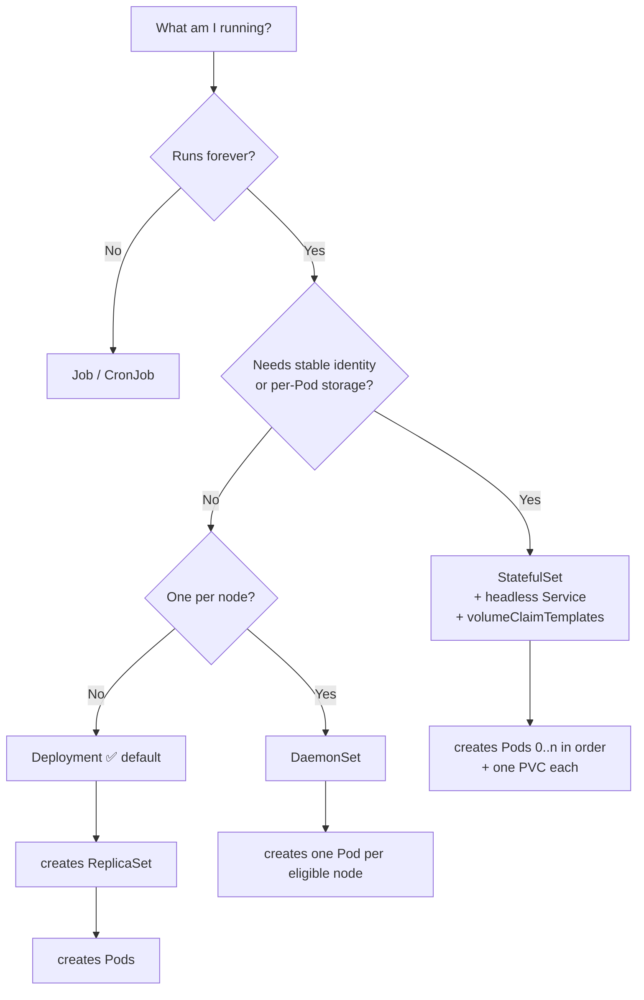

# 🧩 05 · ReplicaSets, StatefulSets & DaemonSets

**Deployment is the default. These three are what you use when the default doesn't fit.**

---

## 🧠 Mental Model

Pick the workload by asking one question: **what kind of thing am I running?**

```text
Do the Pods need stable identity or their own storage?
   │
   ├── NO ──── Does every node need a copy?
   │             │
   │             ├── NO  ──→ 🚀 DEPLOYMENT     (stateless apps — the default)
   │             └── YES ──→ 🛰️ DAEMONSET      (agents: logging, monitoring, CNI)
   │
   └── YES ─────────────────→ 🗄️ STATEFULSET   (databases, queues, clustered stores)

Does it run once and finish rather than run forever?
   └── YES ──────────────────→ ⏱️ JOB / CRONJOB   → see 10-jobs-and-cronjobs.md
```

**ReplicaSet** isn't in that tree on purpose: you don't choose it. It is what a Deployment creates for you.

---

## 🔁 ReplicaSets

### What it is

A ReplicaSet has exactly one job: **keep N Pods matching this template alive**. Nothing more — no versioning, no rollout, no rollback.

```text
Deployment  ──manages──▶  ReplicaSet  ──manages──▶  Pods
 (versions)               (count)                   (workload)
```

> 💡 **Normally you manage ReplicaSets indirectly, through Deployments.** Creating one by hand gives you a Deployment without the useful half. There is no good reason to do it in production.

You still need to *read* them, because that's where rollout problems show up.

### Commands

```bash
kubectl get replicasets
kubectl get rs
```

🟢 **Purpose:** Lists ReplicaSets. During and after a rollout you'll see several per Deployment — one per revision.

```text
NAME              DESIRED   CURRENT   READY   AGE
web-6d4b8f9c7     3         3         3       10m     ← current version
web-5c9a7d2f1     0         0         0       2d      ← previous, kept for rollback
```

```bash
kubectl describe rs <replicaset-name>
```

🟡 **Purpose:** The most useful ReplicaSet command. When a Deployment has **zero Pods and no explanation**, the failure is recorded here — quota rejections, admission webhook denials, and RBAC failures appear in this object's events, not the Deployment's.

```bash
kubectl describe rs -l app=<label-value>
```

🟡 Same thing, without needing the generated hash in the name.

```bash
kubectl get rs -l app=<label-value> \
  -o custom-columns='NAME:.metadata.name,DESIRED:.spec.replicas,IMAGE:.spec.template.spec.containers[0].image'
```

🔴 **Purpose:** See which image each revision ran. Handy for answering "what were we running yesterday?"

```bash
kubectl scale rs <replicaset-name> --replicas=<n>
```

🔴 **Purpose:** Scales the ReplicaSet directly.

> ⚠️ **Production Impact** — this fights the Deployment controller, which will reset the count within seconds. Any effect is temporary and the churn can cause a brief outage. Scale the **Deployment** instead: `kubectl scale deployment/<name> --replicas=<n>`.

### Why old ReplicaSets stick around

They're your rollback. `revisionHistoryLimit` (default 10) controls how many are kept.

```bash
kubectl get deploy <deployment-name> -o jsonpath='{.spec.revisionHistoryLimit}'
```

Setting it to `0` tidies your `get rs` output and destroys `rollout undo`. Don't.

---

## 🗄️ StatefulSets

### What it is

For workloads where **each Pod is not interchangeable** — databases, Kafka, Elasticsearch, anything that replicates data between named members.

```text
DEPLOYMENT                        STATEFULSET
web-6d4b8f9c7-hk2ml               db-0
web-6d4b8f9c7-x9p2q               db-1
web-6d4b8f9c7-m4nrt               db-2
     ▲                                 ▲
random names, any order           stable names, ordered

Pod dies → new random name        Pod dies → comes back as db-1
Shares one PVC (if any)           Each Pod gets its OWN PVC
No stable DNS per Pod             db-1.db-headless.ns.svc.cluster.local
```

Four guarantees a Deployment doesn't give you:

1. **Stable network identity** — `db-0` is always `db-0`
2. **Stable storage** — `db-1`'s volume follows `db-1`, and survives the Pod
3. **Ordered startup** — `db-0` becomes ready before `db-1` starts
4. **Ordered shutdown** — reverse order, highest ordinal first

### Commands

```bash
kubectl get statefulsets
kubectl get sts
```

🟡

```bash
kubectl describe sts <statefulset-name>
```

🟡 **Purpose:** Shows the update strategy, the `volumeClaimTemplates`, and the associated headless Service.

```bash
kubectl get pvc -l app=<label-value>
```

🟡 **Purpose:** Lists the per-Pod volumes. You'll see `data-db-0`, `data-db-1`, `data-db-2` — the naming pattern is `<volumeClaimTemplate-name>-<statefulset-name>-<ordinal>`.

```bash
kubectl scale sts <statefulset-name> --replicas=<n>
```

🔴 **Purpose:** Adds or removes members, in order.

> ⚠️ **Production Impact** — scaling **down** a StatefulSet terminates the highest-ordinal Pods, and for a clustered database that may mean removing a replica that holds data the cluster still needs. Kubernetes will not check whether your cluster is quorate. Follow the database's own procedure (decommission the member first), then scale.
>
> Critically: **the PVCs are not deleted** when you scale down. That's deliberate — it means scaling back up reattaches the original data — but it also means storage keeps costing you money until you delete the claims by hand.

```bash
kubectl rollout status sts/<statefulset-name>
kubectl rollout history sts/<statefulset-name>
kubectl rollout undo sts/<statefulset-name>
kubectl rollout restart sts/<statefulset-name>
```

🟡 **Purpose:** The rollout family works on StatefulSets too — but updates proceed **one Pod at a time, highest ordinal first**, waiting for each to become Ready. A slow-starting database makes this take a long while.

```bash
kubectl delete sts <statefulset-name> --cascade=orphan
```

🔴 **Purpose:** Deletes the StatefulSet but **leaves the Pods running**.

**Use when:** You need to change an immutable field (like the selector) without an outage. Recreate the StatefulSet with matching labels and it adopts the running Pods.

### Deleting a StatefulSet

> ⚠️ **Production Impact** — deleting a StatefulSet deletes its Pods but, by default, **keeps the PVCs**. Your data survives, and so does the bill. To actually reclaim storage you must delete the PVCs explicitly:
> ```bash
> kubectl get pvc -l app=<label-value>       # look first
> kubectl delete pvc -l app=<label-value>    # 🔴 destroys the data
> ```
> Whether the underlying disk is destroyed depends on the StorageClass `reclaimPolicy`. → [08 · Storage](08-storage.md)

### The headless Service

A StatefulSet needs a **headless Service** (`clusterIP: None`) to give each Pod its DNS name.

```bash
kubectl get svc <service-name> -o jsonpath='{.spec.clusterIP}'
```

🟡 If this returns `None`, it's headless — correct for a StatefulSet. If it returns an IP, per-Pod DNS won't work and members can't find each other.

```bash
kubectl run tmp --rm -it --image=busybox:1.36 --restart=Never -- \
  nslookup db-0.db-headless.default.svc.cluster.local
```

🟡 Verify per-Pod DNS actually resolves.

---

## 🛰️ DaemonSets

### What it is

**One Pod per node.** Add a node, it gets one automatically. Remove a node, its Pod goes with it.

```text
NODE 1        NODE 2        NODE 3        NODE 4 (new)
  │             │             │             │
[agent]      [agent]       [agent]       [agent]  ← added automatically
```

Used for infrastructure that must be everywhere: log collectors (Fluent Bit), node monitoring (node-exporter), CNI plugins, CSI node drivers, kube-proxy.

### Commands

```bash
kubectl get daemonsets
kubectl get ds
kubectl get ds -A
```

🟡 **Purpose:** `-A` is the usual form — most DaemonSets live in `kube-system`.

```text
NAME          DESIRED   CURRENT   READY   UP-TO-DATE   AVAILABLE   NODE SELECTOR
kube-proxy    4         4         4       4            4           <none>
fluent-bit    4         4         3       4            3           <none>
```

> 💡 `DESIRED` is the number of **eligible nodes**, computed by Kubernetes — not something you set. If `DESIRED` is lower than your node count, a node selector or an untolerated taint is excluding nodes.

```bash
kubectl describe ds <daemonset-name> -n <namespace>
```

🟡 **Purpose:** Shows the node selector, tolerations, and update strategy.

```bash
kubectl get pods -l <label> -o wide
```

🟡 **Purpose:** With `-o wide` you get the `NODE` column — the quickest way to confirm coverage and spot the node that's missing an agent.

```bash
kubectl rollout restart ds/<daemonset-name> -n <namespace>
kubectl rollout status ds/<daemonset-name> -n <namespace>
```

🟡 **Purpose:** Rolling update across nodes, one at a time by default (`maxUnavailable: 1`).

> ⚠️ **Production Impact** — restarting a CNI or CSI DaemonSet briefly disrupts networking or volume attachment **on every node in the cluster**, in sequence. For `kube-proxy`, `aws-node`, Calico, or Cilium, treat this as a maintenance operation, not a routine one.

### Why is a DaemonSet Pod missing from a node?

```bash
kubectl describe node <node-name> | grep -i taint
```

🟡 A taint the DaemonSet doesn't tolerate excludes that node. → [14 · Node Operations](14-node-operations.md)

```bash
kubectl get ds <daemonset-name> -o jsonpath='{.spec.template.spec.nodeSelector}'
kubectl get nodes --show-labels
```

🟡 A `nodeSelector` that no longer matches the node's labels.

> 💡 A DaemonSet **does** schedule onto cordoned nodes, and `kubectl drain` **does not** evict DaemonSet Pods unless you pass `--ignore-daemonsets`. That's why the flag is on every drain command you'll ever see.

---

## 📊 Side by Side

| | Deployment | StatefulSet | DaemonSet | Job |
| --- | --- | --- | --- | --- |
| **Pod names** | Random | `<name>-0`, `-1`, `-2` | Random | Random |
| **Replica count** | You set it | You set it | = eligible nodes | Completions |
| **Storage** | Shared or none | One PVC per Pod | Usually hostPath | Usually none |
| **Startup order** | Parallel | Ordered `0 → n` | Per node | Parallel |
| **Stable DNS per Pod** | No | Yes (headless Svc) | No | No |
| **Scale to zero** | Yes | Yes | No — tied to nodes | N/A |
| **Use for** | Web apps, APIs | Databases, Kafka | Agents, CNI, CSI | Batch work |

---

## 🐛 Troubleshooting

| Symptom | Command | Likely cause |
| --- | --- | --- |
| Deployment has 0 Pods, no events on it | `kubectl describe rs -l app=<label>` | Quota, webhook, or RBAC rejection — recorded on the ReplicaSet |
| Many ReplicaSets with 0 replicas | *(normal)* | Rollback history. Tuned by `revisionHistoryLimit` |
| StatefulSet stuck at `db-0` | `kubectl describe pod db-0` | Ordered startup — `db-1` won't start until `db-0` is Ready |
| StatefulSet Pod `Pending` forever | `kubectl describe pvc <claim>` | PVC unbound — no StorageClass, or wrong AZ |
| Scaled StatefulSet down, storage bill unchanged | `kubectl get pvc -l app=<label>` | PVCs are retained by design |
| DaemonSet `DESIRED` < node count | `kubectl describe node <node> \| grep -i taint` | Untolerated taint or unmatched nodeSelector |
| DaemonSet Pod won't leave during drain | *(expected)* | Use `--ignore-daemonsets` |

---

## 💡 Memory Trick

```text
DEPLOYMENT   →  "any three of these will do"     (cattle)
STATEFULSET  →  "I need db-0 specifically"       (pets, with names)
DAEMONSET    →  "one on every machine"           (agents)
JOB          →  "run it, then stop"              (tasks)
```

And for ReplicaSet:

> **You don't create ReplicaSets — you read them when a Deployment goes quiet.**

---

## 🗺️ Diagram



---

## ⚠️ Common Mistakes

**Creating ReplicaSets directly.** You lose rollouts and rollback for no benefit.

**Scaling a ReplicaSet instead of its Deployment.** The controller undoes it within seconds.

**Setting `revisionHistoryLimit: 0` to tidy up.** You just deleted your rollback capability.

**Using a Deployment for a database.** Every Pod gets the same PVC (or none), names are random, and startup order is arbitrary. Clustered databases need StatefulSet semantics.

**Expecting StatefulSet PVCs to be cleaned up.** They are deliberately retained on scale-down and on delete. Storage costs accrue silently.

**Forgetting the headless Service.** Without `clusterIP: None`, StatefulSet Pods have no per-Pod DNS and cluster members can't discover each other.

**Trying to scale a DaemonSet.** Its replica count is derived from eligible nodes. To limit it, change the `nodeSelector` or node labels.

**Casually restarting a networking DaemonSet.** `aws-node`, `kube-proxy`, Calico, and Cilium disrupt the whole cluster as they roll.

---

## 🔗 Related

| Task | Go to |
| --- | --- |
| Rollouts and rollbacks | [04 · Deployments](04-deployments.md) |
| Debugging the Pods | [03 · Pods](03-pods.md) |
| Headless Services and DNS | [06 · Services](06-services.md) |
| PVCs and reclaim policies | [08 · Storage](08-storage.md) |
| Jobs and CronJobs | [10 · Jobs & CronJobs](10-jobs-and-cronjobs.md) |
| Taints and drain | [14 · Node Operations](14-node-operations.md) |

---

## 🎯 Interview Tip

**"When would you use a StatefulSet instead of a Deployment?"**

> When Pods aren't interchangeable — when each one needs a stable name, its own persistent volume, and predictable start/stop order. Databases and clustered stores like Kafka or Elasticsearch, where a replica has to come back as *the same* replica with *the same* data. If none of those matter, a Deployment is simpler and more flexible.

**"Why do I have five ReplicaSets for one Deployment?"**
One per revision. All but the current are scaled to zero, kept so `rollout undo` can scale one straight back up. `revisionHistoryLimit` controls how many are kept.

**"How do you make sure a monitoring agent runs everywhere?"**
DaemonSet — and mention the taint/toleration detail, since agents usually need tolerations to land on control-plane and specialised nodes. That's the part most candidates miss.

---

<!-- NAV-FOOTER -->
### 🧭 Navigation

| Previous | Up | Next |
| --- | --- | --- |
| [← 04 · Deployments](04-deployments.md) | [README](../README.md) | [06 · Services →](06-services.md) |
