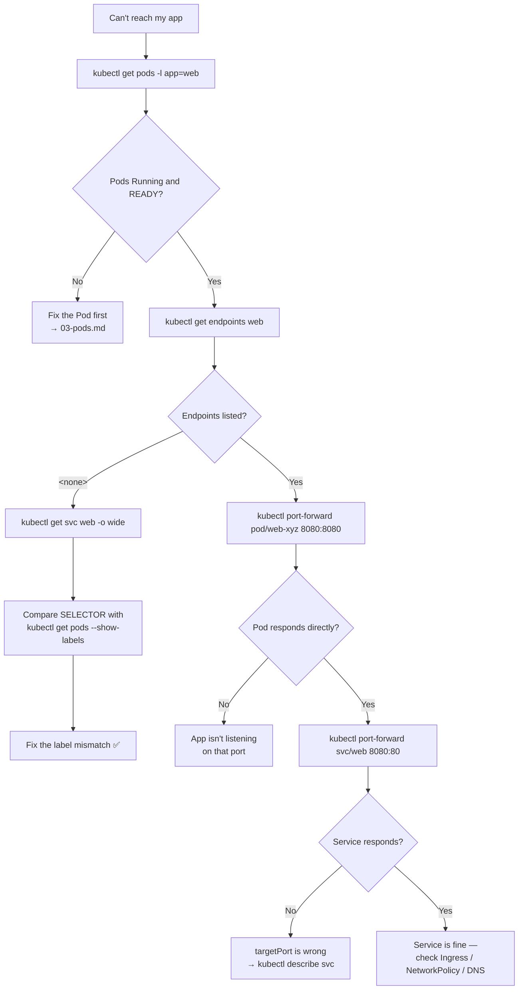

# 🌐 06 · Services

**Pods get new IPs every time they restart. A Service is the stable address in front of them.**

---

## 🧠 Mental Model

```text
                    SERVICE  (stable name + stable IP, never changes)
                       │
              selector: app=web
                       │
        ┌──────────────┼──────────────┐
        ▼              ▼              ▼
     Pod 10.1.1.5   Pod 10.1.2.9   Pod 10.1.3.4
     (dies, replaced with a new IP — the Service doesn't care)
```

The mechanism, in one line:

> **Service → selector matches Pod labels → matching Pod IPs land in Endpoints → traffic is routed there.**

That chain is the whole debugging story. When a Service doesn't work, **one of those arrows is broken**, and `kubectl get endpoints` tells you which side.

### The four types

```text
ClusterIP       ──▶  reachable only INSIDE the cluster        (default)
NodePort        ──▶  ClusterIP + a port on every node
LoadBalancer    ──▶  NodePort + a cloud load balancer
ExternalName    ──▶  just a DNS CNAME, no proxying at all
```

They stack: LoadBalancer *contains* NodePort, which *contains* ClusterIP.

---

## Command Syntax

```bash
kubectl <verb> service <service-name> [flags]
kubectl <verb> svc     <service-name> [flags]     # svc = short name
```

---

## 🔍 I want to see my Services

```bash
kubectl get services
kubectl get svc
```

🟢

```text
NAME         TYPE           CLUSTER-IP      EXTERNAL-IP      PORT(S)        AGE
kubernetes   ClusterIP      10.96.0.1       <none>           443/TCP        45d
web          ClusterIP      10.96.140.22    <none>           80/TCP         3d
api          NodePort       10.96.201.7     <none>           80:31234/TCP   3d
public       LoadBalancer   10.96.55.10     a1b2.elb.aws...  80:32001/TCP   1d
```

**How to read `PORT(S)`:**

| Shown | Means |
| --- | --- |
| `80/TCP` | Service port 80 |
| `80:31234/TCP` | Service port 80, also on node port 31234 |

```bash
kubectl get svc -o wide
```

🟢 **Purpose:** Adds the `SELECTOR` column — which labels this Service is looking for. Extremely useful, and the fastest way to catch a selector typo.

```bash
kubectl describe svc <service-name>
```

🟢 **Purpose:** Everything, including the resolved `Endpoints` line.

```text
Selector:          app=web
Type:              ClusterIP
IP:                10.96.140.22
Port:              http  80/TCP
TargetPort:        8080/TCP
Endpoints:         10.1.1.5:8080,10.1.2.9:8080
```

> 💡 `Endpoints: <none>` is the single most common Service failure. It means **no Pod matched the selector** (or matching Pods aren't Ready).

---

## 🔍 I want to know if the Service is actually wired up

```bash
kubectl get endpoints <service-name>
kubectl get ep <service-name>
```

🟡 **Purpose:** Lists the Pod IPs currently behind the Service. **This is the most important networking command in Kubernetes.**

```text
NAME   ENDPOINTS                         AGE
web    10.1.1.5:8080,10.1.2.9:8080       3d
```

vs. the broken case:

```text
NAME   ENDPOINTS   AGE
web    <none>      3d
```

**`<none>` means one of exactly three things:**

1. **No Pods match the selector** — label typo on either side
2. **Pods match but aren't Ready** — readiness probe failing, so they're excluded on purpose
3. **No Pods exist at all** — the Deployment is broken

```bash
kubectl get endpointslices -l kubernetes.io/service-name=<service-name>
```

🔴 **Purpose:** The modern, scalable backing for Endpoints. `kubectl get endpoints` still works and is easier to read; EndpointSlices matter on large clusters where a single Endpoints object would be enormous.

---

## 🚀 I want to expose an application

```bash
kubectl expose deployment <deployment-name> --port=<port> --target-port=<port>
```

🟡 **Purpose:** Creates a Service in front of a Deployment, borrowing the Deployment's labels as the selector.

```bash
kubectl expose deployment web --port=80 --target-port=8080
```

Breakdown:

```text
--port=80          → the port the SERVICE listens on
--target-port=8080 → the port the CONTAINER listens on
```

> 💡 Getting these backwards is the classic mistake. **`port` is what clients call; `targetPort` is where the app actually listens.** If they're the same, you can omit `--target-port`.

```bash
kubectl expose deployment web --port=80 --type=NodePort
kubectl expose deployment web --port=80 --type=LoadBalancer
```

🟡 Choose the type.

> ⚠️ **Production Impact** — `--type=LoadBalancer` provisions a **real cloud load balancer** on EKS/AKS/GKE. That is a billable resource that appears in your cloud account within seconds and keeps costing money until the Service is deleted. On bare-metal or Kind it stays `<pending>` forever unless something like MetalLB is installed.

**Generate the YAML instead:**

```bash
kubectl expose deployment web --port=80 --target-port=8080 \
  --dry-run=client -o yaml > service.yaml
```

🟢 See [`examples/service.yaml`](../examples/service.yaml).

---

## 🔌 I want to reach a Service from my laptop

```bash
kubectl port-forward svc/<service-name> 8080:80
```

🟢 **Purpose:** Tunnels `localhost:8080` → Service port `80`. Works for any Service type, including ClusterIP, with no cluster networking changes.

```text
8080  → port on YOUR machine
80    → the SERVICE port (not the container port)
```

**Use when:** Testing an internal service, reaching a database, or checking an app before wiring up Ingress.

> 💡 `port-forward` actually connects to **one Pod** behind the Service, chosen when the tunnel opens. It doesn't load balance, and it drops if that Pod is replaced. It's a debugging tool, not a proxy.

```bash
kubectl port-forward svc/<service-name> 8080:80 --address 0.0.0.0
```

🔴 **Purpose:** Binds to all interfaces so other machines can reach your tunnel.

> ⚠️ **Production Impact** — this exposes an internal cluster service to anyone who can reach your workstation, with no authentication in front of it. Don't do this on an untrusted network.

---

## 🌍 I want to understand Service DNS

Every Service gets a DNS name automatically:

```text
<service-name>.<namespace>.svc.cluster.local
```

Within the same namespace, the short form works:

```text
http://web              ← same namespace
http://web.prod         ← different namespace
http://web.prod.svc.cluster.local   ← fully qualified, always correct
```

**Test it from inside the cluster:**

```bash
kubectl run tmp-shell --rm -it --image=busybox:1.36 --restart=Never -- /bin/sh
```

Then:

```sh
nslookup web
nslookup web.prod.svc.cluster.local
wget -qO- http://web:80
```

🟡 This throwaway Pod is the standard way to test cluster DNS and connectivity — from *inside* the network, which is the only place the test is meaningful.

```bash
kubectl get svc -n kube-system kube-dns
kubectl get pods -n kube-system -l k8s-app=kube-dns
```

🟡 **Purpose:** Check CoreDNS is running. If DNS resolution fails cluster-wide, start here. (The Service is named `kube-dns` even though the software is CoreDNS.)

---

## 📋 The Service Types in Practice

### ClusterIP (default)

```bash
kubectl expose deployment web --port=80
```

🟢 Internal only. **Use for:** everything that other Pods call — APIs, databases, caches, internal microservices. This should be the majority of your Services.

### NodePort

```bash
kubectl expose deployment web --port=80 --type=NodePort
```

🟡 Opens the same high port (30000–32767) on **every node**.

**Use for:** local clusters (Minikube, Kind), on-prem without a load balancer, quick demos.

```bash
kubectl get svc <service-name> -o jsonpath='{.spec.ports[0].nodePort}'
kubectl get nodes -o wide     # get a node IP
```

Then reach it at `http://<node-ip>:<node-port>`.

> ⚠️ In production a NodePort means opening that port in your firewall or security group on every node, with no TLS and no path routing. Prefer LoadBalancer or Ingress.

### LoadBalancer

```bash
kubectl expose deployment web --port=80 --type=LoadBalancer
```

🟡 Asks the cloud provider for a real load balancer.

```bash
kubectl get svc <service-name> -w
```

Watch `EXTERNAL-IP` change from `<pending>` to an address. If it stays `<pending>` for minutes:

```bash
kubectl describe svc <service-name>
```

🟡 Events will name the reason — missing IAM permissions, no public subnets, or no cloud controller manager at all `[kubeadm]` `[minikube/kind]`.

> 💡 One LoadBalancer per Service gets expensive fast. For HTTP traffic, use **one** Ingress Controller (itself a LoadBalancer) and route many apps through it. → [09 · Ingress](09-ingress.md)

### ExternalName

🔴 A CNAME to something outside the cluster. No proxying, no endpoints, no selector.

```yaml
apiVersion: v1
kind: Service
metadata:
  name: external-db
spec:
  type: ExternalName
  externalName: db.example.com
```

**Use for:** letting in-cluster apps call `external-db` while you migrate the real thing into the cluster later, without changing application config.

### Headless

`clusterIP: None` — no virtual IP; DNS returns the Pod IPs directly. Required by StatefulSets for per-Pod DNS. → [05 · Other Workloads](05-replicasets-and-other-workloads.md)

---

## 🐛 Troubleshooting

**The network debugging chain:**

```text
POD → SERVICE → ENDPOINTS → INGRESS → DNS
```

Work it in order. Each step assumes the previous one works.

```bash
kubectl get pods -l app=<label-value>              # 1. do Pods exist and are they READY?
kubectl get svc <service-name>                     # 2. does the Service exist?
kubectl get svc <service-name> -o wide             # 3. what selector is it using?
kubectl get endpoints <service-name>               # 4. ← the answer is usually here
kubectl describe svc <service-name>                # 5. ports and events
kubectl port-forward pod/<pod-name> 8080:8080      # 6. does the POD work at all?
kubectl port-forward svc/<service-name> 8080:80    # 7. does the SERVICE work?
```

> 💡 **Steps 6 and 7 are a bisection.** If Pod-forward works and Service-forward doesn't, the fault is in the Service — selector or ports. If neither works, the app itself is broken.

| Symptom | Cause | Fix |
| --- | --- | --- |
| `Endpoints: <none>` | Selector matches nothing | Compare `kubectl get svc -o wide` selector with `kubectl get pods --show-labels` |
| `Endpoints: <none>`, Pods exist | Pods not Ready | `kubectl describe pod` — readiness probe failing |
| Endpoints listed, connection refused | Wrong `targetPort` | App listens on a different port than the Service targets |
| Connection times out | NetworkPolicy blocking | `kubectl get netpol -n <namespace>` |
| DNS name won't resolve | CoreDNS, or wrong namespace | Use the FQDN; check `kubectl get pods -n kube-system -l k8s-app=kube-dns` |
| `EXTERNAL-IP` stuck `<pending>` | No cloud controller / IAM / subnets | `kubectl describe svc` events |
| Works on one Pod, fails on others | Only some Pods are Ready | `kubectl get endpoints` and count them |

### The selector mismatch — the #1 Service bug

```bash
kubectl get svc <service-name> -o jsonpath='{.spec.selector}'
kubectl get pods --show-labels
```

🟡 Compare the two by eye. `app=web` does not match `app: web-app`. Kubernetes will not warn you — an empty selector match is a valid, silent configuration.

---

## 💡 Memory Trick

```text
POD → SERVICE → ENDPOINTS → INGRESS → DNS
```

> **"Is it running? Is it fronted? Is it wired? Is it routed? Is it named?"**

And for the types:

```text
ClusterIP     = inside only
NodePort      = + a port on every node
LoadBalancer  = + a cloud load balancer   💰
ExternalName  = just a DNS alias
```

---

## 🗺️ Diagram



---

## ⚠️ Common Mistakes

**Confusing `port` and `targetPort`.** `port` is what callers use; `targetPort` is where the container listens. Swapping them gives you a Service with endpoints that refuses every connection.

**A selector that matches nothing.** An empty match is valid YAML and produces no error — just `Endpoints: <none>`. Always check endpoints after creating a Service.

**Assuming a Pod is in endpoints just because it's Running.** Only **Ready** Pods are included. That's the feature working correctly, but it surprises people.

**One LoadBalancer per microservice.** Twenty Services means twenty cloud load balancers and twenty bills. Use an Ingress.

**Using a Pod IP in configuration.** It changes on every restart. That is the entire reason Services exist.

**Forgetting the namespace in a DNS name.** `web` only resolves within the same namespace. Cross-namespace needs `web.prod` or the FQDN.

**Expecting `port-forward` to load balance.** It pins to one Pod and dies with it.

**Assuming namespaces isolate traffic.** They don't. Any Pod can reach any Service by default. That needs a NetworkPolicy.

---

## 🔗 Related

| Task | Go to |
| --- | --- |
| Pods not Ready | [03 · Pods](03-pods.md) |
| Headless Services for StatefulSets | [05 · Other Workloads](05-replicasets-and-other-workloads.md) |
| HTTP routing, TLS, hostnames | [09 · Ingress](09-ingress.md) |
| Full network debugging | [12 · Debugging](12-debugging.md) |
| Networking mind map | [Networking Mind Map](../mindmaps/networking-mindmap.md) |
| Deeper networking theory | [k8s-concepts-visualized](https://github.com/cloud-prakhar/k8s-concepts-visualized) |

---

## 🎯 Interview Tip

**"How does a Service find its Pods?"**

> Through a label selector. The endpoints controller watches for Pods matching that selector that are **Ready**, and writes their IPs into an Endpoints (or EndpointSlice) object. kube-proxy programs node-level rules from that. So when a Service doesn't work, `kubectl get endpoints` immediately tells you whether the problem is upstream — Pods and labels — or downstream — ports and routing.

**"ClusterIP vs NodePort vs LoadBalancer?"**
They're layered, not alternatives. ClusterIP is internal-only. NodePort adds a port on every node. LoadBalancer adds a cloud LB pointing at those node ports. Then the practical note: for HTTP you usually want one Ingress in front of many ClusterIP Services rather than a LoadBalancer per app, for cost and for TLS/path routing.

**"Your Service returns nothing. Where do you look?"**
`kubectl get endpoints`. If it's `<none>`, the problem is the selector or Pod readiness. If endpoints exist, it's ports or network policy. Naming that one command is what separates a real answer from a recited list.

---

<!-- NAV-FOOTER -->
### 🧭 Navigation

| Previous | Up | Next |
| --- | --- | --- |
| [← 05 · Other Workloads](05-replicasets-and-other-workloads.md) | [README](../README.md) | [07 · ConfigMaps & Secrets →](07-configmaps-and-secrets.md) |
