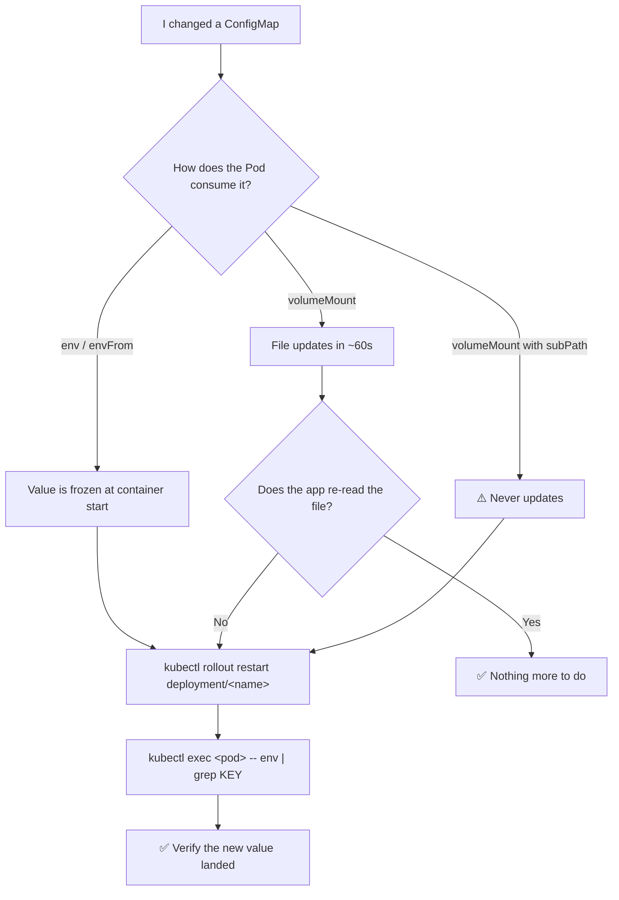

# ⚙️ 07 · ConfigMaps & Secrets

**Configuration doesn't belong in your image. ConfigMaps and Secrets are how you keep it outside — one for ordinary settings, one for sensitive ones.**

---

## 🧠 Mental Model

```text
ConfigMap  =  non-sensitive configuration     (log level, feature flags, URLs, config files)
Secret     =  sensitive configuration         (passwords, tokens, TLS keys, registry creds)
```

They are almost the same object. Same commands, same two ways of consuming them:

```text
ConfigMap / Secret
        │
        ├──▶ as ENVIRONMENT VARIABLES   → read once at container start, never updates
        │
        └──▶ as MOUNTED FILES           → updates eventually (~1 min), app must re-read
```

The rule that catches everyone:

> **Changing a ConfigMap or Secret does not restart your Pods.** Env vars are frozen at start. Mounted files update on disk, but only if your app re-reads them. Almost always you need `kubectl rollout restart`.

---

## Command Syntax

```bash
kubectl <verb> configmap <name> [flags]
kubectl <verb> cm        <name> [flags]     # cm = short name
kubectl <verb> secret    <name> [flags]     # no short name
```

---

# 📄 ConfigMaps

## 🔍 I want to see ConfigMaps

```bash
kubectl get configmaps
kubectl get cm
```

🟢

```bash
kubectl describe configmap <configmap-name>
```

🟢 **Purpose:** Shows keys and their values in readable form. Best first look.

```bash
kubectl get configmap <configmap-name> -o yaml
```

🟢 **Purpose:** The raw object — exactly what a Pod will consume.

```bash
kubectl get configmap <configmap-name> -o jsonpath='{.data.<key>}'
```

🟡 **Purpose:** Extract one value cleanly, without YAML around it.

```bash
kubectl get configmap app-config -o jsonpath='{.data.LOG_LEVEL}'
```

---

## 🚀 I want to create a ConfigMap

**From literal values:**

```bash
kubectl create configmap <name> \
  --from-literal=<key>=<value> \
  --from-literal=<key>=<value>
```

🟢

```bash
kubectl create configmap app-config \
  --from-literal=LOG_LEVEL=debug \
  --from-literal=MAX_CONNECTIONS=100
```

**From a file** (the key becomes the filename):

```bash
kubectl create configmap <name> --from-file=<path>
```

🟢

```bash
kubectl create configmap nginx-config --from-file=nginx.conf
```

**From a file with a custom key:**

```bash
kubectl create configmap nginx-config --from-file=default.conf=./nginx.conf
```

🟡

**From a whole directory** (each file becomes a key):

```bash
kubectl create configmap <name> --from-file=<directory>/
```

🟡

**From an env file** (each `KEY=value` line becomes a key):

```bash
kubectl create configmap <name> --from-env-file=<path>.env
```

🟡

**Generate the YAML instead:**

```bash
kubectl create configmap app-config --from-literal=LOG_LEVEL=debug \
  --dry-run=client -o yaml > configmap.yaml
```

🟢 See [`examples/configmap.yaml`](../examples/configmap.yaml).

---

## 🔄 I want to update a ConfigMap

```bash
kubectl edit configmap <configmap-name>
```

🟡 Opens the live object in your editor.

```bash
kubectl apply -f configmap.yaml
```

🟢 The declarative path — preferred.

**Recreate from literals (there is no `kubectl update`):**

```bash
kubectl create configmap app-config \
  --from-literal=LOG_LEVEL=info \
  --dry-run=client -o yaml | kubectl apply -f -
```

🟡 **Purpose:** Generate the new version and pipe it into `apply`. This is the standard idiom for "change a value from the command line without editing a file".

### 🔔 Then restart the Pods

```bash
kubectl rollout restart deployment/<deployment-name>
```

🟡 **Purpose:** Without this, nothing you just changed takes effect for env-var consumers.

> 💡 The robust pattern is **immutable config**: name your ConfigMaps `app-config-v2`, `app-config-v3`, and change the name in the Deployment. That makes the Pod template change, which triggers a rollout automatically — and gives you a real rollback path. Tools like Kustomize do this for you with a content hash suffix.

```yaml
# Make a ConfigMap immutable — better performance, and prevents accidental edits
apiVersion: v1
kind: ConfigMap
metadata:
  name: app-config-v2
immutable: true
data:
  LOG_LEVEL: info
```

---

# 🔐 Secrets

## ⚠️ Read This First

> **Base64 encoding is NOT encryption.**
>
> ```bash
> echo 'c3VwZXJzZWNyZXQ=' | base64 -d
> supersecret
> ```
>
> Anyone who can read the Secret object can read its contents instantly. Base64 exists so that binary data (certificates, keys) can travel through JSON — nothing more.
>
> Real protection comes from:
> - **RBAC** — restricting who can `get` secrets in a namespace
> - **Encryption at rest** — encrypting Secrets in etcd (a cluster configuration; on EKS this is the KMS envelope-encryption setting)
> - **External secret stores** — AWS Secrets Manager, Vault, or Azure Key Vault, pulled in via the External Secrets Operator or the Secrets Store CSI Driver

---

## 🔍 I want to see Secrets

```bash
kubectl get secrets
```

🟢 Lists names, types, and key counts — never the values.

```bash
kubectl describe secret <secret-name>
```

🟢 **Purpose:** Shows keys and value **sizes**, deliberately not the values themselves.

```text
Type:  Opaque
Data
====
password:  11 bytes
username:  5 bytes
```

```bash
kubectl get secret <secret-name> -o yaml
```

🟡 **Purpose:** Shows the base64-encoded values.

> ⚠️ **Production Impact** — this prints credentials into your terminal, where they persist in scrollback, shell history files, CI logs, and any screen recording. Treat every run of this command as a potential credential leak. Never do it during a screen share.

```bash
kubectl get secret <secret-name> -o jsonpath='{.data.<key>}' | base64 -d
```

🔴 **Purpose:** Decode one specific key.

```bash
kubectl get secret db-secret -o jsonpath='{.data.password}' | base64 -d
```

Add a newline for readability:

```bash
kubectl get secret db-secret -o jsonpath='{.data.password}' | base64 -d; echo
```

Decode **every** key at once:

```bash
kubectl get secret <secret-name> -o go-template='{{range $k,$v := .data}}{{$k}}: {{$v|base64decode}}{{"\n"}}{{end}}'
```

🔴 Same warning applies, more so.

---

## 🚀 I want to create a Secret

**Generic (Opaque) from literals:**

```bash
kubectl create secret generic <name> \
  --from-literal=<key>=<value>
```

🟢

```bash
kubectl create secret generic db-secret \
  --from-literal=username=admin \
  --from-literal=password='S3cur3P@ss'
```

> 💡 Quote the value. Shell metacharacters in passwords (`$`, `!`, backticks) will otherwise be interpreted by bash before kubectl ever sees them.

> ⚠️ A password typed on the command line lands in `~/.bash_history` and in process listings. Prefer `--from-file`:
> ```bash
> printf 'S3cur3P@ss' > ./password.txt
> kubectl create secret generic db-secret --from-file=password=./password.txt
> shred -u ./password.txt
> ```

**TLS:**

```bash
kubectl create secret tls <name> --cert=<path>.crt --key=<path>.key
```

🟡 **Purpose:** Creates a `kubernetes.io/tls` Secret with the fixed keys `tls.crt` and `tls.key` — the format Ingress requires. → [09 · Ingress](09-ingress.md)

**Private registry credentials:**

```bash
kubectl create secret docker-registry <name> \
  --docker-server=<registry> \
  --docker-username=<username> \
  --docker-password=<password> \
  --docker-email=<email>
```

🟡 **Purpose:** Creates a `kubernetes.io/dockerconfigjson` Secret. Reference it in a Pod's `imagePullSecrets` to fix `ImagePullBackOff` on private images.

```yaml
spec:
  imagePullSecrets:
    - name: regcred
```

---

## 📋 Secret Types

| Type | Created by | Required keys | Used for |
| --- | --- | --- | --- |
| `Opaque` | `create secret generic` | any | The default — app credentials, API keys |
| `kubernetes.io/tls` | `create secret tls` | `tls.crt`, `tls.key` | Ingress TLS termination |
| `kubernetes.io/dockerconfigjson` | `create secret docker-registry` | `.dockerconfigjson` | Pulling from private registries |
| `kubernetes.io/basic-auth` | manual | `username`, `password` | Basic auth |
| `kubernetes.io/ssh-auth` | manual | `ssh-privatekey` | Git-over-SSH in CI |
| `kubernetes.io/service-account-token` | manual | — | See note below |

```bash
kubectl get secrets --field-selector type=kubernetes.io/tls
```

🟡 Filter by type.

### ⚠️ ServiceAccount tokens

Since **Kubernetes v1.24**, ServiceAccounts no longer get an automatic, permanent token Secret. Pods receive **short-lived, auto-rotated projected tokens** instead — safer, because they expire and are audience-bound.

If you genuinely need a long-lived token (an external CI system, for example), you must create it deliberately:

```yaml
apiVersion: v1
kind: Secret
metadata:
  name: my-sa-token
  annotations:
    kubernetes.io/service-account.name: my-sa
type: kubernetes.io/service-account-token
```

> ⚠️ **Production Impact** — a manually created token does not expire and does not rotate. It is a standing credential that grants everything its ServiceAccount can do, forever, until you delete it. Prefer projected tokens, or IRSA on EKS. → [16 · EKS Commands](16-eks-commands.md)

---

## 🔗 How Pods Consume Them

**As environment variables** — frozen at container start:

```yaml
env:
  - name: LOG_LEVEL
    valueFrom:
      configMapKeyRef:
        name: app-config
        key: LOG_LEVEL
  - name: DB_PASSWORD
    valueFrom:
      secretKeyRef:
        name: db-secret
        key: password
```

**All keys at once:**

```yaml
envFrom:
  - configMapRef:
      name: app-config
  - secretRef:
      name: db-secret
```

**As mounted files** — updates propagate (~60s), env vars never do:

```yaml
volumes:
  - name: config
    configMap:
      name: app-config
containers:
  - name: app
    volumeMounts:
      - name: config
        mountPath: /etc/config
        readOnly: true
```

**Verify what a Pod actually got:**

```bash
kubectl exec <pod-name> -- env | sort
kubectl exec <pod-name> -- ls -l /etc/config
kubectl exec <pod-name> -- cat /etc/config/<key>
```

🟢 **Purpose:** The ground truth. What's in the ConfigMap and what's in the container are different questions, and this answers the second one.

---

## 🐛 Troubleshooting

| Symptom | Cause | Command |
| --- | --- | --- |
| `CreateContainerConfigError` | Referenced ConfigMap/Secret or key doesn't exist | `kubectl describe pod <pod-name>` — the event names it exactly |
| Changed config, nothing happened | Env vars don't reload | `kubectl rollout restart deployment/<name>` |
| Mounted file is stale | Propagation takes up to ~60s; `subPath` mounts **never** update | `kubectl exec <pod> -- cat <file>` |
| `ImagePullBackOff` on a private image | Missing or wrong `imagePullSecrets` | `kubectl get secret <name> -o yaml`, check `.dockerconfigjson` |
| Secret value has a trailing newline | `echo` added one | Use `printf`, or `echo -n` |
| Ingress TLS not working | Wrong Secret type or keys | Must be `kubernetes.io/tls` with `tls.crt` / `tls.key` |
| App reads an empty value | Key name mismatch | `kubectl describe configmap <name>` and compare exactly |

### The `CreateContainerConfigError` workflow

```bash
kubectl describe pod <pod-name>       # 1. event states the missing name
kubectl get configmap,secret          # 2. does it exist in THIS namespace?
kubectl describe configmap <name>     # 3. does the KEY exist?
```

🟢 ConfigMaps and Secrets are **namespaced**. A Pod cannot reference one in another namespace — this is a frequent cause.

### Trailing newline gotcha

```bash
echo 'password' > pass.txt     # writes "password\n" — 9 bytes
printf 'password' > pass.txt   # writes "password"   — 8 bytes ✅
```

That invisible newline breaks database logins and gives you an authentication error you'll stare at for an hour. Check the size in `kubectl describe secret`.

---

## 💡 Memory Trick

```text
ConfigMap  = settings anyone may read
Secret     = settings nobody should read

env vars   = frozen at start   →  MUST restart
files      = update eventually →  app must re-read
```

> **"Base64 is a costume, not a lock."**

---

## 🗺️ Diagram



---

## ⚠️ Common Mistakes

**Believing base64 protects anything.** It's an encoding. Protect Secrets with RBAC, encryption at rest, and an external secret store.

**Committing Secret YAML to Git.** The base64 blob is the credential, in plaintext, forever, in your history. Use Sealed Secrets, SOPS, or the External Secrets Operator.

**Expecting a config change to restart Pods.** It won't. `rollout restart` or versioned ConfigMap names.

**Using `subPath` mounts for config you intend to update.** `subPath` mounts are snapshots — they never receive updates, unlike whole-directory mounts.

**`echo` instead of `printf` when writing secret files.** The trailing newline becomes part of the credential.

**Unquoted passwords on the command line.** `$`, `!`, and backticks get expanded by your shell.

**Referencing a ConfigMap in another namespace.** Not possible. They're namespaced, and the Pod will fail with `CreateContainerConfigError`.

**Assuming a `Secret` is more protected than a `ConfigMap` at rest.** Without encryption-at-rest configured, both sit in etcd in the clear. The difference is RBAC convention, not built-in cryptography.

---

## 🔗 Related

| Task | Go to |
| --- | --- |
| Restarting Pods after a config change | [04 · Deployments](04-deployments.md) |
| Checking what a container received | [03 · Pods](03-pods.md) |
| `CreateContainerConfigError` in depth | [Failure States](../quick-reference/failure-states.md) |
| TLS Secrets for HTTPS | [09 · Ingress](09-ingress.md) |
| Restricting who can read Secrets | [11 · RBAC](11-rbac.md) |
| AWS Secrets Manager / IRSA | [16 · EKS Commands](16-eks-commands.md) |

---

## 🎯 Interview Tip

**"How do Kubernetes Secrets protect data?"**

The honest answer is the one they're testing for:

> By themselves, barely at all — Secret data is base64-encoded, not encrypted, and is stored in etcd. Real protection is three separate things: RBAC so only the right subjects can read them, encryption at rest so etcd content isn't plaintext on disk, and ideally an external store like AWS Secrets Manager or Vault so the credential never lives in the cluster long-term. What Secrets *do* give you over ConfigMaps is a distinct resource type that RBAC and audit policy can target, and they're not written to node disk in the clear.

**"I updated a ConfigMap but nothing changed. Why?"**
Env vars are injected at container start and never re-read. Mounted files update after about a minute, unless mounted with `subPath`, in which case never. The fix is `kubectl rollout restart`, and the better pattern is versioned ConfigMap names so the Deployment template changes and a rollout happens automatically.

---

<!-- NAV-FOOTER -->
### 🧭 Navigation

| Previous | Up | Next |
| --- | --- | --- |
| [← 06 · Services](06-services.md) | [README](../README.md) | [08 · Storage →](08-storage.md) |
