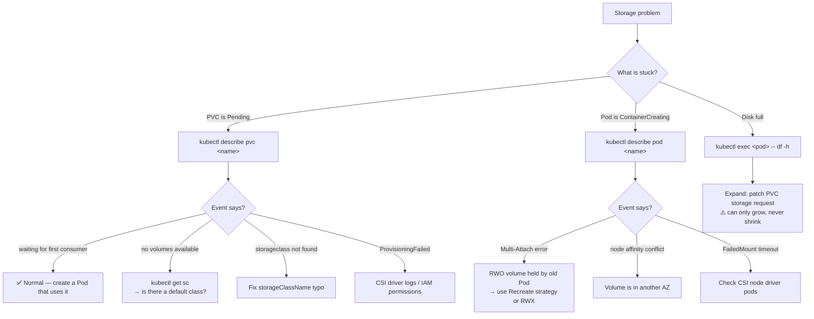

# 💾 08 · Storage

**Containers forget everything when they restart. Persistent volumes are how data survives.**

---

## 🧠 Mental Model

Storage in Kubernetes is a chain of five links. Every storage problem is one broken link.

```text
POD                    "I need a volume at /data"
 ↓ mounts
PVC                    "I request 10Gi, ReadWriteOnce"       ← you write this
 ↓ binds to
PV                     "Here is 10Gi of actual storage"      ← usually created for you
 ↓ provisioned by
STORAGECLASS / CSI     "gp3 on AWS, via the EBS CSI driver"  ← the cluster admin sets this up
 ↓ backed by
REAL DISK              AWS EBS · Azure Disk · GCP PD · NFS · local SSD
```

The separation exists so your manifests stay portable: you ask for *10Gi of fast storage*, and the cluster decides whether that means EBS gp3, Azure Premium SSD, or a local directory in Kind.

**Two ways a PV comes into existence:**

```text
STATIC   → an admin creates PVs by hand; your PVC binds to a matching one
DYNAMIC  → your PVC names a StorageClass, and a PV is created on demand ✅ the normal case
```

---

## Command Syntax

```bash
kubectl <verb> pvc <name>      # persistentvolumeclaims — namespaced
kubectl <verb> pv  <name>      # persistentvolumes      — cluster-scoped
kubectl <verb> sc  <name>      # storageclasses         — cluster-scoped
```

> 💡 **PVCs are namespaced; PVs and StorageClasses are not.** That's why `kubectl get pv -n prod` returns everything — the flag is ignored.

---

## 🔍 I want to see my storage

```bash
kubectl get pvc
```

🟢 **Purpose:** Claims in the current namespace — what your applications asked for.

```text
NAME        STATUS   VOLUME       CAPACITY   ACCESS MODES   STORAGECLASS   AGE
data-db-0   Bound    pvc-a1b2c3   10Gi       RWO            gp3            5d
uploads     Pending                                          <none>        2m
```

**`STATUS` is the whole story:**

| Status | Means |
| --- | --- |
| `Bound` | ✅ Connected to a PV and usable |
| `Pending` | ⚠️ Waiting — no matching PV, or waiting for a Pod to schedule |
| `Lost` | 🔴 Its PV disappeared |

```bash
kubectl get pv
```

🟡 **Purpose:** The actual volumes in the cluster, and which claim owns each one.

```text
NAME         CAPACITY  ACCESS MODES  RECLAIM POLICY  STATUS     CLAIM              STORAGECLASS
pvc-a1b2c3   10Gi      RWO           Delete          Bound      default/data-db-0  gp3
pv-manual    50Gi      RWX           Retain          Available                     <none>
```

> ⚠️ Look at `RECLAIM POLICY`. **`Delete` means the real disk is destroyed when the PVC is deleted.** `Retain` means it survives and must be cleaned up by hand.

```bash
kubectl get storageclass
kubectl get sc
```

🟢 **Purpose:** What kinds of storage this cluster can provision.

```text
NAME            PROVISIONER             RECLAIMPOLICY  VOLUMEBINDINGMODE      AGE
gp3 (default)   ebs.csi.aws.com         Delete         WaitForFirstConsumer   45d
gp2             kubernetes.io/aws-ebs   Delete         Immediate              45d
efs-sc          efs.csi.aws.com         Retain         Immediate              20d
```

> 💡 `(default)` marks the class used when a PVC doesn't name one. **If no class is marked default, every PVC without an explicit `storageClassName` stays `Pending` forever.** This is a very common cause of stuck claims.

---

## 🔍 I want details

```bash
kubectl describe pvc <pvc-name>
```

🟢 **Purpose:** The first command for any storage problem. Shows requested size, access mode, bound volume, the Pods using it, and **Events** — which state the reason for `Pending` outright.

```bash
kubectl describe pv <pv-name>
```

🟡 **Purpose:** The underlying volume — its cloud volume ID, node affinity, reclaim policy, and CSI driver details.

**Use when:** Finding the actual EBS volume ID to look at in the AWS console:

```bash
kubectl get pv <pv-name> -o jsonpath='{.spec.csi.volumeHandle}'
```

🔴 `[EKS]` Returns something like `vol-0a1b2c3d4e5f`.

```bash
kubectl describe sc <storageclass-name>
```

🟡 **Purpose:** Provisioner, parameters (volume type, IOPS, encryption), reclaim policy, and binding mode.

---

## 🔍 I want to know which Pod uses which volume

```bash
kubectl describe pvc <pvc-name> | grep -A3 "Used By"
```

🟡 **Purpose:** Names the Pods currently mounting this claim. Check before deleting anything.

```bash
kubectl get pods -o json | jq -r '
  .items[] | select(.spec.volumes[]?.persistentVolumeClaim) |
  "\(.metadata.name): \(.spec.volumes[] | select(.persistentVolumeClaim) | .persistentVolumeClaim.claimName)"'
```

🔴 **Purpose:** Maps every Pod in the namespace to the PVCs it mounts. Useful before a storage migration.

```bash
kubectl exec <pod-name> -- df -h
```

🟢 **Purpose:** What the container actually sees mounted, and how full it is. Often the fastest answer to "is the disk full?"

---

## 🚀 I want to create storage

**Generate a PVC:**

```yaml
apiVersion: v1
kind: PersistentVolumeClaim
metadata:
  name: uploads
spec:
  accessModes:
    - ReadWriteOnce
  storageClassName: gp3
  resources:
    requests:
      storage: 10Gi
```

```bash
kubectl apply -f pvc.yaml
```

🟢 See [`examples/pvc.yaml`](../examples/pvc.yaml). There is no `kubectl create pvc` — PVCs are declarative only.

**Watch it bind:**

```bash
kubectl get pvc <pvc-name> -w
```

🟢

---

## 📋 Access Modes

```text
RWO  ReadWriteOnce        one NODE can mount it read-write        ← EBS, Azure Disk, GCP PD
ROX  ReadOnlyMany         many nodes, read-only
RWX  ReadWriteMany        many nodes read-write                   ← EFS, Azure Files, NFS
RWOP ReadWriteOncePod     exactly one POD (v1.29+ stable)
```

> 💡 **`ReadWriteOnce` means one node, not one Pod.** Several Pods on the *same* node can share an RWO volume; a Pod on a different node cannot. This surprises people during rolling updates: the new Pod schedules on another node, can't attach the volume, and hangs in `ContainerCreating` while the old Pod still holds it.
>
> For a Deployment with multiple replicas that all need to write, you need **RWX** — which block storage (EBS, Azure Disk) cannot provide. You need a file storage class: EFS `[EKS]`, Azure Files `[AKS]`, Filestore `[GKE]`, or NFS.

```bash
kubectl get pv -o custom-columns='NAME:.metadata.name,MODES:.spec.accessModes,CLASS:.spec.storageClassName'
```

🟡 See access modes across all volumes at a glance.

---

## 📈 I want to resize a volume

```bash
kubectl get sc <storageclass-name> -o jsonpath='{.allowVolumeExpansion}'
```

🟡 **Purpose:** Check expansion is permitted. If this isn't `true`, resizing will silently do nothing.

```bash
kubectl patch pvc <pvc-name> -p '{"spec":{"resources":{"requests":{"storage":"20Gi"}}}}'
```

🟡 **Purpose:** Requests a larger volume. Most CSI drivers expand the disk and the filesystem online, with no restart.

```bash
kubectl get pvc <pvc-name> -w
kubectl describe pvc <pvc-name>     # watch the conditions
```

> ⚠️ **Production Impact — volumes can only grow, never shrink.** There is no supported way to reduce a PVC. Over-provisioning is permanent (and billed) until you migrate the data to a new, smaller volume by hand. Increase in deliberate steps.
>
> Some drivers require a Pod restart to complete the filesystem resize — the PVC will show `FileSystemResizePending` until the Pod is recreated.

---

## 🗑️ I want to delete storage

> ⚠️ **Production Impact — this is the most destructive area in Kubernetes.**
>
> When you delete a PVC, what happens to the data depends entirely on the **reclaim policy** of its PV:
>
> | Policy | On PVC deletion |
> | --- | --- |
> | `Delete` | 🔴 **The PV and the real cloud disk are destroyed. The data is gone.** |
> | `Retain` | The PV survives in `Released` state; data intact but must be manually reclaimed |
>
> `Delete` is the default on nearly every cloud StorageClass. **Check before you delete:**
>
> ```bash
> kubectl get pvc <pvc-name> -o jsonpath='{.spec.volumeName}'
> kubectl get pv <pv-name> -o jsonpath='{.spec.persistentVolumeReclaimPolicy}'
> ```

```bash
kubectl delete pvc <pvc-name>
```

🔴

**Protect a volume before risky work:**

```bash
kubectl patch pv <pv-name> -p '{"spec":{"persistentVolumeReclaimPolicy":"Retain"}}'
```

🔴 **Purpose:** Flips an existing PV to `Retain`, so an accidental PVC deletion doesn't destroy the disk. A genuinely worthwhile precaution before any storage migration.

**Reclaiming a `Released` PV:**

A `Retain` PV stays `Released` and cannot be re-bound until you clear the stale claim reference:

```bash
kubectl patch pv <pv-name> -p '{"spec":{"claimRef": null}}'
```

🔴 It returns to `Available` and a new matching PVC can bind to it — with the old data still on it.

### Why won't my PVC delete?

PVCs have a `kubernetes.io/pvc-protection` finalizer: **a PVC in use by a running Pod will not delete.** It sits in `Terminating` until the Pod goes.

```bash
kubectl describe pvc <pvc-name> | grep -A3 "Used By"
```

🟡 That's the protection working correctly. Delete the Pod (or scale the workload to zero) rather than forcing the finalizer.

---

## 🐛 Troubleshooting

### PVC stuck `Pending`

```bash
kubectl describe pvc <pvc-name>       # ← the Events section names the cause
kubectl get sc                        # is there a default StorageClass?
kubectl get pv                        # is there a matching PV (static provisioning)?
```

| Event / cause | Fix |
| --- | --- |
| `no persistent volumes available for this claim` | No matching PV, and no dynamic provisioner |
| `storageclass.storage.k8s.io "x" not found` | Typo, or the class doesn't exist on this cluster |
| No events at all, `STORAGECLASS` is `<none>` | **No default StorageClass.** Name one explicitly |
| `waiting for first consumer to be created` | ✅ **Normal.** `WaitForFirstConsumer` binding — it binds once a Pod is scheduled |
| `ProvisioningFailed` + IAM error `[EKS]` | The EBS CSI driver's service account lacks permissions |

> 💡 `waiting for first consumer` is not a bug. `WaitForFirstConsumer` delays binding until a Pod is scheduled, so the volume is created in the **same availability zone** as the node. Without it you get zone mismatches. If the PVC has no Pod, it will wait indefinitely — correctly.

### Pod stuck `ContainerCreating`

```bash
kubectl describe pod <pod-name>       # ← FailedMount / FailedAttachVolume events
```

| Event | Cause |
| --- | --- |
| `Multi-Attach error for volume` | An RWO volume is still attached to another node — the old Pod hasn't fully terminated |
| `FailedMount: timeout expired waiting for volumes to attach` | CSI driver problem, or a cross-AZ attempt |
| `FailedMount: mount failed: permission denied` | `fsGroup` / filesystem ownership mismatch |
| `volume node affinity conflict` | The Pod is scheduled in a different AZ than the volume |

**The Multi-Attach case — the most common:**

```bash
kubectl get pods -o wide -l app=<label-value>     # where is the old Pod?
kubectl get pv <pv-name> -o jsonpath='{.spec.nodeAffinity}'
```

🟡 An EBS volume can only attach to one node. During a rolling update on a Deployment with an RWO volume, the new Pod on a new node waits for the old Pod to release it. Fix with `strategy: Recreate`, or move to RWX storage.

### CSI driver health

```bash
kubectl get pods -n kube-system -l app.kubernetes.io/name=aws-ebs-csi-driver
kubectl logs -n kube-system -l app=ebs-csi-controller -c ebs-plugin --tail=50
```

🔴 `[EKS]` If provisioning fails cluster-wide, the driver itself is the suspect. → [16 · EKS Commands](16-eks-commands.md)

```bash
kubectl get csidrivers
kubectl get volumeattachments
```

🔴 Which CSI drivers are installed, and which volumes are currently attached to which nodes.

### Disk full inside the Pod

```bash
kubectl exec <pod-name> -- df -h
kubectl exec <pod-name> -- du -sh /data/* 2>/dev/null | sort -h
```

🟡 The volume being full looks like an application bug until you check.

---

## 💡 Memory Trick

```text
POD → PVC → PV → STORAGECLASS → CSI → REAL DISK
```

> **"Pod wants it, Claim asks for it, Volume is it, Class makes it, Driver attaches it, Disk holds it."**

Walk the chain top-down when a Pod won't start; bottom-up when provisioning fails.

And the one that saves your data:

> **`Delete` reclaim policy means the disk dies with the claim.**

---

## 🗺️ Diagram



---

## ⚠️ Common Mistakes

**Deleting a PVC without checking the reclaim policy.** With `Delete` — the cloud default — the real disk goes with it. Always check first.

**Assuming `ReadWriteOnce` means one Pod.** It means one *node*. This bites during rolling updates on Deployments with volumes.

**Multiple replicas sharing an RWO volume.** Only Pods co-located on one node can. Use RWX (EFS/Azure Files/Filestore) or a StatefulSet where each Pod gets its own volume.

**Expecting to shrink a PVC.** Not supported. Growth is one-way.

**Forgetting StatefulSet PVCs are retained.** Scale down or delete the StatefulSet, and the claims — and the bill — remain. → [05 · Other Workloads](05-replicasets-and-other-workloads.md)

**Reading `waiting for first consumer` as an error.** It's `WaitForFirstConsumer` working as designed.

**Using `emptyDir` for anything you want to keep.** It's deleted with the Pod. It's scratch space, not storage.

**Assuming a default StorageClass exists.** Many clusters have none. Then every PVC without an explicit class hangs `Pending` with no obvious error.

**Ignoring `hostPath` warnings.** It ties a Pod to one specific node's filesystem and is a container-escape risk. Fine in Minikube, wrong in production.

---

## 🔗 Related

| Task | Go to |
| --- | --- |
| Per-Pod volumes | [05 · Other Workloads](05-replicasets-and-other-workloads.md) |
| Pod stuck `ContainerCreating` | [Failure States](../quick-reference/failure-states.md) |
| Mounting config as files | [07 · ConfigMaps & Secrets](07-configmaps-and-secrets.md) |
| EBS CSI driver, EFS, IRSA | [16 · EKS Commands](16-eks-commands.md) |
| Storage mind map | [Storage Mind Map](../mindmaps/storage-mindmap.md) |

---

## 🎯 Interview Tip

**"Explain PV vs PVC vs StorageClass."**

> A PVC is a *request* — "10Gi, ReadWriteOnce" — written by the application team and namespaced alongside the app. A PV is the *actual volume*, cluster-scoped. A StorageClass is the *recipe* that turns a request into a volume automatically, naming a provisioner like `ebs.csi.aws.com` and its parameters. The split is what keeps manifests portable: the same PVC gets EBS on EKS and Azure Disk on AKS.

**"What happens to the data when I delete a PVC?"**
It depends on the PV's `persistentVolumeReclaimPolicy`. `Delete` — the cloud default — destroys the underlying disk. `Retain` keeps it in `Released` state until reclaimed manually. Knowing this distinction, and that you should check it *before* deleting, is what an interviewer is really listening for.

**"Why is my Pod stuck in ContainerCreating with a Multi-Attach error?"**
An RWO volume is still attached to the node running the old Pod. Block storage attaches to one node at a time, so during a rolling update the new Pod waits. Fix it with `strategy: Recreate`, or use RWX file storage if replicas genuinely need shared writes.

---

<!-- NAV-FOOTER -->
### 🧭 Navigation

| Previous | Up | Next |
| --- | --- | --- |
| [← 07 · ConfigMaps & Secrets](07-configmaps-and-secrets.md) | [README](../README.md) | [09 · Ingress →](09-ingress.md) |
