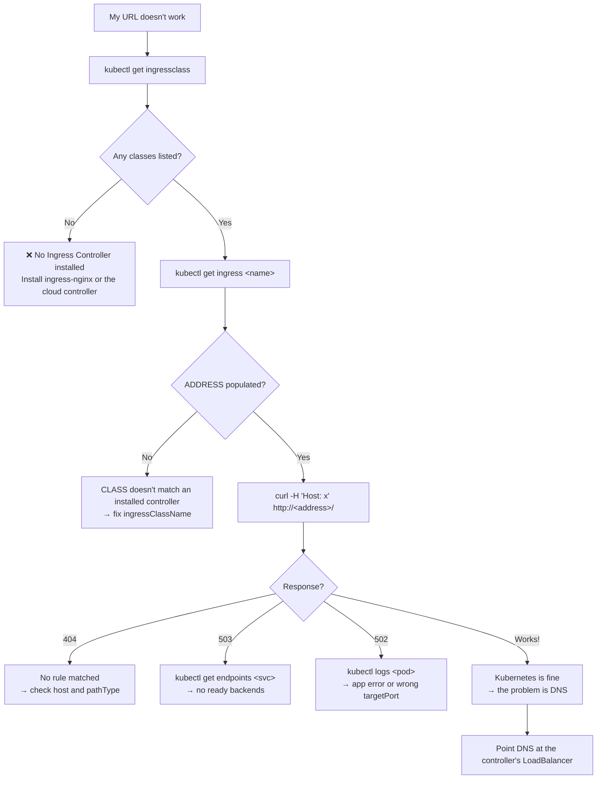

# 🌍 09 · Ingress

**A Service gets you one address per app. An Ingress gets you one address for *all* your apps, with hostnames, paths, and TLS.**

---

## 🧠 Mental Model

```text
User → https://shop.example.com/api
  │
  ▼
INGRESS CONTROLLER      the software that actually routes    (nginx, ALB, Traefik)
  │                     — it is a Pod, exposed by a LoadBalancer Service
  ▼
INGRESS                 the rules: "shop.example.com/api → api-svc:80"
  │                     — it is just data; it does nothing on its own
  ▼
SERVICE                 api-svc
  │
  ▼
POD                     your app
```

The three-way distinction people get wrong:

```text
Ingress             = the routing RULES        (a YAML object; inert)
IngressClass        = WHICH controller reads those rules
Ingress Controller  = the software that DOES the routing  (must be installed!)
```

> ⚠️ **Kubernetes does not include an Ingress Controller.** Creating an Ingress on a cluster with no controller produces a valid object that routes nothing, forever, with no error. This is the single most common Ingress problem.

**Why Ingress instead of many LoadBalancers:**

```text
Without Ingress:  5 apps → 5 LoadBalancer Services → 5 cloud LBs → 💰💰💰💰💰
With Ingress:     5 apps → 1 Ingress Controller    → 1 cloud LB  → 💰
                                                     + TLS + path routing + hostnames
```

---

## Command Syntax

```bash
kubectl <verb> ingress      <name> [flags]
kubectl <verb> ing          <name> [flags]     # ing = short name
kubectl <verb> ingressclass <name>             # cluster-scoped, no short name
```

---

## 🔍 I want to see my Ingresses

```bash
kubectl get ingress
kubectl get ing
```

🟡

```text
NAME      CLASS   HOSTS              ADDRESS              PORTS     AGE
shop      nginx   shop.example.com   a1b2.elb.aws...      80, 443   3d
internal  nginx   *                                       80        1d
```

**How to read it:**

| Column | Means |
| --- | --- |
| `CLASS` | Which controller handles this. `<none>` is usually a bug. |
| `HOSTS` | Hostnames matched. `*` matches anything. |
| `ADDRESS` | Where DNS should point. **Empty means no controller has claimed it.** |
| `PORTS` | `80` only = no TLS configured. `80, 443` = TLS present. |

> 💡 An empty `ADDRESS` after a couple of minutes is the diagnostic. It means either no controller is installed, or the `CLASS` doesn't match any installed controller.

```bash
kubectl get ingress -A
```

🟡 Across all namespaces — the usual way to audit what is exposed.

```bash
kubectl describe ingress <ingress-name>
```

🟡 **Purpose:** The rules table, the backing Services, TLS config, annotations, and events.

```text
Rules:
  Host              Path  Backends
  ----              ----  --------
  shop.example.com
                    /api  api-svc:80 (10.1.1.5:8080,10.1.2.9:8080)
                    /     web-svc:80 (10.1.3.4:8080)
```

> 💡 Look at the Pod IPs in parentheses. **If a backend shows `<error: endpoints "x" not found>` or an empty list, the problem is the Service, not the Ingress.** → [06 · Services](06-services.md)

---

## 🔍 I want to know which controller is installed

```bash
kubectl get ingressclass
```

🟡 **Purpose:** Lists the controllers available on this cluster.

```text
NAME             CONTROLLER                      PARAMETERS   AGE
nginx (default)  k8s.io/ingress-nginx            <none>       45d
alb              ingress.k8s.aws/alb             <none>       45d
```

**Empty output means no Ingress Controller is installed.** Nothing you write will route until one is.

```bash
kubectl describe ingressclass <ingressclass-name>
```

🟡 Shows the controller identifier and whether it's the cluster default.

```bash
kubectl get pods -A | grep -Ei 'ingress|nginx|traefik|contour|alb'
```

🟡 **Purpose:** Find the controller Pods. They're typically in `ingress-nginx`, `kube-system`, or their own namespace.

```bash
kubectl get svc -n ingress-nginx
```

🟡 **Purpose:** The controller's own Service — this is where the real external IP lives, and where your DNS records should ultimately point.

---

## 🚀 I want to create an Ingress

```bash
kubectl create ingress <name> \
  --class=<ingressclass-name> \
  --rule="<host>/<path>=<service-name>:<port>"
```

🟡 **Purpose:** Imperative creation. Multiple `--rule` flags are allowed.

```bash
kubectl create ingress shop \
  --class=nginx \
  --rule="shop.example.com/api*=api-svc:80" \
  --rule="shop.example.com/*=web-svc:80"
```

**With TLS:**

```bash
kubectl create ingress shop \
  --class=nginx \
  --rule="shop.example.com/*=web-svc:80,tls=shop-tls"
```

🟡 `shop-tls` must be an existing `kubernetes.io/tls` Secret. → [07 · ConfigMaps & Secrets](07-configmaps-and-secrets.md)

**Generate the YAML:**

```bash
kubectl create ingress shop --class=nginx \
  --rule="shop.example.com/*=web-svc:80" \
  --dry-run=client -o yaml > ingress.yaml
```

🟢 See [`examples/ingress.yaml`](../examples/ingress.yaml).

**Create the TLS Secret first:**

```bash
kubectl create secret tls shop-tls --cert=./tls.crt --key=./tls.key
```

🟡

---

## 📋 Path Types — the field that silently breaks routing

```yaml
pathType: Prefix     # /api matches /api, /api/, /api/v1     ← use this
pathType: Exact      # /api matches ONLY /api
pathType: ImplementationSpecific   # up to the controller — avoid, it's not portable
```

`pathType` is **required** in `networking.k8s.io/v1`. Using `Exact` when you meant `Prefix` gives you a 404 on every sub-path, and nothing warns you.

```bash
kubectl get ingress <ingress-name> -o jsonpath='{.spec.rules[*].http.paths[*].pathType}'
```

🟡 Check what yours actually says.

---

## ⚙️ Annotations — where the real behaviour lives

The Ingress spec is deliberately minimal. Rewrites, timeouts, body size limits, auth, and cloud-LB configuration all come from controller-specific **annotations**.

```bash
kubectl get ingress <ingress-name> -o jsonpath='{.metadata.annotations}' | tr ',' '\n'
```

🟡 See what's configured.

**Common ingress-nginx annotations:**

```yaml
annotations:
  nginx.ingress.kubernetes.io/rewrite-target: /$2
  nginx.ingress.kubernetes.io/proxy-body-size: "50m"
  nginx.ingress.kubernetes.io/ssl-redirect: "true"
  cert-manager.io/cluster-issuer: letsencrypt-prod
```

**Common AWS Load Balancer Controller annotations** `[EKS]`:

```yaml
annotations:
  alb.ingress.kubernetes.io/scheme: internet-facing
  alb.ingress.kubernetes.io/target-type: ip
  alb.ingress.kubernetes.io/certificate-arn: arn:aws:acm:...
  alb.ingress.kubernetes.io/healthcheck-path: /healthz
```

> ⚠️ **Annotations are not portable.** An `nginx.ingress.kubernetes.io/*` annotation is silently ignored by the ALB controller, and vice versa — no error, just behaviour you expected that never happens. Moving between clusters means rewriting them.

---

## 🐛 Troubleshooting

**Work the chain outside-in. Each step assumes the next one works.**

```text
DNS → INGRESS CONTROLLER → INGRESS RULES → SERVICE → ENDPOINTS → POD
```

```bash
kubectl get ingressclass                            # 1. is a controller installed at all?
kubectl get ingress <ingress-name>                  # 2. does ADDRESS have a value?
kubectl describe ingress <ingress-name>             # 3. do backends resolve to Pod IPs?
kubectl get endpoints <service-name>                # 4. is the Service wired up?
kubectl port-forward svc/<service-name> 8080:80     # 5. does it work bypassing Ingress?
kubectl logs -n ingress-nginx <controller-pod>      # 6. what did the controller see?
```

> 💡 **Step 5 is the bisection.** If `port-forward` to the Service works, everything below Ingress is fine and the problem is routing, TLS, or DNS. If it doesn't, stop debugging Ingress — fix the Service or the Pod first.

| Symptom | Cause | Command |
| --- | --- | --- |
| `ADDRESS` stays empty | No controller, or `CLASS` mismatch | `kubectl get ingressclass` |
| **404 from nginx** | No rule matched — wrong host, or `pathType: Exact` | `kubectl describe ingress` |
| **503 Service Unavailable** | Backend has no ready endpoints | `kubectl get endpoints <svc>` |
| **502 Bad Gateway** | Controller reached the Pod, Pod errored or wrong port | `kubectl logs <pod>` |
| Certificate warning / wrong cert | TLS Secret missing, wrong type, or host mismatch | `kubectl get secret <name> -o jsonpath='{.type}'` |
| Works by IP, not by hostname | DNS not pointing at the controller's LB | `dig <hostname>` vs `kubectl get svc -n ingress-nginx` |
| Rules exist but nothing routes | Ingress in a namespace the controller doesn't watch | Controller `--watch-namespace` flag |
| Sub-paths 404 but root works | `pathType: Exact` | Change to `Prefix` |

### Reading the controller logs

```bash
kubectl logs -n ingress-nginx -l app.kubernetes.io/name=ingress-nginx --tail=50
```

🟡 **Purpose:** ingress-nginx logs every request with its status and the backend it chose. This turns "it returns 404" into "it matched no rule for host X".

```bash
kubectl logs -n ingress-nginx -l app.kubernetes.io/name=ingress-nginx -f
```

🟡 Follow live while you reproduce the request.

`[EKS]` For the AWS Load Balancer Controller:

```bash
kubectl logs -n kube-system -l app.kubernetes.io/name=aws-load-balancer-controller --tail=50
```

🔴 Provisioning failures — missing subnet tags, IAM permissions, invalid ACM ARNs — appear here and in `kubectl describe ingress` events.

### Testing without DNS

```bash
curl -H "Host: shop.example.com" http://<ingress-address>/
```

🟡 **Purpose:** Tests host-based routing before DNS exists. If this works and the real hostname doesn't, your problem is DNS, not Kubernetes.

```bash
kubectl port-forward -n ingress-nginx svc/ingress-nginx-controller 8080:80
curl -H "Host: shop.example.com" http://localhost:8080/
```

🟡 Bypasses the cloud LB entirely — isolates whether the problem is inside or outside the cluster.

---

## 💡 Memory Trick

```text
CLASS → CONTROLLER → RULES → SERVICE → ENDPOINTS → POD
```

> **"Who routes? Is it running? What are the rules? Where do they point? Is that wired? Is it alive?"**

And the distinction worth memorising verbatim:

```text
Ingress            = the rules        (data)
IngressClass       = which controller (a pointer)
Ingress Controller = does the routing (software you must install)
```

---

## 🗺️ Diagram



---

## ⚠️ Common Mistakes

**Creating an Ingress with no controller installed.** The object is accepted, `ADDRESS` stays empty, and nothing ever routes. Always check `kubectl get ingressclass` first.

**Omitting `ingressClassName`.** On a cluster with no default class, no controller claims the Ingress. It just sits there.

**Using `pathType: Exact` for a path prefix.** Root works, every sub-path 404s.

**Copying annotations between controllers.** nginx annotations mean nothing to the ALB controller. They're silently dropped.

**Pointing DNS at the Ingress `ADDRESS` for a NodePort setup.** Point it at the controller's LoadBalancer.

**A TLS Secret in the wrong namespace.** The Secret must live in the **same namespace as the Ingress**. Cross-namespace references don't work.

**Wrong Secret type for TLS.** It must be `kubernetes.io/tls` with `tls.crt` and `tls.key`. An `Opaque` Secret with those keys will not be accepted.

**Debugging Ingress when the Service is broken.** Always `port-forward` to the Service first. Half of "Ingress problems" are Service problems.

**Using the deprecated `extensions/v1beta1` API.** Removed in v1.22. Use `networking.k8s.io/v1`.

---

## 🔗 Related

| Task | Go to |
| --- | --- |
| The Service behind the Ingress | [06 · Services](06-services.md) |
| Creating TLS Secrets | [07 · ConfigMaps & Secrets](07-configmaps-and-secrets.md) |
| Full network debugging | [12 · Debugging](12-debugging.md) |
| ALB controller and ACM | [16 · EKS Commands](16-eks-commands.md) |
| Installing ingress-nginx via Helm | [17 · Helm](17-helm-commands.md) |
| Networking mind map | [Networking Mind Map](../mindmaps/networking-mindmap.md) |

---

## 🎯 Interview Tip

**"What's the difference between a Service and an Ingress?"**

> A Service gives a stable L4 address to a set of Pods. An Ingress is L7 HTTP routing — hostnames, paths, TLS termination — in front of many Services. The key point is that an Ingress object is inert: it's a set of rules that an Ingress Controller reads and implements. Kubernetes ships the API but not the controller, so an Ingress on a cluster without one silently does nothing.

**"Why not just use LoadBalancer Services?"**
Cost and capability. Each LoadBalancer Service provisions its own cloud load balancer, so twenty microservices means twenty of them. One Ingress Controller behind a single LB routes all of them, and adds TLS termination, path routing, and host-based virtual hosting that L4 can't do.

**"Ingress vs Gateway API?"**
Worth knowing as of 2026: Gateway API is the successor, designed to replace the annotation sprawl with a typed, role-separated API (`GatewayClass` / `Gateway` / `HTTPRoute`). Ingress remains stable and universally supported, so it's still what most clusters run — but mentioning Gateway API as the direction of travel shows you're current.

---

<!-- NAV-FOOTER -->
### 🧭 Navigation

| Previous | Up | Next |
| --- | --- | --- |
| [← 08 · Storage](08-storage.md) | [README](../README.md) | [10 · Jobs & CronJobs →](10-jobs-and-cronjobs.md) |
