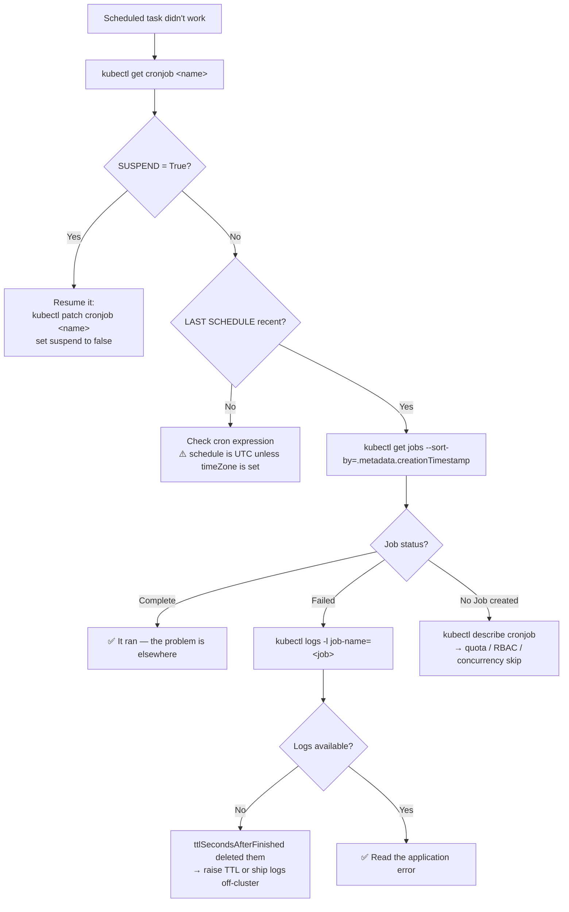

# ⏱️ 10 · Jobs & CronJobs

**Deployments run forever. Jobs run until they finish. CronJobs run on a schedule.**

---

## 🧠 Mental Model

```text
DEPLOYMENT   →  keep it running          "always have 3 web servers alive"
JOB          →  run until it completes   "process this batch, then stop"
CRONJOB      →  run on a schedule        "back up the database at 02:00"
```

The relationship, which explains most CronJob debugging:

```text
CRONJOB          the schedule + a Job template
   │ (creates one per tick)
   ▼
  JOB            "run this to completion"
   │ (creates one or more)
   ▼
  POD            the container that does the work
```

> 💡 **A CronJob makes Jobs. A Job makes Pods.** When a scheduled task fails, the error is usually in the **Pod**, and the Pod may already have been cleaned up. Knowing this chain is the whole skill.

**Restart semantics differ from Deployments:**

```text
restartPolicy: Never     → container fails → Job creates a NEW Pod    (up to backoffLimit)
restartPolicy: OnFailure → container fails → SAME Pod restarts it
restartPolicy: Always    → ❌ not allowed in a Job
```

---

## Command Syntax

```bash
kubectl <verb> job     <name> [flags]     # no short name
kubectl <verb> cronjob <name> [flags]
kubectl <verb> cj      <name> [flags]     # cj = short name
```

---

# 🔨 Jobs

## 🔍 I want to see Jobs

```bash
kubectl get jobs
```

🟡

```text
NAME              STATUS     COMPLETIONS   DURATION   AGE
migrate-db        Complete   1/1           45s        2h
import-users      Failed     0/1           5m         30m
process-batch     Running    3/10          2m         2m
```

`COMPLETIONS` is `<succeeded>/<desired>`. A Job is done when it reaches its target.

```bash
kubectl describe job <job-name>
```

🟡 **Purpose:** Pod statuses, backoff count, and events. Shows `Pods Statuses: 0 Running / 0 Succeeded / 3 Failed`.

```bash
kubectl get pods -l job-name=<job-name>
```

🟡 **Purpose:** The Pods this Job created. **This is the command that matters** — the actual error lives in the Pod, not the Job.

> 💡 `job-name` is a label Kubernetes adds automatically. It is the reliable way to find a Job's Pods, since their names are randomly suffixed.

```bash
kubectl logs -l job-name=<job-name> --tail=100
```

🟡 **Purpose:** Logs from every Pod the Job created, including the failed attempts. The single most useful Job debugging command.

```bash
kubectl logs job/<job-name>
```

🟡 Logs from one Pod of the Job.

---

## 🚀 I want to run a Job

```bash
kubectl create job <job-name> --image=<image> -- <command>
```

🟡

```bash
kubectl create job migrate-db --image=myapp:1.4 -- /app/migrate --up
```

**Run a Job from an existing CronJob's template** — the most useful form:

```bash
kubectl create job <job-name> --from=cronjob/<cronjob-name>
```

🟡 **Purpose:** Triggers a scheduled task **right now**, using exactly the definition the schedule would have used.

```bash
kubectl create job backup-manual-001 --from=cronjob/nightly-backup
```

**Use when:** Testing a CronJob without waiting for its schedule, or re-running a missed run.

**Generate the YAML:**

```bash
kubectl create job migrate --image=myapp:1.4 --dry-run=client -o yaml -- /app/migrate
```

🟢 See [`examples/job.yaml`](../examples/job.yaml).

**Watch it run:**

```bash
kubectl get job <job-name> -w
kubectl wait --for=condition=complete job/<job-name> --timeout=300s
```

🟡 **Purpose:** `wait` blocks until the Job completes and exits non-zero on timeout — exactly what a CI pipeline needs after triggering a migration.

```bash
kubectl wait --for=condition=failed job/<job-name> --timeout=10s
```

🔴 The inverse check.

---

## 📋 The Fields That Control Job Behaviour

```yaml
spec:
  backoffLimit: 4              # retries before marking the Job Failed (default 6)
  activeDeadlineSeconds: 600   # hard timeout — kills the Job regardless of retries
  completions: 10              # how many successful Pods are needed
  parallelism: 3               # how many Pods may run at once
  ttlSecondsAfterFinished: 3600  # auto-delete the Job 1h after it finishes
```

```bash
kubectl get job <job-name> -o jsonpath='{.spec.backoffLimit}{"\n"}{.spec.activeDeadlineSeconds}'
```

🟡 Check what yours is set to.

> 💡 **`ttlSecondsAfterFinished` is the fix for the mess.** Without it, finished Jobs and their Pods accumulate forever, cluttering `kubectl get pods` and consuming etcd. With it, they clean themselves up — but note that once deleted, **the logs are gone too**. Set it long enough to investigate failures, or ship logs off-cluster.

**Parallel batch example:**

```text
completions: 10, parallelism: 3
→ runs 3 Pods at a time until 10 have succeeded
```

---

# ⏰ CronJobs

## 🔍 I want to see CronJobs

```bash
kubectl get cronjobs
kubectl get cj
```

🟡

```text
NAME              SCHEDULE      TIMEZONE   SUSPEND   ACTIVE   LAST SCHEDULE   AGE
nightly-backup    0 2 * * *     Etc/UTC    False     0        8h              30d
hourly-sync       0 * * * *     <none>     True      0        5d              30d
```

**Read `SUSPEND` first.** `True` means it is not running and will not run — often someone paused it during an incident and forgot.

**`LAST SCHEDULE`** of `<none>` on an old CronJob means it has never fired: check the schedule expression and `SUSPEND`.

```bash
kubectl describe cronjob <cronjob-name>
```

🟡 **Purpose:** Schedule, concurrency policy, history limits, and the events for each spawned Job.

```bash
kubectl get jobs -l <label>
kubectl get jobs --sort-by=.metadata.creationTimestamp
```

🟡 **Purpose:** The Jobs a CronJob has created. Their names are `<cronjob-name>-<timestamp>`.

---

## 🚀 I want to create a CronJob

```bash
kubectl create cronjob <name> \
  --image=<image> \
  --schedule="<cron-expression>" \
  -- <command>
```

🟡

```bash
kubectl create cronjob nightly-backup \
  --image=postgres:16 \
  --schedule="0 2 * * *" \
  -- /bin/sh -c 'pg_dump $DB_URL > /backup/db.sql'
```

**Cron syntax:**

```text
 ┌───────── minute       (0-59)
 │ ┌─────── hour         (0-23)
 │ │ ┌───── day of month (1-31)
 │ │ │ ┌─── month        (1-12)
 │ │ │ │ ┌─ day of week  (0-6, Sunday = 0)
 │ │ │ │ │
 0 2 * * *     → 02:00 every day
 */15 * * * *  → every 15 minutes
 0 */6 * * *   → every 6 hours
 0 9 * * 1-5   → 09:00 Monday to Friday
 0 0 1 * *     → midnight on the 1st of each month
```

> ⚠️ **CronJobs run in UTC by default**, not your local time or the node's. `0 2 * * *` is 02:00 UTC. Since v1.27 you can set `spec.timeZone` explicitly:
> ```yaml
> spec:
>   schedule: "0 2 * * *"
>   timeZone: "Asia/Kolkata"
> ```
> Without it, daylight-saving changes will shift your job by an hour twice a year.

**Generate the YAML:**

```bash
kubectl create cronjob backup --image=postgres:16 --schedule="0 2 * * *" \
  --dry-run=client -o yaml -- /backup.sh
```

🟢 See [`examples/cronjob.yaml`](../examples/cronjob.yaml).

---

## ⏸️ I want to pause a CronJob

```bash
kubectl patch cronjob <cronjob-name> -p '{"spec":{"suspend":true}}'
```

🟡 **Purpose:** Stops future runs without deleting anything. The correct move during an incident or a maintenance window.

```bash
kubectl patch cronjob <cronjob-name> -p '{"spec":{"suspend":false}}'
```

🟡 Resume.

> ⚠️ **Production Impact** — a suspended CronJob is invisible unless you look at the `SUSPEND` column. Backups that silently stopped running three weeks ago are discovered at the worst possible moment. If you suspend something, set a reminder, and check periodically:
> ```bash
> kubectl get cronjobs -A -o custom-columns='NS:.metadata.namespace,NAME:.metadata.name,SUSPEND:.spec.suspend,LAST:.status.lastScheduleTime'
> ```

---

## 📋 Concurrency & History

```yaml
spec:
  concurrencyPolicy: Forbid      # Allow | Forbid | Replace
  successfulJobsHistoryLimit: 3  # keep 3 successful Jobs
  failedJobsHistoryLimit: 1      # keep 1 failed Job
  startingDeadlineSeconds: 300   # if a run is missed, how late may it still start
```

| `concurrencyPolicy` | Behaviour when the previous run is still going |
| --- | --- |
| `Allow` *(default)* | Start anyway — runs overlap |
| `Forbid` | Skip this run |
| `Replace` | Kill the running Job and start fresh |

> ⚠️ **`Allow` is the default and is usually wrong for backups and syncs.** A job that occasionally takes longer than its interval will pile up, and two copies writing to the same destination can corrupt data. For anything non-idempotent, set `Forbid`.

> 💡 `failedJobsHistoryLimit: 1` keeps only the most recent failure — so a job failing every hour destroys the evidence of *why* it started failing. Raise it while investigating.

---

## 🗑️ I want to delete Jobs

> ⚠️ **Production Impact** — deleting a Job deletes its Pods, and **the logs go with them**. If you're deleting a failed Job, capture the logs first:
> ```bash
> kubectl logs -l job-name=<job-name> --tail=-1 > job-failure.log
> ```

```bash
kubectl delete job <job-name>
```

🟡

```bash
kubectl delete jobs --field-selector status.successful=1
```

🟡 **Purpose:** Clean up completed Jobs, leaving the failed ones for investigation.

```bash
kubectl delete cronjob <cronjob-name>
```

🔴 **Purpose:** Deletes the CronJob and, by default, its Jobs and Pods.

> ⚠️ If this is a backup CronJob, deleting it stops your backups. Prefer `suspend` unless you are certain.

```bash
kubectl delete job <job-name> --cascade=orphan
```

🔴 Deletes the Job but leaves its Pods — useful when you want to keep a failed Pod around for inspection.

---

## 🐛 Troubleshooting

### A Job failed

```bash
kubectl get jobs                              # 1. STATUS = Failed?
kubectl describe job <job-name>               # 2. how many attempts, what events?
kubectl get pods -l job-name=<job-name>       # 3. the actual Pods, including failed ones
kubectl logs -l job-name=<job-name>           # 4. ← the real error
kubectl describe pod <failed-pod-name>        # 5. if it never started
```

| Symptom | Cause | Check |
| --- | --- | --- |
| `BackoffLimitExceeded` | Failed `backoffLimit` times | `kubectl logs -l job-name=<name>` |
| `DeadlineExceeded` | Hit `activeDeadlineSeconds` | Raise the deadline, or make the job faster |
| Job `Running` forever | Command never exits | Is it a long-running server rather than a task? |
| No Pods at all | Quota, RBAC, or admission rejection | `kubectl describe job <name>` events |
| Pods vanished before you looked | `ttlSecondsAfterFinished` cleaned up | Raise the TTL, or ship logs off-cluster |
| `CreateContainerConfigError` | Missing ConfigMap/Secret | `kubectl describe pod` |

### A CronJob never runs

```bash
kubectl get cronjob <cronjob-name>            # 1. is SUSPEND=True?
kubectl describe cronjob <cronjob-name>       # 2. events + last schedule time
kubectl get jobs --sort-by=.metadata.creationTimestamp   # 3. did it ever create Jobs?
kubectl get events --sort-by=.lastTimestamp | grep -i cronjob
```

| Symptom | Cause |
| --- | --- |
| `SUSPEND: True` | Someone paused it. This is the answer more often than you'd think. |
| Runs at an unexpected hour | UTC vs local time — set `spec.timeZone` |
| `LAST SCHEDULE` is `<none>` | Invalid cron expression, or the CronJob was just created |
| Missed a run entirely | The controller missed the window; `startingDeadlineSeconds` too small |
| Runs pile up | `concurrencyPolicy: Allow` and jobs overrunning their interval |

### Capturing logs before they disappear

The hardest part of Job debugging is that evidence deletes itself. Options:

```bash
kubectl logs -l job-name=<job-name> --tail=-1 > job.log     # grab it now
```

Or raise `failedJobsHistoryLimit` and `ttlSecondsAfterFinished`, or ship logs to a collector so the Pod isn't the only copy.

---

## 💡 Memory Trick

```text
DEPLOYMENT  →  runs forever
JOB         →  runs once
CRONJOB     →  runs on a clock

CRONJOB  makes  JOBS  makes  PODS
   │              │            │
schedule       retries     the actual error
```

> **Debug downward.** The CronJob tells you *whether* it ran, the Job tells you *how many times* it tried, the Pod tells you *why* it failed.

---

## 🗺️ Diagram



---

## ⚠️ Common Mistakes

**Using a Deployment for a batch task.** The container exits successfully, the Deployment restarts it, and you get an infinite `CrashLoopBackOff` on a job that worked perfectly.

**Forgetting CronJobs run in UTC.** Your 02:00 backup runs at 07:30 local, in the middle of the working day.

**Leaving `concurrencyPolicy: Allow` on non-idempotent jobs.** Overlapping runs corrupting shared state is a genuinely nasty bug to track down.

**Not setting `ttlSecondsAfterFinished`.** Thousands of completed Pods accumulate. But set it too *low* and failure logs vanish before you look.

**Setting `restartPolicy: Always` in a Job.** Rejected by the API — it's not valid.

**Suspending a CronJob and forgetting.** Backups quietly stop. Audit `SUSPEND` across the cluster periodically.

**Assuming exactly-once execution.** CronJob guarantees are *at least once* under normal operation and *possibly zero* if the controller is down past `startingDeadlineSeconds`. Make jobs idempotent.

**Using `kubectl delete job` on a failure before reading the logs.** They go with it.

---

## 🔗 Related

| Task | Go to |
| --- | --- |
| Why the Pod failed | [03 · Pods](03-pods.md) |
| Long-running vs batch workloads | [05 · Other Workloads](05-replicasets-and-other-workloads.md) |
| Env and config for jobs | [07 · ConfigMaps & Secrets](07-configmaps-and-secrets.md) |
| `kubectl wait` in pipelines | [15 · Productivity](15-kubectl-productivity.md) |
| Full debugging workflow | [12 · Debugging](12-debugging.md) |

---

## 🎯 Interview Tip

**"When would you use a Job instead of a Deployment?"**

> When the work has an end. A Deployment's contract is "this should always be running", so a process that exits gets restarted — a batch task in a Deployment becomes an infinite restart loop. A Job's contract is "run this to successful completion", with a retry budget via `backoffLimit` and a hard timeout via `activeDeadlineSeconds`. Database migrations, data imports, and report generation are all Jobs.

**"How would you run a CronJob task immediately for testing?"**
`kubectl create job <name> --from=cronjob/<cronjob-name>` — it uses the exact template the schedule would have used, so you're testing the real thing rather than an approximation.

**"Does a CronJob guarantee exactly-once execution?"**
No — and this is the answer that impresses. It's at-least-once in practice: a run can be skipped if the controller is unavailable past `startingDeadlineSeconds`, and with `concurrencyPolicy: Allow` runs can overlap. The design conclusion is that scheduled jobs must be idempotent.

---

<!-- NAV-FOOTER -->
### 🧭 Navigation

| Previous | Up | Next |
| --- | --- | --- |
| [← 09 · Ingress](09-ingress.md) | [README](../README.md) | [11 · RBAC →](11-rbac.md) |
