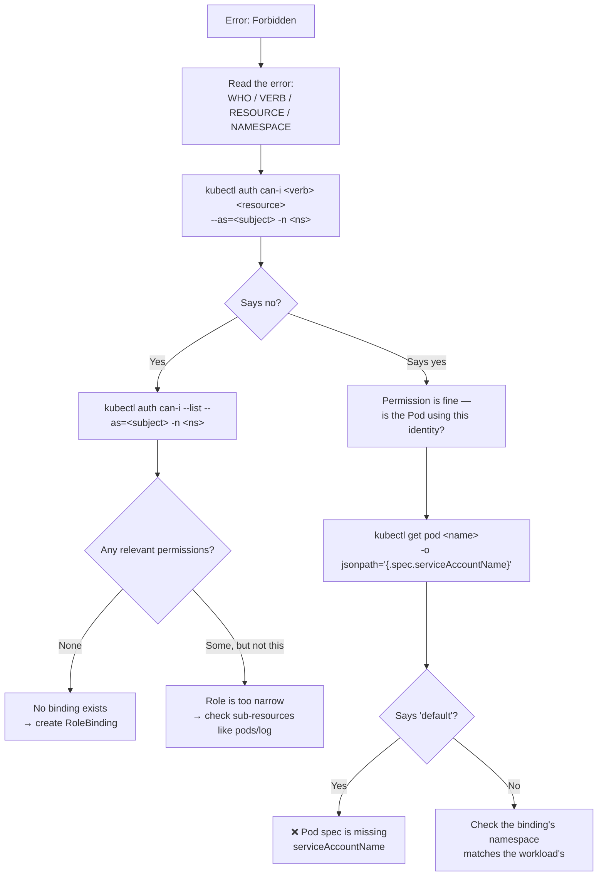

# 🔐 11 · RBAC

**RBAC answers one question: can this identity perform this action on this resource? Three objects, one binding, done.**

---

## 🧠 Mental Model

RBAC is three questions and one connector:

```text
WHO?                    CAN DO WHAT?                CONNECTED HOW?
  │                          │                            │
User                     Role                        RoleBinding
Group          +         (namespace-scoped)    +      (namespace-scoped)
ServiceAccount           ClusterRole                  ClusterRoleBinding
                         (cluster-wide)               (cluster-wide)
```

**A permission only exists when a binding joins a subject to a role.** A Role on its own grants nothing. A ServiceAccount on its own can do nothing. The binding is the permission.

### The scope grid — the part people get wrong

|  | **Role** (namespaced) | **ClusterRole** (cluster-wide) |
| --- | --- | --- |
| **RoleBinding** (in namespace X) | Permissions in namespace X | Those permissions, **but only in namespace X** ← very useful |
| **ClusterRoleBinding** | ❌ Not allowed | Permissions **everywhere** ⚠️ |

> 💡 The top-right cell is the one worth learning: **define a ClusterRole once, bind it per-namespace with RoleBindings.** That's how you give a team "admin in their own namespace" without writing the same Role fifteen times.

Two more rules that explain a lot:

- **RBAC is purely additive.** There are no deny rules. If any binding grants it, you can do it.
- **Everything is denied by default.** No matching binding means no permission.

---

## Command Syntax

```bash
kubectl auth can-i <verb> <resource> [flags]
kubectl <verb> role|rolebinding|clusterrole|clusterrolebinding|serviceaccount <name>
kubectl <verb> sa <name>          # sa = short name for serviceaccounts
```

---

## ✅ I want to know if I can do something

```bash
kubectl auth can-i <verb> <resource>
```

🟢 **Purpose:** Answers `yes` or `no`. The fastest command in this entire file, and the one you'll use most.

```bash
kubectl auth can-i create pods
kubectl auth can-i delete deployments
kubectl auth can-i get secrets -n prod
```

```bash
kubectl auth can-i '*' '*'
```

🟢 **Purpose:** "Am I cluster-admin?" A `yes` here means you can do anything to anything.

```bash
kubectl auth can-i --list
```

🟢 **Purpose:** Everything you're allowed to do in the current namespace. Excellent for orienting yourself in an unfamiliar cluster.

```bash
kubectl auth can-i --list -n <namespace>
```

🟢

```bash
kubectl auth can-i create pods --as=<username>
kubectl auth can-i get secrets --as=system:serviceaccount:<namespace>:<serviceaccount-name>
```

🔴 **Purpose:** **Impersonation.** Check permissions *as someone else* — the single best way to debug "the application says forbidden" without touching the application.

```bash
kubectl auth can-i --list --as=system:serviceaccount:prod:api-sa -n prod
```

🔴 **Purpose:** The full permission set of a workload's identity. When a Pod gets a 403 from the API, run this and the missing permission is immediately obvious.

> 💡 Impersonation itself requires permission (the `impersonate` verb). If you get `forbidden` on `--as`, that's about *your* rights, not the target's.

```bash
kubectl auth whoami
```

🟡 **Purpose:** Who does the cluster think you are? Returns your username and groups. Stable since v1.28, and surprisingly clarifying when a cloud IAM mapping isn't doing what you expected.

---

## 🔍 I want to see the RBAC objects

```bash
kubectl get serviceaccounts
kubectl get sa
```

🟢

```bash
kubectl get roles -n <namespace>
kubectl get rolebindings -n <namespace>
```

🟡 Namespaced permissions.

```bash
kubectl get clusterroles
kubectl get clusterrolebindings
```

🟡 Cluster-wide. There will be many built-ins — filter for what you created:

```bash
kubectl get clusterroles | grep -v '^system:'
```

```bash
kubectl describe role <role-name> -n <namespace>
kubectl describe clusterrole <clusterrole-name>
```

🟡 **Purpose:** Shows the rules in a readable table.

```text
PolicyRule:
  Resources   Non-Resource URLs   Resource Names   Verbs
  ---------   -----------------   --------------   -----
  pods        []                  []               [get list watch]
  pods/log    []                  []               [get]
```

```bash
kubectl describe rolebinding <rolebinding-name> -n <namespace>
```

🟡 **Purpose:** Shows which Role is bound to which subjects. This is where you confirm the connection actually exists.

```text
Role:
  Kind:  Role
  Name:  pod-reader
Subjects:
  Kind            Name      Namespace
  ----            ----      ---------
  ServiceAccount  api-sa    prod
```

### The four built-in ClusterRoles

```bash
kubectl describe clusterrole view
kubectl describe clusterrole edit
kubectl describe clusterrole admin
kubectl describe clusterrole cluster-admin
```

🟡 Use these before writing your own:

| ClusterRole | Grants |
| --- | --- |
| `view` | Read-only, **excluding Secrets** |
| `edit` | Read/write on most resources, no RBAC changes |
| `admin` | `edit` + manage Roles/RoleBindings within a namespace |
| `cluster-admin` | ⚠️ Everything, everywhere |

---

## 🚀 I want to grant permissions

### 1. Create a ServiceAccount

```bash
kubectl create serviceaccount <serviceaccount-name>
```

🟢 **Purpose:** An identity for a workload. Pods use ServiceAccounts; humans use Users (which Kubernetes itself doesn't manage — they come from your IdP or cloud IAM).

### 2. Create a Role

```bash
kubectl create role <role-name> \
  --verb=<verb>,<verb> \
  --resource=<resource>,<resource>
```

🟡

```bash
kubectl create role pod-reader --verb=get,list,watch --resource=pods,pods/log
```

```bash
kubectl create clusterrole <name> --verb=get,list --resource=nodes
```

🟡 Cluster-scoped resources (nodes, PVs, namespaces) **require** a ClusterRole.

**Restrict to specific named objects:**

```bash
kubectl create role config-reader \
  --verb=get --resource=configmaps --resource-name=app-config
```

🔴 **Purpose:** Least privilege at the object level — read *this one* ConfigMap, not all of them.

### 3. Bind them

```bash
kubectl create rolebinding <name> \
  --role=<role-name> \
  --serviceaccount=<namespace>:<serviceaccount-name>
```

🟡

```bash
kubectl create rolebinding read-pods \
  --role=pod-reader \
  --serviceaccount=prod:api-sa \
  -n prod
```

```bash
kubectl create rolebinding <name> --clusterrole=view --user=<username> -n <namespace>
```

🟡 **Purpose:** The pattern from the scope grid — a built-in ClusterRole, scoped to one namespace by a RoleBinding.

```bash
kubectl create clusterrolebinding <name> --clusterrole=<name> --user=<username>
```

🔴

> ⚠️ **Production Impact** — a ClusterRoleBinding grants the role in **every namespace, including `kube-system`**. Binding `cluster-admin` this way hands over complete control of the cluster: reading every Secret, deleting every workload, modifying RBAC itself. It is almost never what you want; a RoleBinding to a ClusterRole is.

### 4. Attach the ServiceAccount to a Pod

```yaml
spec:
  serviceAccountName: api-sa
```

```bash
kubectl get pod <pod-name> -o jsonpath='{.spec.serviceAccountName}'
```

🟡 **Purpose:** Confirm which identity a Pod is actually using. If this says `default`, your carefully-built ServiceAccount isn't being used at all — an extremely common cause of unexplained 403s.

---

## 📋 Verbs and Resources

**Verbs:**

```text
get      list     watch          ← reading
create   update   patch          ← writing
delete   deletecollection        ← removing
*                                ← all of the above ⚠️
```

Plus special ones: `impersonate`, `bind`, `escalate`, `use` (for PodSecurityPolicies / SCCs).

**Sub-resources are separate permissions** — this trips people up constantly:

```text
pods            → list and read Pod objects
pods/log        → read logs                   ← needed for kubectl logs
pods/exec       → exec into containers        ← needed for kubectl exec
pods/portforward→ port-forward
deployments/scale → scale
```

> 💡 A role with `pods: [get, list]` lets someone see Pods but **not read logs**. `kubectl logs` will fail with a confusing 403. You need `pods/log` explicitly.

```bash
kubectl api-resources -o wide
```

🟡 Shows the verbs each resource supports.

---

## 🐛 Troubleshooting

### "Error from server (Forbidden)"

The error message itself names everything you need:

```text
Error from server (Forbidden): pods is forbidden:
User "system:serviceaccount:prod:api-sa" cannot list resource "pods"
in API group "" in the namespace "prod"
       ▲                    ▲              ▲                    ▲
     WHO                  VERB          RESOURCE            NAMESPACE
```

Then work it in four commands:

```bash
kubectl auth can-i list pods --as=system:serviceaccount:prod:api-sa -n prod   # 1. confirm
kubectl auth can-i --list --as=system:serviceaccount:prod:api-sa -n prod      # 2. what CAN it do?
kubectl get rolebindings -n prod -o wide                                       # 3. what's bound?
kubectl describe rolebinding <name> -n prod                                    # 4. to what role?
```

| Symptom | Cause |
| --- | --- |
| Forbidden despite a Role existing | No RoleBinding — the Role grants nothing alone |
| Forbidden despite a RoleBinding | Binding is in the wrong namespace |
| Works in one namespace, not another | RoleBinding is namespace-scoped; you need one per namespace |
| Pod gets 403 but your user works | The Pod uses a ServiceAccount, not your identity |
| `kubectl logs` forbidden, `get pods` works | Missing the `pods/log` sub-resource |
| Everything forbidden, ServiceAccount looks right | Pod spec lacks `serviceAccountName` — it's using `default` |
| Forbidden on EKS with valid IAM | The IAM principal isn't mapped to a Kubernetes group | 

### Find every binding for a subject

```bash
kubectl get rolebindings,clusterrolebindings -A -o json | jq -r '
  .items[] | select(.subjects[]?.name == "<subject-name>") |
  "\(.kind)/\(.metadata.name) in \(.metadata.namespace // "cluster") → \(.roleRef.kind)/\(.roleRef.name)"'
```

🔴 **Purpose:** "What does this ServiceAccount actually have?" Answers it completely, across the whole cluster.

### Audit who has cluster-admin

```bash
kubectl get clusterrolebindings -o json | jq -r '
  .items[] | select(.roleRef.name == "cluster-admin") |
  "\(.metadata.name): \(.subjects // [] | map(.kind + "/" + .name) | join(", "))"'
```

🔴 **Purpose:** A genuinely valuable security check. Run it on any cluster you inherit — the answer is often longer than anyone expects.

`[EKS]` IAM-to-Kubernetes mapping:

```bash
kubectl get configmap aws-auth -n kube-system -o yaml
```

🔴 On clusters using the legacy `aws-auth` ConfigMap, this maps IAM roles to Kubernetes users and groups. Newer clusters use EKS **access entries** instead — see [16 · EKS Commands](16-eks-commands.md).

> ⚠️ **Production Impact** — a mistake in `aws-auth` can lock **every administrator** out of the cluster irrecoverably. Back it up before editing, and keep a second working session open while you test.

---

## 💡 Memory Trick

```text
WHO?            →  ServiceAccount / User / Group
CAN DO WHAT?    →  Role (namespace) / ClusterRole (cluster)
CONNECTED?      →  RoleBinding / ClusterRoleBinding
VERIFY          →  kubectl auth can-i --as=...
```

> **"A Role without a Binding is a permission nobody has."**

And the scope rule in one line:

> **Role = one namespace. ClusterRole = everywhere — unless a RoleBinding pins it to one namespace.**

---

## 🗺️ Diagram



---

## ⚠️ Common Mistakes

**Creating a Role and expecting it to work.** Without a binding it grants nothing to nobody.

**Binding in the wrong namespace.** A RoleBinding only grants within its own namespace, regardless of where the ServiceAccount lives.

**Forgetting sub-resources.** `pods` doesn't include `pods/log` or `pods/exec`. This produces the most confusing 403s in Kubernetes.

**Forgetting `serviceAccountName` in the Pod spec.** The Pod silently uses `default`, which has almost no permissions.

**Reaching for `cluster-admin` to make an error go away.** It works, and it hands over the entire cluster. Use `kubectl auth can-i --list` to find the *specific* missing permission instead.

**Using a ClusterRoleBinding when a RoleBinding would do.** ClusterRoleBinding means every namespace including `kube-system`.

**Expecting deny rules.** RBAC is additive only. To remove access you remove bindings — there is nothing to "deny".

**Creating long-lived ServiceAccount token Secrets.** Since v1.24 Pods get short-lived projected tokens automatically. A manual token Secret never expires. → [07 · ConfigMaps & Secrets](07-configmaps-and-secrets.md)

**Editing `aws-auth` without a backup.** `[EKS]` One bad edit locks everyone out.

---

## 🔗 Related

| Task | Go to |
| --- | --- |
| ServiceAccount tokens | [07 · ConfigMaps & Secrets](07-configmaps-and-secrets.md) |
| Which SA a Pod is using | [03 · Pods](03-pods.md) |
| Namespace-scoped design | [02 · Namespaces](02-namespaces.md) |
| IRSA, access entries, `aws-auth` | [16 · EKS Commands](16-eks-commands.md) |
| RBAC mind map | [RBAC Mind Map](../mindmaps/rbac-mindmap.md) |

---

## 🎯 Interview Tip

**"Explain Kubernetes RBAC."**

> Four object types in two pairs. Role and ClusterRole define *what* — a set of verbs on resources — with Role scoped to a namespace and ClusterRole cluster-wide. RoleBinding and ClusterRoleBinding attach those to subjects: users, groups, or ServiceAccounts. Nothing is permitted until a binding exists, and RBAC is purely additive — there are no deny rules.

**"What's the difference between a RoleBinding to a ClusterRole and a ClusterRoleBinding?"**
This is the question that separates people who've configured RBAC from people who've read about it. A RoleBinding referencing a ClusterRole grants those permissions **only within the RoleBinding's namespace**. A ClusterRoleBinding grants them everywhere. So you define a ClusterRole like `view` once and bind it per-namespace — which is exactly how the built-in roles are meant to be used.

**"How would you debug a Pod getting 403 from the API?"**
`kubectl auth can-i --list --as=system:serviceaccount:<ns>:<sa>` to see what that identity actually has, and `kubectl get pod -o jsonpath='{.spec.serviceAccountName}'` to confirm the Pod is even using the ServiceAccount you think it is. Mentioning that second check is worth a lot — defaulting to `default` is a very common real-world cause.

---

<!-- NAV-FOOTER -->
### 🧭 Navigation

| Previous | Up | Next |
| --- | --- | --- |
| [← 10 · Jobs & CronJobs](10-jobs-and-cronjobs.md) | [README](../README.md) | [12 · Debugging →](12-debugging.md) |
