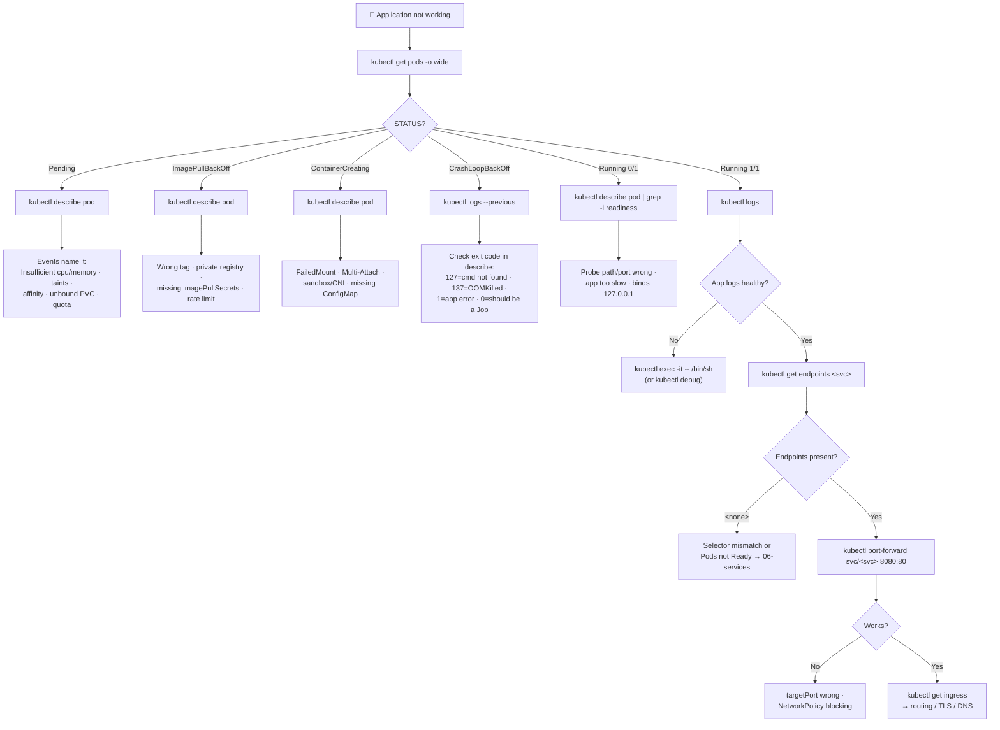

# 🐛 12 · Debugging

**The most important file in this repository. When something breaks at 2am, this is the page you open.**

---

## 🧠 Mental Model

Debugging Kubernetes is not about knowing many commands. It is about **narrowing the layer**.

```text
Is the problem...
  │
  ├── 1. THE POD?         Is it scheduled? Started? Alive? Ready?
  ├── 2. THE APP?         Is the process working correctly inside a healthy Pod?
  ├── 3. THE NETWORK?     Can traffic reach it — Service, Endpoints, Ingress, DNS?
  ├── 4. THE CONFIG?      ConfigMaps, Secrets, env, volumes
  ├── 5. THE RESOURCES?   CPU, memory, quota, node capacity
  └── 6. THE PERMISSIONS? RBAC
```

Each layer has one command that either clears it or condemns it. Work top to bottom and stop when you find the break.

**The chain everything reduces to:**

```text
GET  →  DESCRIBE  →  LOGS  →  EXEC
```

> **Find it → Inspect it → Read what happened → Go inside it.**

---

## 🚨 The 60-Second Triage

Run these first. In most incidents, the answer is in one of them.

```bash
kubectl get pods -A -o wide | grep -Ev 'Running|Completed'
```

🟢 **Purpose:** Everything unhealthy in the whole cluster, on one screen. The best opening command there is.

```bash
kubectl get events -A --sort-by=.lastTimestamp | tail -30
```

🟢 **Purpose:** The 30 most recent things Kubernetes did or failed to do, cluster-wide.

> 💡 Events are **retained for one hour by default**. If a Pod failed three hours ago, its events are gone — which is why `describe` on a long-broken Pod can look mysteriously empty.

```bash
kubectl get nodes
```

🟢 **Purpose:** If a node is `NotReady`, everything on it is your problem and nothing else matters yet.

```bash
kubectl top nodes
```

🟡 `[needs Metrics Server]` **Purpose:** Is a node out of CPU or memory?

---

## 🔍 Step 1 — What state is the Pod in?

```bash
kubectl get pods
```

The `STATUS` column routes you immediately:

| Status | It means | Go to |
| --- | --- | --- |
| `Pending` | Not scheduled onto a node yet | [Pending](#pending--not-scheduled) |
| `ContainerCreating` | Scheduled, still setting up | [ContainerCreating](#containercreating--stuck-starting) |
| `ImagePullBackOff` / `ErrImagePull` | Can't fetch the image | [Image pull](#imagepullbackoff--errimagepull) |
| `CrashLoopBackOff` | Starts, dies, repeat | [CrashLoop](#crashloopbackoff--starts-then-dies) |
| `Running` but `0/1` | Started, readiness probe failing | [Not Ready](#running-but-not-ready) |
| `Running` `1/1` but broken | The Pod is fine — look at network or app | [Step 3](#-step-3--is-the-network-the-problem) |
| `OOMKilled` | Exceeded its memory limit | [OOMKilled](#oomkilled) |
| `Error` / `Completed` | Container exited | Check `logs --previous` |
| `Evicted` | Node ran out of resources | [Evicted](#evicted) |
| `Terminating` (stuck) | Finalizer or slow shutdown | [Terminating](#terminating-forever) |

Full reference table with causes: **[Failure States](../quick-reference/failure-states.md)**

---

## 🔍 Step 2 — Why?

### The four commands, in order

```bash
kubectl describe pod <pod-name>
```

🟢 **Read it bottom-up.** The `Events` section at the end states the problem in English. Above it, `Last State` tells you how the previous container died and with what exit code.

```bash
kubectl logs <pod-name>
kubectl logs <pod-name> --previous
```

🟢 The second one is the important one for crashes — the current container may have just started and printed nothing.

```bash
kubectl exec -it <pod-name> -- /bin/sh
```

🟢 Only useful once the container stays up.

```bash
kubectl get events --field-selector involvedObject.name=<pod-name> --sort-by=.lastTimestamp
```

🟡 Every event for one specific object, oldest first.

---

### `Pending` — not scheduled

The scheduler couldn't place it. `describe` tells you exactly why.

```bash
kubectl describe pod <pod-name> | grep -A10 Events
```

| Event text contains | Cause | Next command |
| --- | --- | --- |
| `Insufficient cpu` / `Insufficient memory` | No node has room | `kubectl describe node <node>` — check Allocated resources |
| `node(s) had untolerated taint` | Taints exclude every node | `kubectl describe node <node> \| grep -i taint` |
| `didn't match Pod's node affinity/selector` | `nodeSelector` matches no node | `kubectl get nodes --show-labels` |
| `pod has unbound immediate PersistentVolumeClaims` | PVC isn't Bound | `kubectl describe pvc <claim>` |
| `node(s) had volume node affinity conflict` | Volume is in another AZ | `kubectl describe pv <pv>` |
| `exceeded quota` | Namespace ResourceQuota | `kubectl describe resourcequota -n <ns>` |
| `0/3 nodes are available` + nothing else | Often cordoned nodes | `kubectl get nodes` — look for `SchedulingDisabled` |

```bash
kubectl describe node <node-name> | grep -A8 "Allocated resources"
```

🟡 **Purpose:** Shows how much CPU/memory is already **requested** on that node. Scheduling is decided on *requests*, not actual usage — a node at 15% real CPU can still be unschedulable if requests are fully committed.

---

### `ImagePullBackOff` / `ErrImagePull`

```bash
kubectl describe pod <pod-name> | grep -A5 Events
```

| Event | Cause | Fix |
| --- | --- | --- |
| `manifest for X not found` | Tag doesn't exist — usually a typo | Check the tag in your registry |
| `pull access denied` / `unauthorized` | Private registry, no credentials | Create and reference an `imagePullSecrets` |
| `no such host` | Registry hostname wrong or DNS broken | Check the image reference |
| `too many requests` | Docker Hub rate limit | Authenticate, or mirror the image |
| `x509: certificate signed by unknown authority` | Private registry with a self-signed cert | Trust the CA on the nodes |

```bash
kubectl get pod <pod-name> -o jsonpath='{.spec.containers[*].image}'
```

🟢 **Purpose:** Print the exact image string. Read it character by character — the fault is usually right there.

```bash
kubectl get pod <pod-name> -o jsonpath='{.spec.imagePullSecrets}'
```

🟡 Is a pull secret even referenced? → [07 · ConfigMaps & Secrets](07-configmaps-and-secrets.md)

---

### `CrashLoopBackOff` — starts, then dies

**This is not a Kubernetes error.** It means your container keeps exiting, and Kubernetes keeps restarting it with increasing backoff (10s, 20s, 40s… capped at 5 minutes).

```bash
kubectl logs <pod-name> --previous      # ← 90% of the time, the answer is here
```

🟡 **The most valuable command in this file.**

```bash
kubectl describe pod <pod-name> | grep -A10 "Last State"
```

🟡 **Purpose:** How it died.

```text
Last State:     Terminated
  Reason:       Error
  Exit Code:    1
```

**Exit codes worth knowing:**

| Code | Means |
| --- | --- |
| `0` | Exited cleanly — should this be a Job rather than a Deployment? |
| `1` | Generic application error — read the logs |
| `126` | Command found but not executable |
| `127` | **Command not found** — bad `command`/`args`, or a wrong image |
| `137` | SIGKILL — almost always **OOMKilled**, check `Reason` |
| `139` | SIGSEGV — segfault |
| `143` | SIGTERM — terminated gracefully |

**Common causes, in rough order of frequency:**

1. Missing or wrong environment variable / config
2. Can't reach a dependency (database, API) at startup
3. Memory limit too low → `OOMKilled`
4. Wrong `command` / `args` → exit 127
5. Failing **liveness** probe restarting a healthy-but-slow app
6. A one-shot task deployed as a Deployment → exit 0, restarted forever

```bash
kubectl get pod <pod-name> -o jsonpath='{.spec.containers[0].livenessProbe}'
```

🟡 **Purpose:** If the app is slow to boot and `initialDelaySeconds` is short, the liveness probe kills it before it ever becomes ready — an infinite loop that looks exactly like an app bug. Use a `startupProbe` for slow starters.

---

### `Running` but not Ready

`READY 0/1` with `STATUS Running` means the process started but the **readiness probe** is failing. Kubernetes deliberately keeps it out of Service endpoints.

```bash
kubectl describe pod <pod-name> | grep -A5 -i readiness
kubectl describe pod <pod-name> | grep -i unhealthy
```

🟢 The events name the probe and the response it got.

```bash
kubectl exec <pod-name> -- wget -qO- http://localhost:8080/healthz
```

🟡 **Purpose:** Run the probe's own check from inside the container. If this works and the probe fails, the probe's port or path is misconfigured.

| Cause | Check |
| --- | --- |
| Wrong path or port in the probe | `kubectl get pod <name> -o yaml \| grep -A8 readinessProbe` |
| App slower to start than `initialDelaySeconds` | Increase it, or add a `startupProbe` |
| Health endpoint depends on a broken dependency | `kubectl logs <pod-name>` |
| App binds `127.0.0.1` not `0.0.0.0` | `kubectl exec <pod> -- netstat -tlnp` |

---

### `OOMKilled`

```bash
kubectl describe pod <pod-name> | grep -B2 -A5 "Last State"
```

```text
Last State:     Terminated
  Reason:       OOMKilled
  Exit Code:    137
```

```bash
kubectl get pod <pod-name> -o jsonpath='{.spec.containers[*].resources}'
kubectl top pod <pod-name> --containers
```

🟡 `[needs Metrics Server]` Compare the limit against actual usage.

The container exceeded its **memory limit** and the kernel killed it. Either raise the limit, or fix the leak. → [13 · Resource Management](13-resource-management.md)

> 💡 A JVM or Node.js app that ignores cgroup limits will happily try to use more than its limit. Set the runtime's own heap ceiling below the container limit.

---

### `ContainerCreating` — stuck starting

```bash
kubectl describe pod <pod-name> | grep -A10 Events
```

| Event | Cause |
| --- | --- |
| `FailedMount` / `timeout expired waiting for volumes` | Storage — see [08 · Storage](08-storage.md) |
| `Multi-Attach error for volume` | RWO volume still attached elsewhere |
| `failed to create pod sandbox` | CNI problem — check the network DaemonSet |
| `CreateContainerConfigError` | Missing ConfigMap/Secret or key |
| `secret "x" not found` | Referenced Secret doesn't exist in this namespace |

---

### `Evicted`

The node ran out of memory or disk, and the kubelet started evicting Pods to recover.

```bash
kubectl get pods -A --field-selector status.phase=Failed
kubectl describe pod <pod-name> | grep -i message
kubectl describe node <node-name> | grep -A5 Conditions
```

🟡 Look for `MemoryPressure` or `DiskPressure` on the node.

```bash
kubectl delete pods -A --field-selector status.phase=Failed
```

🟡 Clean up the evicted husks after fixing the cause.

---

### `Terminating` forever

```bash
kubectl get pod <pod-name> -o jsonpath='{.metadata.finalizers}'
kubectl describe pod <pod-name>
```

🟡 Causes: a finalizer nothing is clearing, a `preStop` hook that never returns, a long `terminationGracePeriodSeconds`, or an unreachable node.

> ⚠️ **Production Impact** — `--grace-period=0 --force` removes the Pod from the API without confirming the containers stopped. For a StatefulSet that risks two Pods with the same identity writing to one volume — data corruption. Only use it when you have confirmed the node is genuinely gone.

---

## 🌐 Step 3 — Is the network the problem?

The Pod is `Running 1/1` and its logs look fine, but nothing can reach it.

```text
POD → SERVICE → ENDPOINTS → INGRESS → DNS
```

```bash
kubectl get endpoints <service-name>
```

🟡 **The one command that splits the problem in half.** `<none>` means the fault is upstream (labels, readiness). Populated means it's downstream (ports, policy, ingress).

```bash
kubectl port-forward pod/<pod-name> 8080:8080     # does the POD work?
kubectl port-forward svc/<service-name> 8080:80   # does the SERVICE work?
```

🟢 A bisection: if the first works and the second doesn't, it's the Service's selector or `targetPort`.

**Test from inside the cluster:**

```bash
kubectl run netshoot --rm -it --image=nicolaka/netshoot --restart=Never -- /bin/bash
```

🟡 A toolbox Pod with `dig`, `curl`, `nslookup`, `tcpdump`, and `netstat`. Inside it:

```sh
nslookup <service-name>.<namespace>.svc.cluster.local
curl -v http://<service-name>.<namespace>:80
nc -zv <pod-ip> 8080
```

Or with plain busybox if you can't pull that image:

```bash
kubectl run tmp --rm -it --image=busybox:1.36 --restart=Never -- /bin/sh
```

```bash
kubectl get netpol -A
```

🟡 **Purpose:** NetworkPolicies. A default-deny policy causes connection **timeouts** (not refusals) that look exactly like an application hang. Easy to forget it exists.

```bash
kubectl get pods -n kube-system -l k8s-app=kube-dns
kubectl logs -n kube-system -l k8s-app=kube-dns --tail=50
```

🟡 CoreDNS. If nothing resolves cluster-wide, start here.

Details → [06 · Services](06-services.md) · [09 · Ingress](09-ingress.md)

---

## ⚙️ Step 4 — Is the config the problem?

```bash
kubectl exec <pod-name> -- env | sort
```

🟢 **Purpose:** What the container *actually* received — not what the manifest says it should have.

```bash
kubectl exec <pod-name> -- ls -la /etc/config
kubectl exec <pod-name> -- cat /etc/config/<file>
```

🟢 Verify mounted config.

```bash
kubectl get configmap,secret -n <namespace>
```

🟢 Does the referenced object exist in **this** namespace?

> 💡 If you changed a ConfigMap and nothing happened, that's expected — env vars are frozen at container start. `kubectl rollout restart deployment/<name>`. → [07 · ConfigMaps & Secrets](07-configmaps-and-secrets.md)

---

## 📊 Step 5 — Is it resources?

```bash
kubectl top pods --containers
kubectl top nodes
```

🟡 `[needs Metrics Server]`

```bash
kubectl describe node <node-name> | grep -A8 "Allocated resources"
kubectl describe resourcequota -n <namespace>
```

🟡 Requests vs capacity, and namespace quotas. → [13 · Resource Management](13-resource-management.md)

---

## 🔐 Step 6 — Is it permissions?

```bash
kubectl auth can-i --list --as=system:serviceaccount:<namespace>:<sa-name> -n <namespace>
kubectl get pod <pod-name> -o jsonpath='{.spec.serviceAccountName}'
```

🔴 If an app logs 403s from the Kubernetes API, this is the pair of commands. → [11 · RBAC](11-rbac.md)

---

## 🧰 Advanced Tools

### `kubectl debug` — when there's no shell

```bash
kubectl debug -it <pod-name> --image=busybox:1.36 --target=<container-name>
```

🔴 Attaches an **ephemeral container** sharing the target's process namespace. Stable since v1.25. The answer for distroless and scratch images.

```bash
kubectl debug <pod-name> -it --image=busybox --copy-to=<debug-pod-name>
```

🔴 Works on a **copy**, leaving production untouched.

```bash
kubectl debug node/<node-name> -it --image=busybox
```

🔴 A privileged Pod on a node with its filesystem at `/host` — for debugging the node itself.

> ⚠️ **Production Impact** — node debug Pods are privileged and can read anything on that host, including other containers' data and kubelet credentials. Delete them when you're done.

### Watch things change

```bash
kubectl get pods -w
kubectl get events -w
```

🟢 Live stream. Invaluable during a rollout or while reproducing a failure.

### Compare against what you meant to deploy

```bash
kubectl diff -f deployment.yaml
```

🟡 **Purpose:** Shows exactly what `apply` would change. Answers "is what's running the same as what's in Git?" — a question that resolves a surprising number of "impossible" bugs.

### Copy files out of a Pod

```bash
kubectl cp <namespace>/<pod-name>:/path/to/file ./local-file
kubectl cp ./local-file <namespace>/<pod-name>:/path/to/file
```

🟡 Requires `tar` in the container.

### Raw API access

```bash
kubectl get --raw '/api/v1/nodes/<node-name>/proxy/stats/summary'
```

🔴 Node-level kubelet stats, including per-Pod disk usage.

---

## 🗺️ The Full Decision Tree



---

## 💡 Memory Chains

```text
POD PROBLEM          GET → DESCRIBE → LOGS → EXEC
DEPLOY PROBLEM       GET → DESCRIBE → ROLLOUT STATUS → PODS → LOGS
NETWORK PROBLEM      POD → SERVICE → ENDPOINTS → INGRESS → DNS
STORAGE PROBLEM      POD → PVC → PV → STORAGECLASS → CSI
RBAC PROBLEM         WHO → CAN-I → ROLE → BINDING
CONFIG PROBLEM       EXEC env → CONFIGMAP → SECRET → ROLLOUT RESTART
NODE PROBLEM         GET NODES → DESCRIBE NODE → CONDITIONS → TOP
```

More: **[Command Memory Chains](../quick-reference/command-patterns.md#-command-memory-chains)**

---

## ⚠️ Common Mistakes

**Forgetting `--previous` on a crash.** The current container has been alive two seconds and logged nothing.

**Not reading the Events section.** `describe` usually states the cause in plain English at the bottom. People scroll past it.

**Assuming events are still there.** They expire after ~1 hour. A Pod broken since yesterday has no events left.

**Treating `CrashLoopBackOff` as a Kubernetes error.** It's your container exiting. Kubernetes is reporting, not causing.

**Debugging the Ingress when the Service has no endpoints.** Always `kubectl get endpoints` first.

**Deleting the broken Pod before investigating.** A Deployment replaces it and the evidence is gone.

**Trusting `READY 1/1`.** It means a probe passed, not that the app is correct.

**Ignoring NetworkPolicies.** Default-deny produces silent timeouts that look like application hangs.

**Using `--force --grace-period=0` as a default.** It risks split-brain on stateful workloads.

**Comparing `kubectl top` to limits and forgetting scheduling uses *requests*.** A node with low actual usage can still be unschedulable.

---

## 🔗 Related

| Task | Go to |
| --- | --- |
| Failure state lookup table | [Failure States](../quick-reference/failure-states.md) |
| Printable decision tree | [Troubleshooting Flow](../quick-reference/troubleshooting-flow.md) |
| Pod commands in depth | [03 · Pods](03-pods.md) |
| Stuck rollouts | [04 · Deployments](04-deployments.md) |
| Service and endpoints | [06 · Services](06-services.md) |
| Volume failures | [08 · Storage](08-storage.md) |
| OOMKilled and quotas | [13 · Resource Management](13-resource-management.md) |
| Node conditions | [14 · Node Operations](14-node-operations.md) |
| Troubleshooting mind map | [Troubleshooting Mind Map](../mindmaps/troubleshooting-mindmap.md) |

---

## 🎯 Interview Tip

**"A Pod is in CrashLoopBackOff. Walk me through it."**

> First, CrashLoopBackOff isn't a Kubernetes failure — the container is exiting and Kubernetes is restarting it with backoff. So I want to know *how* it exited: `kubectl describe pod` and read `Last State` for the reason and exit code. 137 means OOMKilled, so it's a memory limit. 127 means command not found, so it's the image or the args. Otherwise it's an application error, and `kubectl logs --previous` gets me the output from the run that actually died — the current container may have logged nothing. From there it's usually missing config, an unreachable dependency at startup, or a liveness probe firing before a slow app is up.

**"How do you debug a container with no shell?"**
`kubectl debug -it <pod> --image=busybox --target=<container>` — an ephemeral container sharing the target's process namespace. Stable since v1.25, and the standard answer for distroless images.

**"Your app returns 503 through the Ingress. Where do you start?"**
`kubectl get endpoints` for the backing Service. 503 from an ingress controller almost always means no ready backends, which pushes the investigation to Pod readiness or a selector mismatch — not to the Ingress at all.

---

<!-- NAV-FOOTER -->
### 🧭 Navigation

| Previous | Up | Next |
| --- | --- | --- |
| [← 11 · RBAC](11-rbac.md) | [README](../README.md) | [13 · Resource Management →](13-resource-management.md) |
