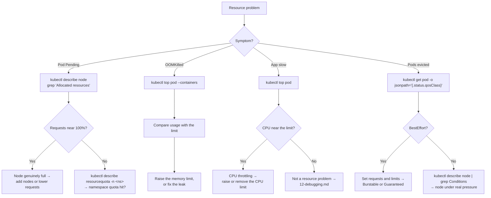

# 📊 13 · Resource Management

**Requests decide where a Pod goes. Limits decide when it dies. Getting these wrong causes most "mysterious" Kubernetes behaviour.**

---

## 🧠 Mental Model

Two numbers, two completely different jobs:

```text
REQUEST  =  what the SCHEDULER reserves     "guarantee me this much"
            → decides WHICH NODE the Pod lands on
            → the node is "full" when requests are committed, not when it's busy

LIMIT    =  the hard ceiling the KERNEL enforces
            → CPU over limit  → throttled (slowed down, stays alive)
            → RAM over limit  → OOMKilled (killed immediately)
```

> 💡 **CPU is compressible, memory is not.** Exceeding a CPU limit makes your app slow. Exceeding a memory limit makes it dead. That asymmetry drives every recommendation below.

```text
Node: 4 CPU, 16Gi
├── requests committed: 3.8 CPU  →  scheduler says FULL
└── actual usage:       0.6 CPU  →  htop says IDLE
                                     ↑
              Both true. Scheduling uses requests, never usage.
```

### Quality of Service classes

Kubernetes assigns a QoS class from your requests and limits. It decides **who gets killed first** when a node runs out of memory.

```text
Guaranteed   requests == limits, for every container      → killed LAST   🟢
Burstable    requests set, limits higher (or absent)      → killed second 🟡
BestEffort   nothing set at all                           → killed FIRST  🔴
```

```bash
kubectl get pod <pod-name> -o jsonpath='{.status.qosClass}'
```

🟡 Check any Pod's class. A production database on `BestEffort` is a bad night waiting to happen.

---

## 📈 I want to see actual usage

```bash
kubectl top nodes
```

🟡 `[needs Metrics Server]`

```text
NAME       CPU(cores)   CPU%   MEMORY(bytes)   MEMORY%
node-1     820m         20%    5120Mi          32%
node-2     3100m        77%    12000Mi         75%
```

```bash
kubectl top pods
kubectl top pods -A
kubectl top pods --containers
```

🟡 **Purpose:** `--containers` breaks a multi-container Pod down per container — essential when a sidecar is the memory hog.

```bash
kubectl top pods --sort-by=memory
kubectl top pods --sort-by=cpu
kubectl top pods -A --sort-by=memory | head -20
```

🟡 **Purpose:** The top consumers in the cluster. The first command to run when a node is under pressure.

### `kubectl top` doesn't work?

```bash
kubectl get deployment metrics-server -n kube-system
kubectl get apiservices | grep metrics
```

🟡 `error: Metrics API not available` means Metrics Server isn't installed. It is **not** part of core Kubernetes — you add it yourself (EKS/kubeadm) though AKS and GKE include it by default.

```bash
kubectl logs -n kube-system deployment/metrics-server --tail=30
```

🔴 Common failure: TLS errors against kubelets on self-managed clusters, needing `--kubelet-insecure-tls`.

> 💡 `kubectl top` shows a **point-in-time sample**, not a peak. A Pod OOMKilled by a five-second spike will look perfectly healthy here. For sizing decisions you need Prometheus history, not `top`.

---

## 🔍 I want to see what's requested and limited

```bash
kubectl describe node <node-name> | grep -A10 "Allocated resources"
```

🟡 **Purpose:** The scheduler's view of a node. This — not `top` — is what determines whether a Pod can be placed.

```text
Resource   Requests      Limits
--------   --------      ------
cpu        3800m (95%)   6000m (150%)
memory     12Gi (75%)    20Gi (125%)
```

> 💡 Limits over 100% is normal and intentional — it's overcommit. Requests over ~90% means the node is effectively full.

```bash
kubectl get pod <pod-name> -o jsonpath='{range .spec.containers[*]}{.name}{"\t"}{.resources}{"\n"}{end}'
```

🟡 What one Pod asks for.

```bash
kubectl get pods -o custom-columns=\
'NAME:.metadata.name,CPU_REQ:.spec.containers[*].resources.requests.cpu,MEM_REQ:.spec.containers[*].resources.requests.memory,MEM_LIM:.spec.containers[*].resources.limits.memory'
```

🔴 **Purpose:** Requests and limits for every Pod in the namespace, in one table. The fastest audit there is.

```bash
kubectl get pods -A -o json | jq -r '
  .items[] | select(.spec.containers[].resources.requests == null) |
  "\(.metadata.namespace)/\(.metadata.name)"'
```

🔴 **Purpose:** Every Pod with **no resource requests at all** — i.e. every `BestEffort` Pod. These are your first eviction casualties and your scheduling blind spots.

---

## 🚀 I want to set resources

```yaml
resources:
  requests:
    cpu: "250m"        # 250 millicores = 0.25 of a core
    memory: "256Mi"
  limits:
    cpu: "1000m"       # 1 core
    memory: "512Mi"
```

```bash
kubectl set resources deployment/<deployment-name> \
  -c=<container-name> \
  --requests=cpu=250m,memory=256Mi \
  --limits=cpu=1,memory=512Mi
```

🟡 **Purpose:** Sets them imperatively and triggers a rollout.

> ⚠️ **Production Impact** — changing resources changes the Pod template, so **every Pod is replaced**. Lowering a memory limit below actual usage causes an immediate OOMKill loop across all replicas. Check current usage first: `kubectl top pods --containers`.

**Units, precisely:**

```text
CPU:     1 = 1 core = 1000m        500m = half a core
MEMORY:  Mi = mebibyte (1024²)     M = megabyte (1000²)
         Gi = gibibyte             G = gigabyte
```

> 💡 Use `Mi`/`Gi`, not `M`/`G`. `512M` is about 488Mi — a 5% shortfall that becomes an OOMKill at exactly the wrong moment.

### The sizing guidance that actually matters

| | Recommendation | Why |
| --- | --- | --- |
| **Memory request** | ≈ steady-state usage | Scheduler needs a truthful number |
| **Memory limit** | request × 1.2–1.5, and **set it** | Unset means it can consume the node |
| **CPU request** | ≈ average usage | Guarantees a share under contention |
| **CPU limit** | ⚠️ often better left unset | Throttling hurts latency badly |

> 💡 **Always set a memory limit; think hard before setting a CPU limit.** A container without a memory limit can take down an entire node. A CPU limit, by contrast, throttles your app in 100ms windows even when the node is idle — a well-documented source of latency spikes in latency-sensitive services. Set CPU *requests* to guarantee a share, and leave limits off unless you specifically need to cap a noisy neighbour.

> 💡 For memory, prefer **`requests == limits`** on anything important. That's the `Guaranteed` QoS class, and it means your Pod is the last thing evicted under node pressure.

---

## 📏 Namespace-level controls

### ResourceQuota — a hard cap for the whole namespace

```bash
kubectl get resourcequota -n <namespace>
kubectl describe resourcequota -n <namespace>
```

🟡

```text
Name:            team-quota
Resource         Used    Hard
--------         ----    ----
limits.memory    14Gi    16Gi
requests.cpu     3500m   4
pods             18      20
```

```bash
kubectl create quota <name> \
  --hard=cpu=4,memory=16Gi,pods=20 \
  -n <namespace>
```

🔴

> ⚠️ **Production Impact** — once a ResourceQuota exists that limits `requests.cpu` or `requests.memory`, **every Pod in that namespace must declare those values** or it will be rejected at admission. Adding a quota to a namespace full of Pods with no resources set will break the next deployment of every one of them, with the failure appearing on the ReplicaSet rather than the Deployment.

**When a quota is hit,** the Deployment updates fine but no Pods appear:

```bash
kubectl describe replicaset -n <namespace> | grep -A5 Events
```

🟡 `exceeded quota: team-quota, requested: ..., used: ..., limited: ...`

### LimitRange — defaults and bounds per Pod

```bash
kubectl get limitrange -n <namespace>
kubectl describe limitrange -n <namespace>
```

🟡 **Purpose:** Injects default requests/limits into Pods that don't specify them, and enforces min/max.

```yaml
apiVersion: v1
kind: LimitRange
metadata:
  name: defaults
spec:
  limits:
    - type: Container
      default:              # becomes the limit if unset
        cpu: 500m
        memory: 512Mi
      defaultRequest:       # becomes the request if unset
        cpu: 100m
        memory: 128Mi
      max:
        memory: 4Gi
```

> 💡 **A LimitRange is the right companion to a ResourceQuota.** The quota demands that every Pod declares resources; the LimitRange supplies sensible defaults so existing manifests don't break. Deploy them together.

---

## 📈 Horizontal Pod Autoscaler

```bash
kubectl get hpa
kubectl describe hpa <hpa-name>
```

🟡

```text
NAME   REFERENCE        TARGETS         MINPODS  MAXPODS  REPLICAS
web    Deployment/web   45%/70%         2        10       3
```

```bash
kubectl autoscale deployment <deployment-name> --min=2 --max=10 --cpu-percent=70
```

🟡 **Purpose:** Creates an HPA that scales on CPU.

> ⚠️ CPU-percentage HPAs are computed **against the CPU request**. If a Deployment has no CPU request, the HPA cannot compute a percentage and reports `<unknown>/70%` while doing nothing. This is the most common HPA failure.

```bash
kubectl get hpa <hpa-name> -o jsonpath='{.status.conditions}' | jq
```

🔴 `ScalingActive: False` with `FailedGetResourceMetric` means Metrics Server is missing or the request isn't set.

> 💡 An HPA and manual `kubectl scale` fight each other. If you scale a Deployment that has an HPA, the HPA reverts it within a minute. Check for one before scaling: `kubectl get hpa`.

---

## 🐛 Troubleshooting

| Symptom | Cause | Command |
| --- | --- | --- |
| Pod `Pending`, node looks idle | Requests committed, not usage | `kubectl describe node <n> \| grep -A10 Allocated` |
| Pod `OOMKilled` | Memory limit too low, or a leak | `kubectl describe pod \| grep -A5 "Last State"` |
| App slow, CPU nowhere near limit | CPU throttling in 100ms windows | Remove or raise the CPU limit |
| Deployment updated, no Pods appear | ResourceQuota rejection | `kubectl describe rs -n <ns>` |
| Pods evicted under load | `BestEffort` QoS killed first | `kubectl get pod -o jsonpath='{.status.qosClass}'` |
| `kubectl top` errors | Metrics Server not installed | `kubectl get deploy metrics-server -n kube-system` |
| HPA shows `<unknown>` | No CPU request, or no metrics | `kubectl describe hpa <name>` |
| HPA won't scale past a point | `maxReplicas`, or no node capacity | `kubectl describe hpa`, `kubectl get nodes` |
| Node `MemoryPressure` | Overcommitted limits | `kubectl top nodes`, `kubectl describe node` |

### The "node is full but idle" investigation

```bash
kubectl describe node <node-name> | grep -A10 "Allocated resources"   # 1. requests committed
kubectl top node <node-name>                                          # 2. actual usage
kubectl get pods -A -o wide --field-selector spec.nodeName=<node-name> # 3. who's on it
```

🟡 A large gap between the two means Pods are over-requesting. That's wasted money and unnecessary nodes — the most common cost problem in Kubernetes.

---

## 💡 Memory Trick

```text
REQUEST  →  where it goes    (scheduler)
LIMIT    →  when it dies     (kernel)

CPU over limit     →  throttled  (slow)
MEMORY over limit  →  OOMKilled  (dead)
```

> **"Requests are a promise to the scheduler. Limits are a threat to your container."**

And for QoS:

> **BestEffort dies first. Guaranteed dies last. Set requests == limits on what matters.**

---

## 🗺️ Diagram



---

## ⚠️ Common Mistakes

**Setting no resources at all.** The Pod is `BestEffort`: it's evicted first, the scheduler can't place it intelligently, and one memory leak can take out a whole node.

**Setting a memory limit far above the request.** You get `Burstable` QoS and a Pod that's evicted before Guaranteed ones. For important workloads, make them equal.

**Setting CPU limits reflexively.** CPU throttling causes latency spikes even on an idle node. Set requests; think carefully before setting limits.

**Confusing `M` and `Mi`.** `512M` is roughly 488Mi. That 5% is enough to OOMKill under load.

**Reading `kubectl top` as the peak.** It's an instantaneous sample. Sizing from it misses spikes entirely.

**Adding a ResourceQuota without a LimitRange.** Every existing Pod without resources set stops deploying, and the error hides on the ReplicaSet.

**Manually scaling a Deployment that has an HPA.** Reverted within a minute.

**Creating an HPA with no CPU request on the Deployment.** It reports `<unknown>` and never scales.

**Diagnosing a `Pending` Pod with `kubectl top`.** Scheduling is about *requests*. The node can be idle and full at the same time.

---

## 🔗 Related

| Task | Go to |
| --- | --- |
| `OOMKilled` in depth | [12 · Debugging](12-debugging.md) · [Failure States](../quick-reference/failure-states.md) |
| Scaling Deployments | [04 · Deployments](04-deployments.md) |
| Namespace scoping | [02 · Namespaces](02-namespaces.md) |
| Node pressure and eviction | [14 · Node Operations](14-node-operations.md) |
| Cluster Autoscaler / Karpenter | [16 · EKS Commands](16-eks-commands.md) |
| Installing Metrics Server | [17 · Helm](17-helm-commands.md) |

---

## 🎯 Interview Tip

**"What's the difference between a request and a limit?"**

> A request is what the scheduler reserves — it decides which node the Pod fits on, and a node is considered full when requests are committed regardless of actual usage. A limit is a hard ceiling the kernel enforces at runtime. The important asymmetry is that CPU is compressible and memory isn't: exceeding a CPU limit throttles the container, exceeding a memory limit gets it OOMKilled immediately.

**"What are QoS classes and why do they matter?"**
Guaranteed when requests equal limits on every container, Burstable when requests are set but limits are higher, BestEffort when nothing is set. Under node memory pressure the kubelet evicts BestEffort first and Guaranteed last, so anything you care about should have requests equal to limits for memory.

**"Should you always set CPU limits?"**
The answer that shows real operational experience is *no*. CPU limits are enforced by CFS quota in 100ms periods, so a bursty service gets throttled even when the node is idle — a well-known cause of p99 latency spikes. Set CPU requests to guarantee a share under contention, and use limits only when you specifically need to cap a noisy neighbour. Memory limits, in contrast, should essentially always be set.

---

<!-- NAV-FOOTER -->
### 🧭 Navigation

| Previous | Up | Next |
| --- | --- | --- |
| [← 12 · Debugging](12-debugging.md) | [README](../README.md) | [14 · Node Operations →](14-node-operations.md) |
