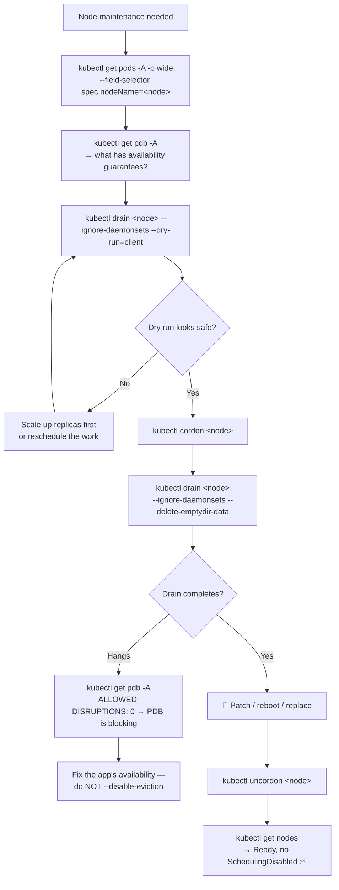

# ⚙️ 14 · Node Operations

**Everything here affects real machines and the workloads on them. This is the most operationally risky chapter in the repository — every command is 🟡 or 🔴 for a reason.**

---

## 🧠 Mental Model

Node maintenance is three verbs in a fixed order:

```text
CORDON     →  "no NEW Pods here"        (existing Pods keep running)
DRAIN      →  "move existing Pods off"  (cordons first, then evicts)
UNCORDON   →  "open for business again"
```

```text
        cordon                drain                  work                uncordon
NODE ──────────▶ Ready,   ──────────▶ Ready,     ──────────▶ patched ──────────▶ Ready
     no new pods  SchedulingDisabled   empty                                     scheduling
     existing     + workloads          + safe to                                 restored
     still run    rescheduled          reboot
```

And a fourth, different in kind:

```text
TAINT      →  "repel Pods unless they explicitly tolerate this"
```

> 💡 **Cordon is a blunt on/off switch. Taint is selective.** Cordon blocks everything; a taint blocks everything *except* Pods carrying a matching toleration. That's how you reserve GPU nodes for GPU workloads while keeping the node schedulable.

---

## Command Syntax

```bash
kubectl <verb> node <node-name> [flags]
kubectl <verb> no   <node-name> [flags]     # no = short name
```

Nodes are **cluster-scoped** — `-n` does nothing.

---

## 🔍 I want to inspect nodes

```bash
kubectl get nodes
```

🟢

```text
NAME     STATUS                     ROLES    AGE   VERSION
node-1   Ready                      <none>   45d   v1.35.1
node-2   Ready,SchedulingDisabled   <none>   45d   v1.35.1
node-3   NotReady                   <none>   45d   v1.35.1
```

`SchedulingDisabled` = cordoned. `NotReady` = the kubelet isn't reporting healthy.

```bash
kubectl get nodes -o wide
```

🟢 Adds internal/external IP, OS image, kernel, container runtime, and kubelet version — the quickest way to spot version skew across a node group.

```bash
kubectl describe node <node-name>
```

🟡 **Purpose:** The complete picture — conditions, capacity, allocated resources, taints, and every Pod on the node.

**The four sections that matter:**

```bash
kubectl describe node <node-name> | grep -A6 Conditions
```

| Condition | Healthy value | If wrong |
| --- | --- | --- |
| `Ready` | `True` | The kubelet isn't healthy — nothing schedules here |
| `MemoryPressure` | `False` | Node is low on memory; Pods will be evicted |
| `DiskPressure` | `False` | Node is low on disk; images and Pods evicted |
| `PIDPressure` | `False` | Too many processes |

```bash
kubectl describe node <node-name> | grep -A10 "Allocated resources"
kubectl describe node <node-name> | grep -i taint
kubectl describe node <node-name> | grep -A20 "Non-terminated Pods"
```

🟡 Requests committed, taints applied, and what's actually running there.

```bash
kubectl get pods -A -o wide --field-selector spec.nodeName=<node-name>
```

🟡 **Purpose:** Everything on one node, cleanly. Run this **before** any drain to know what you're about to move.

```bash
kubectl get nodes --show-labels
kubectl get nodes -l <key>=<value>
```

🟡 Labels drive `nodeSelector` and `nodeAffinity`.

```bash
kubectl top nodes
```

🟡 `[needs Metrics Server]` Actual usage — distinct from committed requests. → [13 · Resource Management](13-resource-management.md)

---

## 🚧 I want to take a node out of service

### Step 1 — Cordon

```bash
kubectl cordon <node-name>
```

🟡 **Purpose:** Marks the node unschedulable. **Running Pods are not affected** — they keep serving traffic. Only new placements are blocked.

**Use when:** A node is misbehaving and you want to stop the bleeding without disruption, or as the first half of a planned maintenance window.

> 💡 Cordon is **safe and instantly reversible**. When in doubt during an incident, cordon first and investigate after.

### Step 2 — Drain

> ⚠️ **Production Impact** — `drain` **evicts every Pod on the node**. Each one terminates and is rescheduled elsewhere, which means: a brief capacity reduction, connection resets for anything without graceful shutdown handling, and — if the rest of the cluster lacks capacity — Pods stuck `Pending` with your service degraded.
>
> Before draining anything in production:
> ```bash
> kubectl get pods -A -o wide --field-selector spec.nodeName=<node-name>   # what moves
> kubectl get pdb -A                                                        # what's protected
> kubectl get nodes                                                         # is there room elsewhere?
> ```

```bash
kubectl drain <node-name> --ignore-daemonsets
```

🔴 **Purpose:** Cordons the node, then evicts its Pods.

Breakdown:

```text
drain                → cordon + evict all Pods
--ignore-daemonsets  → don't fail on DaemonSet Pods
```

> 💡 **`--ignore-daemonsets` is required in practice, not optional.** DaemonSet Pods are immediately recreated on the same node by design, so drain refuses to proceed without this flag. Every real drain command has it.

```bash
kubectl drain <node-name> \
  --ignore-daemonsets \
  --delete-emptydir-data \
  --timeout=300s
```

🔴 The realistic production form:

```text
--delete-emptydir-data  → allow evicting Pods with emptyDir volumes
                          ⚠️ that scratch data is DESTROYED
--timeout=300s          → give up rather than hang forever
```

```bash
kubectl drain <node-name> --ignore-daemonsets --dry-run=client
```

🟡 **Purpose:** Lists what *would* be evicted, changing nothing. **Run this first, every time.**

```bash
kubectl drain <node-name> --ignore-daemonsets --force
```

🔴 **Purpose:** Also evicts unmanaged Pods — bare Pods with no controller.

> ⚠️ **Production Impact** — `--force` deletes bare Pods **permanently**. Nothing recreates them; they are simply gone. Only use it once you've confirmed with `--dry-run` that nothing irreplaceable is on that node.

### Step 3 — Do the work

Patch the OS, replace the instance, upgrade the kubelet.

### Step 4 — Uncordon

```bash
kubectl uncordon <node-name>
```

🟡 **Purpose:** Makes the node schedulable again.

> 💡 **Existing Pods do not come back.** They were rescheduled elsewhere and stay there. The node fills up again gradually as new Pods are created — or immediately, if a rebalancer like Descheduler is running.

**Verify:**

```bash
kubectl get nodes
kubectl get pods -A -o wide --field-selector spec.nodeName=<node-name>
```

---

## 🛡️ PodDisruptionBudgets — what makes drain safe

A PDB declares the minimum availability an application requires during **voluntary** disruption. `kubectl drain` respects it.

```bash
kubectl get pdb -A
kubectl describe pdb <pdb-name> -n <namespace>
```

🟡

```text
NAME      MIN AVAILABLE   ALLOWED DISRUPTIONS
web-pdb   2               1
db-pdb    2               0        ← drain will BLOCK on this
```

`ALLOWED DISRUPTIONS: 0` means evicting one more Pod would breach the budget, so drain waits — indefinitely.

```bash
kubectl create poddisruptionbudget <name> --selector=app=<label> --min-available=2
```

🟡

> 💡 **A hanging drain is usually a PDB doing its job.** Don't reach for `--disable-eviction`; find the PDB, understand why it can't allow another disruption (often the app is already degraded), and fix that. Bypassing the PDB takes the service down.

```bash
kubectl drain <node-name> --ignore-daemonsets --disable-eviction
```

🔴 **Purpose:** Deletes Pods directly, bypassing the eviction API and therefore all PDBs.

> ⚠️ **Production Impact** — this is the command that turns a maintenance window into an outage. It ignores every availability guarantee the application teams declared. Reserve it for a node that is already gone and unrecoverable.

---

## 🏷️ Taints and Tolerations

**Taint = the node repels Pods. Toleration = the Pod is allowed anyway.**

```bash
kubectl taint nodes <node-name> <key>=<value>:<effect>
```

🔴

```bash
kubectl taint nodes node-1 workload=gpu:NoSchedule
```

**The three effects:**

| Effect | Meaning |
| --- | --- |
| `NoSchedule` | New Pods without a toleration won't be placed here. Existing Pods stay. |
| `PreferNoSchedule` | Soft — the scheduler avoids it if it can |
| `NoExecute` | ⚠️ New Pods blocked **and existing Pods without a toleration are evicted immediately** |

> ⚠️ **Production Impact** — `NoExecute` evicts running Pods the moment you apply it, with no drain, no ordering, and no PDB protection. Applying a `NoExecute` taint to a busy node is effectively an instant, ungraceful drain. Use `NoSchedule` unless you specifically mean this.

**Remove a taint** (trailing `-`):

```bash
kubectl taint nodes <node-name> <key>=<value>:<effect>-
kubectl taint nodes node-1 workload=gpu:NoSchedule-
```

🔴

```bash
kubectl describe node <node-name> | grep -i taint
kubectl get nodes -o custom-columns='NAME:.metadata.name,TAINTS:.spec.taints[*].key'
```

🟡 See what's tainted across the cluster.

**The matching toleration in a Pod spec:**

```yaml
tolerations:
  - key: "workload"
    operator: "Equal"
    value: "gpu"
    effect: "NoSchedule"
```

> 💡 **A toleration permits, it does not attract.** A Pod tolerating the GPU taint *may* land on the GPU node — or on any other node. To force it there you also need a `nodeSelector` or `nodeAffinity`. Taints keep others out; affinity pulls you in. You usually need both.

**Built-in taints you'll meet:**

```text
node-role.kubernetes.io/control-plane:NoSchedule   ← why workloads avoid control-plane nodes
node.kubernetes.io/not-ready:NoExecute             ← added automatically when a node goes NotReady
node.kubernetes.io/unreachable:NoExecute           ← added when the node stops reporting
node.kubernetes.io/disk-pressure:NoSchedule
node.kubernetes.io/memory-pressure:NoSchedule
```

---

## 🏷️ Node labels

```bash
kubectl label node <node-name> <key>=<value>
kubectl label node <node-name> <key>-
```

🟡 Add and remove.

```bash
kubectl label node node-1 disktype=ssd
```

Then target it:

```yaml
nodeSelector:
  disktype: ssd
```

```bash
kubectl get nodes -L <label-key>
```

🟡 **Purpose:** Adds a column for that label — cleaner than `--show-labels` when you care about one thing.

```bash
kubectl get nodes -L topology.kubernetes.io/zone -L node.kubernetes.io/instance-type
```

🟡 `[EKS]` `[AKS]` `[GKE]` Availability zone and instance type — useful for confirming spread across zones.

---

## 🐛 Troubleshooting

### A node is `NotReady`

```bash
kubectl describe node <node-name> | grep -A10 Conditions
kubectl get pods -A -o wide --field-selector spec.nodeName=<node-name>
kubectl get events -A --sort-by=.lastTimestamp | grep <node-name>
```

| Condition / message | Cause |
| --- | --- |
| `Ready: Unknown`, `kubelet stopped posting node status` | Node unreachable — network, or the instance is gone |
| `MemoryPressure: True` | Out of memory; kubelet is evicting |
| `DiskPressure: True` | Disk full — often image sprawl or container logs |
| `NetworkUnavailable: True` | CNI plugin not working |
| `PIDPressure: True` | Process limit exhausted |

> 💡 After ~5 minutes of `NotReady`, Kubernetes applies `node.kubernetes.io/unreachable:NoExecute` and Pods are rescheduled elsewhere automatically. Often the correct action is to wait, then replace the node — not to intervene.

```bash
kubectl debug node/<node-name> -it --image=busybox
```

🔴 **Purpose:** A privileged Pod on the node with its filesystem at `/host`. For inspecting kubelet logs and disk usage when SSH isn't available.

> ⚠️ **Production Impact** — this container can read everything on the host, including other workloads' data and kubelet credentials. Delete it as soon as you're done.

### A drain won't finish

```bash
kubectl get pdb -A                                  # ALLOWED DISRUPTIONS: 0?
kubectl get pods -A -o wide --field-selector spec.nodeName=<node-name>
kubectl describe pod <stuck-pod-name>
```

| Cause | Resolution |
| --- | --- |
| PDB blocking | Scale the app up first, or fix the unhealthy replicas |
| Pod has no controller | `--force` (⚠️ deletes it permanently) |
| Pod uses `emptyDir` | `--delete-emptydir-data` (⚠️ destroys that data) |
| Evicted Pod can't reschedule | No capacity elsewhere — `kubectl get nodes`, add capacity |
| Long `terminationGracePeriodSeconds` | Wait, or use `--timeout` |

### Node disk full

```bash
kubectl describe node <node-name> | grep -i diskpressure
kubectl get pods -A -o wide --field-selector spec.nodeName=<node-name>
```

🟡 Usually accumulated container images or unrotated logs. The kubelet garbage-collects images under pressure, but a node with many large images can outrun it.

---

## 💡 Memory Trick

```text
CORDON    →  stop NEW pods            (safe, reversible)
DRAIN     →  move EXISTING pods away  (disruptive)
UNCORDON  →  allow scheduling again   (safe)

TAINT     →  repel pods unless tolerated
```

> **"Cordon is a closed sign. Drain empties the building. Uncordon reopens. Taint is a bouncer with a guest list."**

The maintenance sequence, memorised:

```text
cordon → drain → patch → uncordon → verify
```

---

## 🗺️ Diagram



---

## ⚠️ Common Mistakes

**Draining without checking what's on the node.** Always `--dry-run=client` and list the Pods first.

**Forgetting `--ignore-daemonsets`.** The drain refuses to start and the error isn't obvious.

**Using `--force` casually.** It permanently deletes bare Pods. Nothing brings them back.

**Using `--disable-eviction` to unstick a drain.** You're overriding availability guarantees the application team deliberately set.

**Using `--delete-emptydir-data` without knowing what's in the emptyDirs.** That scratch data is destroyed.

**Applying a `NoExecute` taint on a live node.** Every non-tolerating Pod is evicted immediately, with no graceful drain and no PDB protection.

**Expecting Pods to return after `uncordon`.** They don't. The node refills gradually with new Pods.

**Forgetting to uncordon.** The node sits idle and you're paying for it. Audit with `kubectl get nodes | grep SchedulingDisabled`.

**Assuming a toleration schedules a Pod onto a node.** It only *permits*. Pair it with `nodeSelector` or `nodeAffinity`.

**Draining several nodes at once.** Especially with a cluster autoscaler in play, you can evict more than the remaining capacity can hold.

---

## 🔗 Related

| Task | Go to |
| --- | --- |
| Cluster and node inspection | [01 · Cluster & Context](01-cluster-and-context.md) |
| Why DaemonSets survive drain | [05 · Other Workloads](05-replicasets-and-other-workloads.md) |
| Node pressure and eviction | [13 · Resource Management](13-resource-management.md) |
| `Pending` from taints | [12 · Debugging](12-debugging.md) |
| Managed node groups, Karpenter | [16 · EKS Commands](16-eks-commands.md) |
| Cluster admin mind map | [Cluster Admin Mind Map](../mindmaps/cluster-admin-mindmap.md) |

---

## 🎯 Interview Tip

**"Walk me through patching a node in production."**

> Check what's running on it and what PodDisruptionBudgets apply, then `kubectl drain --dry-run=client` to see what would move. Confirm the rest of the cluster has capacity to absorb it. Then cordon, drain with `--ignore-daemonsets`, do the work, and uncordon. If the drain hangs, that's usually a PDB refusing further disruption — which means the application isn't in a state where it can lose another replica, and the right response is to fix that rather than bypass the budget.

**"Cordon vs drain vs taint?"**
Cordon stops new scheduling but leaves running Pods alone. Drain cordons *and* evicts. Taint is selective rather than blanket — it repels Pods that don't carry a matching toleration, which is how you dedicate nodes to specific workloads.

**"What's the difference between NoSchedule and NoExecute?"**
`NoSchedule` affects only new placements; existing Pods stay. `NoExecute` also evicts running Pods that don't tolerate it — immediately, with no PDB protection. It's what Kubernetes itself applies when a node goes unreachable, and it's why Pods migrate off a failed node automatically.

---

<!-- NAV-FOOTER -->
### 🧭 Navigation

| Previous | Up | Next |
| --- | --- | --- |
| [← 13 · Resource Management](13-resource-management.md) | [README](../README.md) | [15 · kubectl Productivity →](15-kubectl-productivity.md) |
