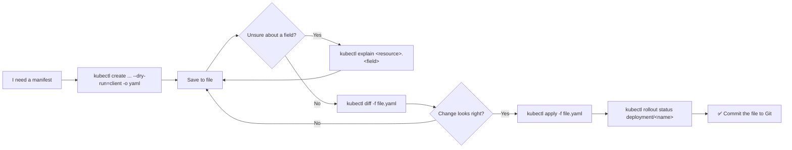

# ⚡ 15 · kubectl Productivity

**The commands that stop you writing YAML by hand, guessing at field names, and deploying changes you haven't seen.**

---

## 🧠 Mental Model

Four tools turn kubectl from a query language into a workflow:

```text
explain    →  the API docs, in your terminal      "what fields exist?"
--dry-run  →  generate YAML without creating it   "write this for me"
diff       →  preview a change before applying    "what will this actually do?"
-o          →  reshape output for humans or scripts
```

Learn these four and you stop looking things up.

---

## 📖 `kubectl explain` — documentation in the terminal

```bash
kubectl explain <resource>
kubectl explain <resource>.<field>
```

🟡 **Purpose:** Every field of every resource, including CRDs installed on *your* cluster, at the version *your* cluster runs. It cannot be out of date the way a web page can.

```bash
kubectl explain pod
kubectl explain pod.spec
kubectl explain pod.spec.containers
kubectl explain pod.spec.containers.resources
kubectl explain deployment.spec.strategy.rollingUpdate
kubectl explain ingress.spec.rules.http.paths
```

```bash
kubectl explain pod.spec --recursive
```

🟡 **Purpose:** The entire field tree at once, no descriptions. The fastest way to see a resource's whole shape.

```bash
kubectl explain deployment.spec.template.spec --recursive | head -40
```

> 💡 **This works for CRDs too.** After installing cert-manager or Argo CD, `kubectl explain certificate.spec` documents the operator's own API from the cluster. Most people never realise this.

```bash
kubectl explain <resource> --api-version=<group/version>
```

🔴 Pin to a specific API version when several are served.

---

## 🏗️ Generate YAML without writing YAML

The single biggest productivity gain in kubectl.

```bash
kubectl <create-command> --dry-run=client -o yaml
```

🟢 **Purpose:** Builds the object and prints it instead of sending it to the cluster.

```text
--dry-run=client   → build it locally, contact nothing
--dry-run=server   → send it to the API for validation, but don't persist
-o yaml            → print the result as YAML
```

**The recipes worth memorising:**

```bash
# Pod
kubectl run <pod-name> --image=<image> --dry-run=client -o yaml

# Deployment
kubectl create deployment <name> --image=<image> --replicas=3 --dry-run=client -o yaml

# Service
kubectl expose deployment <name> --port=80 --target-port=8080 --dry-run=client -o yaml

# ConfigMap
kubectl create configmap <name> --from-literal=KEY=value --dry-run=client -o yaml

# Secret
kubectl create secret generic <name> --from-literal=password=x --dry-run=client -o yaml

# Job
kubectl create job <name> --image=<image> --dry-run=client -o yaml -- <command>

# CronJob
kubectl create cronjob <name> --image=<image> --schedule="0 2 * * *" --dry-run=client -o yaml

# Ingress
kubectl create ingress <name> --class=nginx --rule="host/path=svc:80" --dry-run=client -o yaml

# Namespace
kubectl create namespace <name> --dry-run=client -o yaml

# RBAC
kubectl create role <name> --verb=get,list --resource=pods --dry-run=client -o yaml
kubectl create rolebinding <name> --role=<role> --serviceaccount=ns:sa --dry-run=client -o yaml
```

**Save it and edit:**

```bash
kubectl create deployment web --image=nginx:1.25 --replicas=3 \
  --dry-run=client -o yaml > deployment.yaml
```

> 💡 **This is how you learn manifest structure.** Rather than copying YAML from a blog and hoping the API version is current, generate a correct skeleton from your own cluster and edit it. Every file in [`examples/`](../examples/) was produced this way.

### `--dry-run=server` — validate against the real API

```bash
kubectl apply -f deployment.yaml --dry-run=server
```

🟡 **Purpose:** Sends it to the API server for full validation — including admission webhooks and defaulting — without persisting anything. Catches errors that client-side validation misses, like a policy webhook rejecting your Pod security settings.

---

## 🔍 `kubectl diff` — see the change before you make it

```bash
kubectl diff -f <file>.yaml
```

🟡 **Purpose:** Shows exactly what `kubectl apply` would change.

```diff
  spec:
    replicas: 3
    template:
      spec:
        containers:
-       - image: nginx:1.25
+       - image: nginx:1.26
```

**Use when:**
- Before any production apply — the thirty seconds this takes has prevented a lot of incidents
- Answering "is what's running the same as what's in Git?"
- Checking whether someone changed the live object by hand

```bash
kubectl diff -f ./manifests/
```

🟡 Whole directory.

> 💡 Exit code is `1` when there are differences and `0` when there are none, so it works as a drift detector in CI:
> ```bash
> kubectl diff -f ./manifests/ && echo "no drift" || echo "⚠️ drift detected"
> ```

---

## 📤 Output Formats

```bash
kubectl get pods -o wide
```

🟢 More columns — IP, node, and readiness gates.

```bash
kubectl get pod <pod-name> -o yaml
kubectl get pod <pod-name> -o json
```

🟡 The full object. `-o json` pipes into `jq`.

```bash
kubectl get pods -o name
```

🟡 **Purpose:** Just `pod/<name>` lines — designed for piping.

```bash
kubectl get pods -o name | xargs -n1 kubectl describe
```

```bash
kubectl get pods -o custom-columns='NAME:.metadata.name,STATUS:.status.phase,NODE:.spec.nodeName'
```

🟡 **Purpose:** Exactly the columns you want. More readable than jsonpath for tabular output.

```bash
kubectl get pods -o jsonpath='{.items[*].metadata.name}'
```

🔴 **Purpose:** Extract specific values. The syntax that unlocks scripting.

**JSONPath, from simple to useful:**

```bash
# one field from one object
kubectl get pod <pod-name> -o jsonpath='{.status.podIP}'

# one field from every object
kubectl get pods -o jsonpath='{.items[*].metadata.name}'

# newline-separated, one per line
kubectl get pods -o jsonpath='{range .items[*]}{.metadata.name}{"\n"}{end}'

# two fields, tab-separated
kubectl get pods -o jsonpath='{range .items[*]}{.metadata.name}{"\t"}{.status.podIP}{"\n"}{end}'

# every image running in the namespace
kubectl get pods -o jsonpath='{.items[*].spec.containers[*].image}' | tr ' ' '\n' | sort -u

# filter by a field value
kubectl get pods -o jsonpath='{.items[?(@.status.phase=="Running")].metadata.name}'
```

> 💡 `{range}...{end}` is what makes jsonpath readable. Without it everything lands on one space-separated line.

```bash
kubectl get pods --sort-by=.metadata.creationTimestamp
kubectl get pods --sort-by=.status.containerStatuses[0].restartCount
kubectl get events --sort-by=.lastTimestamp
```

🟡 **Purpose:** Sorting. The second one — sort by restart count — surfaces your flakiest Pods instantly.

More recipes: **[kubectl One-Liners](../quick-reference/kubectl-one-liners.md)**

---

## 🏷️ Labels and Selectors

```text
Labels    = tags you attach to objects
Selectors = the query language for finding them
```

```bash
kubectl get pods --show-labels
kubectl get pods -L <label-key>
```

🟢 The second adds one label as its own column — much easier to read.

```bash
kubectl get pods -l app=<value>
kubectl get pods -l 'app in (web,api)'
kubectl get pods -l 'app=web,tier!=cache'
kubectl get pods -l '!canary'
kubectl get all -l app=<value>
```

🟡 Equality, set membership, multiple conditions (AND), and "label absent".

```bash
kubectl label pod <pod-name> <key>=<value>
kubectl label pod <pod-name> <key>=<value> --overwrite
kubectl label pod <pod-name> <key>-
kubectl label pods --all <key>=<value>
```

🟡 Add, replace, remove (trailing `-`), and bulk.

```bash
kubectl annotate deployment <name> kubernetes.io/change-cause="upgrade to 1.26" --overwrite
```

🟡 **Purpose:** Populates the `CHANGE-CAUSE` column in `kubectl rollout history`. → [04 · Deployments](04-deployments.md)

> 💡 **Labels are for selecting, annotations are for storing.** If a controller or Service needs to find it, it's a label. If it's information for humans or tools, it's an annotation. Annotations can hold much larger values and aren't indexed.

---

## ⏳ `kubectl wait` — for scripts and pipelines

```bash
kubectl wait --for=condition=<condition> <resource>/<name> --timeout=<duration>
```

🟡 **Purpose:** Blocks until a condition is met, then exits. Non-zero on timeout — which is what makes it useful in CI.

```bash
kubectl wait --for=condition=ready pod/<pod-name> --timeout=120s
kubectl wait --for=condition=available deployment/<name> --timeout=300s
kubectl wait --for=condition=complete job/<job-name> --timeout=600s
kubectl wait --for=delete pod/<pod-name> --timeout=60s
kubectl wait --for=condition=ready pod -l app=<value> --timeout=180s
```

**A real deployment pipeline:**

```bash
kubectl apply -f ./manifests/
kubectl wait --for=condition=available deployment/web --timeout=300s
kubectl rollout status deployment/web --timeout=300s
```

> 💡 `kubectl wait --for=condition=available` on a Deployment and `kubectl rollout status` overlap but aren't identical: `wait` checks the Available condition; `rollout status` follows the rollout to completion and reports progress. Use `rollout status` for deploys.

---

## 🔎 Discovering the API

```bash
kubectl api-resources
```

🟡 **Purpose:** Every resource type this cluster serves — name, short name, API group, and whether it's namespaced. **The authoritative answer to "what can I `kubectl get`?"**

```bash
kubectl api-resources --namespaced=true
kubectl api-resources --namespaced=false
kubectl api-resources --api-group=apps
kubectl api-resources --verbs=list,get
kubectl api-resources -o wide
```

🟡 `-o wide` adds the supported verbs per resource — useful when writing RBAC rules.

```bash
kubectl api-versions
```

🟡 Every API group/version served. Confirms whether `networking.k8s.io/v1` or a beta version is available.

```bash
kubectl get crds
```

🟡 Custom resources installed by operators — the fastest way to learn what a cluster is actually running.

---

## 🚀 Speed

```bash
alias k=kubectl
```

🟢 *(Optional.)* Then `k get po`, `k get deploy`, `k get svc`.

**Shell completion** — the highest-value setup step:

```bash
source <(kubectl completion bash)
echo 'source <(kubectl completion bash)' >> ~/.bashrc
echo 'complete -o default -F __start_kubectl k' >> ~/.bashrc     # completion for the alias too
```

```bash
source <(kubectl completion zsh)
```

🟢 Tab-completes resource names, namespaces, and flags against the live cluster. This does more for your speed than any alias.

> 💡 **Nothing in this repository depends on aliases.** Every command is written in full so it can be copied into a script, a runbook, or a colleague's terminal without translation.

**Useful environment shortcuts:**

```bash
export KUBE_EDITOR="vim"                                  # what kubectl edit opens
export KUBECONFIG=~/.kube/config:~/.kube/other-config     # merge configs temporarily
```

**Worth installing:**

| Tool | Does |
| --- | --- |
| `kubectx` / `kubens` | Switch context and namespace in one word |
| `stern` | Tail logs from many Pods with colour |
| `k9s` | Terminal UI for the whole cluster |
| `kubectl krew` | Plugin manager for kubectl |
| `kube-ps1` | Shows the current context in your shell prompt |

> 💡 `kube-ps1` is worth it for one reason: it puts the current cluster in front of your eyes on every prompt, which is the cheapest possible defence against running a command against production.

---

## 🧪 Other useful commands

```bash
kubectl cp <namespace>/<pod-name>:/path/file ./local-file
kubectl cp ./local-file <namespace>/<pod-name>:/path/file
```

🟡 Copy in and out. Requires `tar` in the container.

```bash
kubectl apply -k ./overlays/prod/
```

🟡 Kustomize, built into kubectl. Overlays for per-environment differences without templating.

```bash
kubectl replace --force -f <file>.yaml
```

🔴 **Purpose:** Deletes and recreates the object.

> ⚠️ **Production Impact** — this is a delete followed by a create, not an update. For a Deployment that means **every Pod is destroyed at once** — a full outage, not a rolling update. It also loses anything not in your file. Use `kubectl apply` unless you are deliberately changing an immutable field and have accepted the downtime.

```bash
kubectl get pods --watch-only
kubectl get events -w
```

🟡 Stream changes only.

```bash
kubectl proxy --port=8001
```

🔴 Authenticated proxy to the API server on localhost. Useful for exploring the raw API:

```bash
curl http://localhost:8001/api/v1/namespaces/default/pods
```

```bash
kubectl get --raw '/metrics' | head -20
```

🔴 Raw API server metrics.

---

## 💡 Memory Trick

```text
Don't know the field?      →  kubectl explain
Don't want to write YAML?  →  --dry-run=client -o yaml
Don't trust the change?    →  kubectl diff
Don't know what exists?    →  kubectl api-resources
```

> **"Explain it, generate it, diff it, apply it."**

---

## 🗺️ Diagram



---

## ⚠️ Common Mistakes

**Copying YAML from the internet.** API versions change and blog posts don't. Generate it from your own cluster with `--dry-run=client -o yaml`.

**Applying to production without `kubectl diff`.** Thirty seconds that prevents outages.

**Confusing `--dry-run=client` and `--dry-run=server`.** Client-side skips admission webhooks and defaulting — it won't catch a policy rejection.

**Writing documentation that assumes `k`.** Aliases are personal; commands in runbooks should be complete.

**Using `kubectl replace --force` as a stronger `apply`.** It's a delete and recreate — instant full outage for a Deployment.

**Reaching for jsonpath when `custom-columns` is clearer.** For tabular output, `-o custom-columns` is far easier to read and maintain.

**Forgetting `{range}...{end}` in jsonpath.** Everything collapses onto one line.

**Not enabling shell completion.** It's a one-line setup that pays for itself the same day.

---

## 🔗 Related

| Task | Go to |
| --- | --- |
| One-liner recipes | [kubectl One-Liners](../quick-reference/kubectl-one-liners.md) |
| Command patterns | [Command Patterns](../quick-reference/command-patterns.md) |
| Generated example manifests | [`examples/`](../examples/) |
| Imperative vs declarative | [README](../README.md#-imperative-vs-declarative) |
| Debugging output | [12 · Debugging](12-debugging.md) |

---

## 🎯 Interview Tip

**"How do you write a manifest for something you haven't deployed before?"**

> `kubectl create <thing> --dry-run=client -o yaml` to generate a valid skeleton from the cluster itself, then `kubectl explain <resource>.<field>` for any field I'm unsure about — that's the API docs for the exact version the cluster runs, including CRDs. Then `kubectl diff` before applying, so I see the change before making it.

**"What's the difference between `create`, `apply`, and `replace`?"**
`create` fails if the object exists. `apply` does a three-way merge against the last-applied configuration, so it's idempotent and safe to re-run — the right choice for GitOps. `replace` overwrites the whole object, and `replace --force` deletes and recreates it, which for a Deployment means every Pod goes at once.

**"How would you find every image running in a cluster?"**
`kubectl get pods -A -o jsonpath='{.items[*].spec.containers[*].image}' | tr ' ' '\n' | sort -u`. It's a small thing, but being able to build that on the spot shows you actually use jsonpath rather than just knowing it exists.

---

<!-- NAV-FOOTER -->
### 🧭 Navigation

| Previous | Up | Next |
| --- | --- | --- |
| [← 14 · Node Operations](14-node-operations.md) | [README](../README.md) | [16 · EKS Commands →](16-eks-commands.md) |
