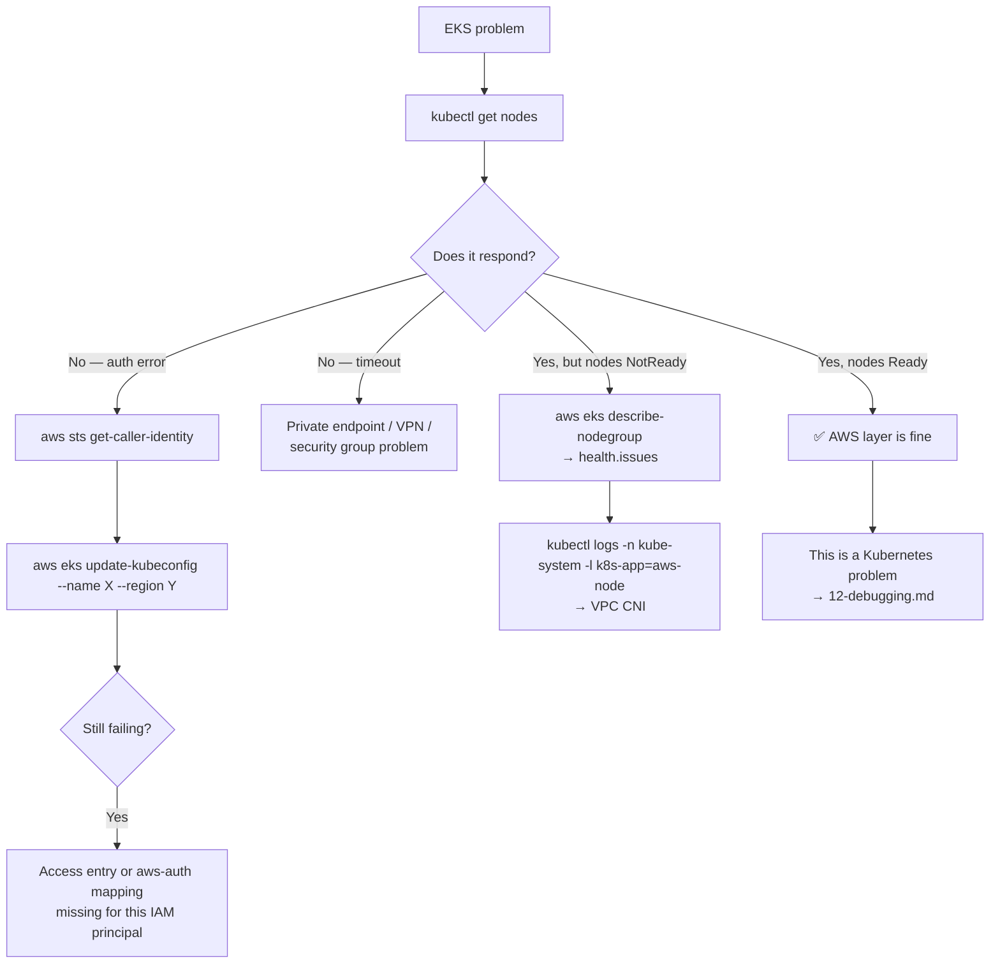

# ☁️ 16 · AWS EKS Commands

**Three different tools, three different jobs. Knowing which one owns which problem is most of EKS operations.**

---

## 🧠 Mental Model

```text
eksctl        →  CREATES and manages EKS infrastructure
                 (clusters, node groups, IRSA — it writes CloudFormation for you)

aws eks       →  talks to the AWS EKS API
                 (list, describe, update kubeconfig, manage add-ons)

kubectl       →  talks to the KUBERNETES API inside the cluster
                 (pods, deployments, services — everything in this repo's other files)
```

Drawn as layers:

```text
┌──────────────────────────────────────────────┐
│  eksctl / Terraform     → build the cluster   │  AWS layer
│  aws eks                → manage the cluster  │  (IAM, VPC, EC2)
├──────────────────────────────────────────────┤
│  kubectl                → use the cluster     │  Kubernetes layer
└──────────────────────────────────────────────┘
```

> 💡 **The dividing line is the one thing to remember.** "My node group won't scale" is an AWS problem — `aws eks` / `eksctl` / the EC2 console. "My Pod is CrashLooping" is a Kubernetes problem — `kubectl`, and nothing in this file will help. Half of all EKS confusion is people looking in the wrong layer.

---

## 🔑 Getting Connected

```bash
aws eks list-clusters --region <region>
```

🟢 **Purpose:** What clusters exist in this account and region.

```bash
aws eks describe-cluster --name <cluster-name> --region <region>
```

🟡 **Purpose:** Version, endpoint, VPC config, logging, and encryption settings.

```bash
aws eks describe-cluster --name <cluster-name> --region <region> \
  --query 'cluster.{Version:version,Status:status,Endpoint:endpoint}' --output table
```

🟡 Just the parts you usually want.

```bash
aws eks update-kubeconfig --name <cluster-name> --region <region>
```

🟢 **Purpose:** **The command you'll run most.** Writes cluster credentials into `~/.kube/config` and switches to that context.

```text
update-kubeconfig  → add/merge this cluster into ~/.kube/config
--name             → the EKS cluster name
--region           → which AWS region it's in
```

```bash
aws eks update-kubeconfig --name prod --region eu-west-1 --profile <aws-profile>
```

🟢 With a named AWS profile.

```bash
aws eks update-kubeconfig --name prod --region eu-west-1 --alias prod
```

🟡 **Purpose:** `--alias` gives the context a human name instead of the full ARN. Worth doing every time.

**Verify:**

```bash
kubectl config current-context
kubectl get nodes
aws sts get-caller-identity
```

🟢 The third one answers "which AWS identity am I actually using?" — the root cause of most EKS auth confusion.

> 💡 `update-kubeconfig` **merges**, it doesn't overwrite. Your other clusters are safe.

---

## 🔐 Access & Authentication

EKS maps **AWS IAM identities** to **Kubernetes users and groups**. Two mechanisms exist:

```text
Access Entries    ← modern (2023+), managed via the AWS API. Preferred.
aws-auth ConfigMap ← legacy, edited inside the cluster. Still very common.
```

### Access Entries (modern)

```bash
aws eks list-access-entries --cluster-name <cluster-name> --region <region>
```

🟡 **Purpose:** Which IAM principals can reach this cluster.

```bash
aws eks describe-access-entry \
  --cluster-name <cluster-name> \
  --principal-arn <iam-role-arn> \
  --region <region>
```

🟡

```bash
aws eks list-associated-access-policies \
  --cluster-name <cluster-name> \
  --principal-arn <iam-role-arn> \
  --region <region>
```

🟡 What that principal is allowed to do.

```bash
aws eks create-access-entry \
  --cluster-name <cluster-name> \
  --principal-arn <iam-role-arn> \
  --type STANDARD \
  --region <region>

aws eks associate-access-policy \
  --cluster-name <cluster-name> \
  --principal-arn <iam-role-arn> \
  --policy-arn arn:aws:eks::aws:cluster-access-policy/AmazonEKSViewPolicy \
  --access-scope type=cluster \
  --region <region>
```

🔴 **Purpose:** Grant a role access. Note the two-step shape: create the entry, then attach a policy.

> ⚠️ **Production Impact** — `AmazonEKSClusterAdminPolicy` is full cluster-admin. Prefer `AmazonEKSViewPolicy` or `AmazonEKSEditPolicy`, and scope to a namespace with `--access-scope type=namespace,namespaces=<ns>`.

### aws-auth ConfigMap (legacy)

```bash
kubectl get configmap aws-auth -n kube-system -o yaml
```

🔴 **Purpose:** The IAM → Kubernetes mapping on older clusters.

```yaml
mapRoles:
  - rolearn: arn:aws:iam::123456789012:role/EKSNodeRole
    username: system:node:{{EC2PrivateDNSName}}
    groups:
      - system:bootstrappers
      - system:nodes
```

> ⚠️ **Production Impact — this is the most dangerous object in an EKS cluster.** A malformed edit, or removing the node role entry, can lock **every human and every node** out of the cluster with no way back in short of recreating it. Before touching it:
> ```bash
> kubectl get configmap aws-auth -n kube-system -o yaml > aws-auth-backup.yaml
> ```
> Keep a second working terminal authenticated while you test. Prefer access entries if the cluster supports them.

```bash
eksctl get iamidentitymapping --cluster <cluster-name> --region <region>
```

🟡 A far safer way to *read* the same mapping.

```bash
eksctl create iamidentitymapping \
  --cluster <cluster-name> --region <region> \
  --arn <iam-role-arn> \
  --group system:masters \
  --username admin-user
```

🔴 Safer to write than editing the ConfigMap by hand — but `system:masters` is cluster-admin. Bind a narrower group.

**Debugging access:**

```bash
aws sts get-caller-identity            # who does AWS think I am?
kubectl auth whoami                    # who does Kubernetes think I am?
kubectl auth can-i '*' '*'             # what can I do?
```

🟡 Run all three when access is confusing. → [11 · RBAC](11-rbac.md)

---

## 🖥️ Node Groups

```bash
aws eks list-nodegroups --cluster-name <cluster-name> --region <region>
```

🟡

```bash
aws eks describe-nodegroup \
  --cluster-name <cluster-name> \
  --nodegroup-name <nodegroup-name> \
  --region <region>
```

🟡 **Purpose:** Instance types, scaling config, AMI version, and — importantly — `health.issues` when nodes fail to join.

```bash
eksctl get nodegroup --cluster <cluster-name> --region <region>
```

🟡 Much more readable output.

```bash
eksctl create nodegroup \
  --cluster <cluster-name> \
  --name <nodegroup-name> \
  --node-type t3.medium \
  --nodes 3 --nodes-min 2 --nodes-max 6 \
  --region <region>
```

🔴 **Purpose:** Creates a managed node group. Takes 5–15 minutes.

> ⚠️ **Production Impact** — this provisions billable EC2 instances immediately and creates CloudFormation stacks. Check your account limits and cost expectations first.

```bash
aws eks update-nodegroup-config \
  --cluster-name <cluster-name> \
  --nodegroup-name <nodegroup-name> \
  --scaling-config minSize=2,maxSize=10,desiredSize=4 \
  --region <region>
```

🔴 Resize.

```bash
eksctl delete nodegroup --cluster <cluster-name> --name <nodegroup-name> --region <region>
```

🔴 **Purpose:** Deletes the node group. eksctl **drains the nodes first** by default, respecting PodDisruptionBudgets.

> ⚠️ **Production Impact** — every workload on those nodes is evicted and must reschedule elsewhere. If the remaining node groups lack capacity, Pods sit `Pending` and your service degrades. Confirm capacity first, and never pass `--disable-eviction`. → [14 · Node Operations](14-node-operations.md)

### Upgrading

```bash
aws eks update-cluster-version \
  --name <cluster-name> --kubernetes-version <version> --region <region>
```

🔴 **Control plane first, always.**

```bash
eksctl upgrade nodegroup \
  --cluster <cluster-name> --name <nodegroup-name> \
  --kubernetes-version <version> --region <region>
```

🔴 **Then the nodes.**

> ⚠️ **Production Impact** — EKS upgrades are **one minor version at a time and irreversible**. There is no downgrade. Before upgrading, check the Kubernetes deprecation notes for removed APIs, verify your add-ons support the target version, and test on a non-production cluster. A node group upgrade rolls every instance, draining as it goes.

```bash
aws eks describe-addon-versions --kubernetes-version <version> --region <region> \
  --query 'addons[].addonName' --output table
```

🟡 Which add-on versions support the target Kubernetes version. Check this *before* upgrading.

---

## 🧩 Add-ons

EKS manages certain components for you: VPC CNI, CoreDNS, kube-proxy, EBS CSI driver, and others.

```bash
aws eks list-addons --cluster-name <cluster-name> --region <region>
```

🟡

```bash
aws eks describe-addon \
  --cluster-name <cluster-name> --addon-name <addon-name> --region <region>
```

🟡 Version, status, and the IAM role attached to it.

```bash
aws eks create-addon \
  --cluster-name <cluster-name> \
  --addon-name aws-ebs-csi-driver \
  --service-account-role-arn <iam-role-arn> \
  --region <region>
```

🔴 **Purpose:** Installs the EBS CSI driver — **required for PVCs to work** on EKS 1.23+. Its absence is the most common cause of PVCs stuck `Pending` on new clusters. → [08 · Storage](08-storage.md)

```bash
aws eks update-addon \
  --cluster-name <cluster-name> --addon-name <addon-name> \
  --addon-version <version> --resolve-conflicts PRESERVE --region <region>
```

🔴 `--resolve-conflicts PRESERVE` keeps your customisations; `OVERWRITE` discards them.

**Verify from the Kubernetes side:**

```bash
kubectl get pods -n kube-system
kubectl get daemonset -n kube-system aws-node        # VPC CNI
kubectl get deployment -n kube-system coredns
kubectl get pods -n kube-system -l app.kubernetes.io/name=aws-ebs-csi-driver
```

🟡

---

## 🎫 IRSA — IAM Roles for Service Accounts

**The correct way to give a Pod AWS permissions.** No credentials in Secrets, no node-wide IAM role shared by every Pod.

```text
ServiceAccount  ──annotated with──▶  IAM Role  ──trusts──▶  OIDC provider of the cluster
      │
      ▼
    Pod gets temporary, auto-rotated AWS credentials
```

```bash
aws eks describe-cluster --name <cluster-name> --region <region> \
  --query 'cluster.identity.oidc.issuer' --output text
```

🟡 **Purpose:** The cluster's OIDC issuer URL. IRSA requires it to be registered as an IAM identity provider.

```bash
eksctl utils associate-iam-oidc-provider \
  --cluster <cluster-name> --region <region> --approve
```

🔴 One-time setup per cluster.

```bash
eksctl create iamserviceaccount \
  --cluster <cluster-name> --region <region> \
  --namespace <namespace> \
  --name <serviceaccount-name> \
  --attach-policy-arn <policy-arn> \
  --approve
```

🔴 **Purpose:** Creates the IAM role, the trust policy, and the annotated Kubernetes ServiceAccount in one command. This is the reason most people keep eksctl installed even when the cluster is managed by Terraform.

**Verify:**

```bash
kubectl get sa <serviceaccount-name> -n <namespace> -o yaml | grep eks.amazonaws.com/role-arn
kubectl get pod <pod-name> -o jsonpath='{.spec.serviceAccountName}'
kubectl exec <pod-name> -- env | grep AWS_
```

🟡 The third command should show `AWS_ROLE_ARN` and `AWS_WEB_IDENTITY_TOKEN_FILE`. **If those aren't present, IRSA isn't working** — the Pod isn't using the annotated ServiceAccount, or the Pod predates the annotation.

> 💡 A Pod must be **recreated** after its ServiceAccount is annotated. The webhook that injects those env vars runs at Pod creation. `kubectl rollout restart deployment/<name>`.

**Common IRSA failures:**

| Symptom | Cause |
| --- | --- |
| `AccessDenied` from the AWS SDK | Trust policy doesn't match the `namespace:serviceaccount` |
| No `AWS_ROLE_ARN` env var | Pod not recreated after annotation, or wrong SA |
| `WebIdentityErr: no OIDC provider` | OIDC provider not associated with the cluster |
| Works on some Pods, not others | Different ServiceAccounts |

---

## 🌐 EKS-specific Networking & Storage

```bash
kubectl get pods -n kube-system -l k8s-app=aws-node
kubectl logs -n kube-system -l k8s-app=aws-node --tail=50
```

🔴 **VPC CNI.** On EKS, **Pods get real VPC IP addresses**, which means the number of Pods per node is bounded by the instance type's ENI limits. `Pending` Pods with "insufficient IP addresses" point here.

```bash
kubectl get nodes -o custom-columns='NAME:.metadata.name,PODS:.status.allocatable.pods'
```

🟡 Max Pods per node — often the real constraint on EKS, not CPU or memory.

```bash
kubectl logs -n kube-system -l app.kubernetes.io/name=aws-load-balancer-controller --tail=50
```

🔴 **AWS Load Balancer Controller.** Provisions ALBs from Ingresses and NLBs from LoadBalancer Services. Failures — missing subnet tags, IAM gaps, bad ACM ARNs — surface here and in `kubectl describe ingress`. → [09 · Ingress](09-ingress.md)

> 💡 Subnets must be tagged for the controller to find them: `kubernetes.io/role/elb: 1` for public, `kubernetes.io/role/internal-elb: 1` for private. Missing tags is the most common ALB provisioning failure.

```bash
kubectl get sc
kubectl get pods -n kube-system -l app=ebs-csi-controller
```

🟡 EBS volumes are **zone-bound** — a Pod can only mount one from its own AZ. Use `volumeBindingMode: WaitForFirstConsumer` (the default on the `gp3` class) so the volume is created where the Pod lands. → [08 · Storage](08-storage.md)

---

## 🏗️ Cluster Lifecycle

```bash
eksctl create cluster \
  --name <cluster-name> --region <region> \
  --version <version> \
  --nodegroup-name <nodegroup-name> \
  --node-type t3.medium --nodes 3 --nodes-min 2 --nodes-max 5 \
  --managed
```

🔴 **Purpose:** Creates a full cluster — VPC, subnets, control plane, node group. Takes **15–25 minutes**.

> ⚠️ **Production Impact** — this creates a substantial amount of billable AWS infrastructure via CloudFormation. An EKS control plane alone bills continuously whether or not you use it. For anything permanent, use Terraform so the cluster is version-controlled and reviewable; eksctl is best for learning and short-lived environments.

```bash
eksctl create cluster -f cluster.yaml
```

🔴 Config-file form — reviewable, repeatable, far better than a long flag list.

```bash
eksctl delete cluster --name <cluster-name> --region <region>
```

🔴

> ⚠️ **Production Impact** — deletes the cluster and everything in it. Load balancers and EBS volumes created *by* Kubernetes are often **not** cleaned up automatically and remain as orphaned, billable resources. Delete Kubernetes Services of type LoadBalancer and PVCs **first**, then delete the cluster:
> ```bash
> kubectl delete svc --all-namespaces --field-selector spec.type=LoadBalancer
> kubectl get pvc -A
> ```

```bash
eksctl utils describe-stacks --cluster <cluster-name> --region <region>
```

🔴 The CloudFormation stacks behind the cluster. Where you look when a delete fails halfway.

---

## 🐛 Troubleshooting

| Symptom | Layer | Command |
| --- | --- | --- |
| `You must be logged in to the server` | AWS | `aws sts get-caller-identity`, then `aws eks update-kubeconfig` |
| `error: exec plugin: executable aws not found` | Local | AWS CLI not on PATH |
| Nodes not joining the cluster | AWS | `aws eks describe-nodegroup` → `health.issues` |
| Nodes join then go `NotReady` | K8s | `kubectl logs -n kube-system -l k8s-app=aws-node` |
| PVC stuck `Pending` | AWS | Is the EBS CSI driver add-on installed? |
| Pods `Pending`, "insufficient IPs" | AWS | ENI limits for the instance type; check subnet capacity |
| Ingress gets no ALB | AWS | ALB controller logs + subnet tags |
| Pod gets `AccessDenied` from AWS | Both | IRSA — check `AWS_ROLE_ARN` in the Pod's env |
| `kubectl` works for you, not for CI | AWS | Access entry / `aws-auth` mapping for the CI role |

### The first thing to establish

```bash
kubectl get nodes
```

If this works, you're through the AWS layer and it's a Kubernetes problem — go to [12 · Debugging](12-debugging.md). If it doesn't, it's IAM, kubeconfig, or networking, and stay in this file.

---

## 💡 Memory Trick

```text
eksctl    →  BUILD it     (infrastructure)
aws eks   →  MANAGE it    (AWS API)
kubectl   →  USE it       (Kubernetes API)
```

> **"eksctl makes the cluster, aws eks describes the cluster, kubectl runs things in the cluster."**

And the daily one-liner:

```bash
aws eks update-kubeconfig --name <cluster> --region <region> --alias <short-name>
```

---

## 🗺️ Diagram



---

## ⚠️ Common Mistakes

**Debugging a Kubernetes problem with AWS tools, or vice versa.** Establish which layer you're in first: does `kubectl get nodes` work?

**Editing `aws-auth` without a backup.** One bad edit locks everyone out permanently.

**Forgetting the EBS CSI driver add-on.** On EKS 1.23+ it isn't installed by default, and every PVC hangs `Pending` with no obvious explanation.

**Not recreating Pods after annotating a ServiceAccount for IRSA.** The credentials are injected at Pod creation. Restart the Deployment.

**Deleting a cluster without cleaning up Kubernetes-created AWS resources.** Orphaned load balancers and EBS volumes keep billing.

**Ignoring ENI limits.** On EKS the Pod-per-node ceiling is usually an IP address limit, not CPU or memory.

**Attempting to skip a minor version on upgrade.** EKS allows one at a time, and there is no rollback.

**Missing subnet tags for the ALB controller.** Ingresses are created and no load balancer ever appears.

**Using node IAM roles instead of IRSA.** Every Pod on the node inherits those permissions — a serious blast-radius problem.

**Forgetting `--region`.** The AWS CLI falls back to your default region and reports the cluster doesn't exist.

---

## 🔗 Related

| Task | Go to |
| --- | --- |
| Contexts and kubeconfig | [01 · Cluster & Context](01-cluster-and-context.md) |
| Kubernetes-side RBAC | [11 · RBAC](11-rbac.md) |
| EBS, PVCs, storage classes | [08 · Storage](08-storage.md) |
| ALB Ingress | [09 · Ingress](09-ingress.md) |
| Draining nodes safely | [14 · Node Operations](14-node-operations.md) |
| Installing controllers | [17 · Helm](17-helm-commands.md) |

---

## 🎯 Interview Tip

**"What's the difference between eksctl, aws eks, and kubectl?"**

> They operate at different layers. `eksctl` provisions EKS infrastructure — it's a CloudFormation generator for clusters, node groups, and IRSA. `aws eks` is the AWS API client for managing an existing cluster: kubeconfig, add-ons, node group config, upgrades. `kubectl` talks to the Kubernetes API inside the cluster and knows nothing about AWS. The practical value is knowing which one owns a given problem — nodes not joining is an AWS-layer question, a CrashLooping Pod is a Kubernetes-layer one.

**"How do you give a Pod permission to read an S3 bucket?"**
IRSA. Associate an OIDC provider with the cluster, create an IAM role whose trust policy names the specific `namespace:serviceaccount`, annotate the ServiceAccount with the role ARN, and set `serviceAccountName` on the Pod. The Pod then receives short-lived, auto-rotated credentials via a projected token. The alternative — putting permissions on the node role — gives them to *every* Pod on that node, which is why it's the wrong answer.

**"Why might a PVC be stuck Pending on a new EKS cluster?"**
Most often because the EBS CSI driver add-on isn't installed — it stopped being in-tree from 1.23. Also worth mentioning: `WaitForFirstConsumer` binding is normal and not an error, and EBS volumes are zone-bound so a Pod in a different AZ can't mount one.

---

<!-- NAV-FOOTER -->
### 🧭 Navigation

| Previous | Up | Next |
| --- | --- | --- |
| [← 15 · kubectl Productivity](15-kubectl-productivity.md) | [README](../README.md) | [17 · Helm →](17-helm-commands.md) |
