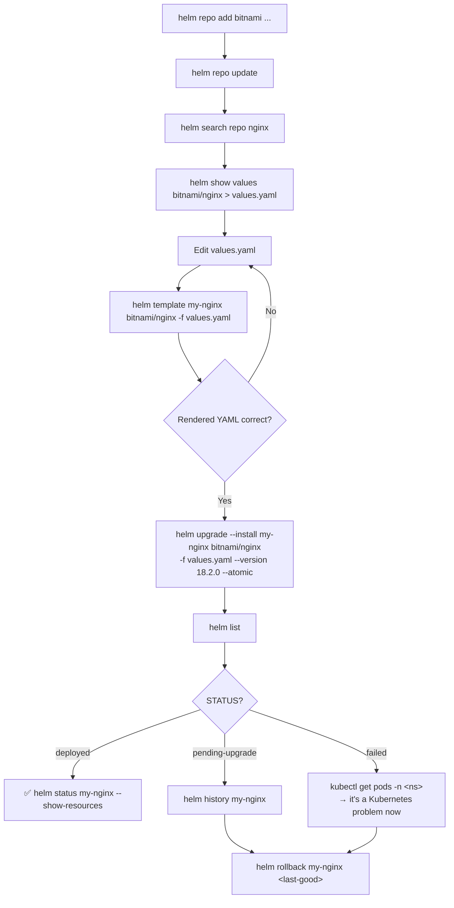

# 📦 17 · Helm

**kubectl manages Kubernetes resources. Helm manages *packages* of Kubernetes resources — and, crucially, their version history.**

---

## 🧠 Mental Model

```text
kubectl  =  manages individual Kubernetes resources
Helm     =  manages packages of them, as one versioned unit
```

The pipeline:

```text
CHART              a package: templates + default values
  +
values.yaml        your overrides for this environment
  ↓
  render
  ↓
Kubernetes YAML    plain manifests, exactly what kubectl would apply
  ↓
RELEASE            a named, versioned installation of that chart in a namespace
  ↓
Kubernetes resources
```

The four nouns, which is the vocabulary interviewers test:

```text
REPOSITORY   →  where charts are hosted           (bitnami, ingress-nginx)
CHART        →  the package itself                (nginx, postgresql)
RELEASE      →  one installation of a chart       (my-nginx in namespace web)
REVISION     →  a version of that release         (revision 1, 2, 3...)
```

> 💡 **A release is what makes Helm different from `kubectl apply -f`.** Helm records every revision, so `helm rollback` restores an entire previous state — all the resources at once. It's the rollback story that justifies the extra tooling.

**Helm 3 note:** there is no Tiller. Helm 3 talks to the Kubernetes API directly with your credentials, and stores release state in Secrets inside the release's namespace. Any tutorial mentioning Tiller is Helm 2 and obsolete.

---

## Command Syntax

```bash
helm <command> <release-name> <chart> [flags]
```

---

## 📚 Repositories

```bash
helm repo add <repo-name> <repo-url>
```

🟢

```bash
helm repo add bitnami https://charts.bitnami.com/bitnami
helm repo add ingress-nginx https://kubernetes.github.io/ingress-nginx
helm repo add prometheus-community https://prometheus-community.github.io/helm-charts
```

```bash
helm repo list
helm repo update
helm repo remove <repo-name>
```

🟢 **`helm repo update` refreshes the local index.** If `helm search` can't find a chart version you know exists, run this first — it's the answer more often than not.

```bash
helm search repo <keyword>
helm search repo <keyword> --versions
helm search hub <keyword>
```

🟢 `search repo` looks in repos you've added; `search hub` searches Artifact Hub across the internet.

---

## 🔍 Inspect Before You Install

```bash
helm show values <repo-name>/<chart-name>
```

🟢 **Purpose:** Every configurable value with its defaults. **Always run this before installing anything.** It is the chart's real documentation.

```bash
helm show values bitnami/nginx > values.yaml
```

🟢 Save it, delete what you don't need, edit the rest.

```bash
helm show chart <repo-name>/<chart-name>
helm show readme <repo-name>/<chart-name>
helm show all <repo-name>/<chart-name>
```

🟡 Metadata, README, and everything.

```bash
helm template <release-name> <repo-name>/<chart-name> -f values.yaml
```

🟡 **Purpose:** Renders the chart to plain YAML locally and prints it. **Nothing touches the cluster.**

**Use when:**
- Seeing exactly what a chart will create before trusting it
- Reviewing a third-party chart for anything unexpected
- Producing manifests for a GitOps repo
- Debugging template errors without a cluster

```bash
helm template my-nginx bitnami/nginx -f values.yaml | kubectl apply --dry-run=server -f -
```

🔴 Render *and* validate against the live API, still creating nothing. The most thorough pre-flight check available.

---

## 🚀 Install

```bash
helm install <release-name> <repo-name>/<chart-name>
```

🟢

```bash
helm install my-nginx bitnami/nginx
```

```bash
helm install <release-name> <chart> \
  --namespace <namespace> --create-namespace \
  -f values.yaml \
  --version <chart-version>
```

🟡 The realistic form:

```text
--namespace          → install here
--create-namespace   → create it if absent
-f values.yaml       → your configuration
--version            → pin the CHART version (not the app version)
```

> 💡 **Always pin `--version` in production.** Without it, Helm installs whatever the latest chart happens to be the day you run it — so the same command produces different results in staging and production. This is the single most common source of "it worked yesterday".

```bash
helm install <release-name> <chart> --set <key>=<value> --set <key>=<value>
```

🟡 Override individual values inline. Fine for one or two; use a values file beyond that.

```bash
helm install my-nginx bitnami/nginx --set replicaCount=3 --set service.type=LoadBalancer
```

> ⚠️ Values passed with `--set` exist only in your shell history. Anyone reading the cluster later has no idea why a setting is what it is. Values files are reviewable and belong in Git.

```bash
helm install <release-name> <chart> --dry-run --debug
```

🟡 **Purpose:** Renders and validates without installing, showing the computed values. Run this before any production install.

```bash
helm install <release-name> <chart> --wait --timeout 5m
```

🟡 **Purpose:** Blocks until all resources are Ready, and **rolls back automatically on timeout** if combined with `--atomic`.

```bash
helm install <release-name> <chart> --atomic --timeout 10m
```

🟡 **Purpose:** All-or-nothing. If anything fails, Helm removes what it created. Excellent for CI — you never end up in a half-installed state.

---

## 🔄 Upgrade

```bash
helm upgrade <release-name> <chart> -f values.yaml
```

🟡

```bash
helm upgrade --install <release-name> <chart> -f values.yaml \
  --namespace <namespace> --create-namespace
```

🟡 **Purpose:** Install if absent, upgrade if present. **Idempotent — this is the form to use in CI/CD**, so the same pipeline works for the first deploy and the hundredth.

```bash
helm upgrade --install my-nginx bitnami/nginx \
  --namespace web --create-namespace \
  --version 18.2.0 \
  -f values.yaml \
  --atomic --timeout 10m
```

🟡 The production-grade command, in full.

> ⚠️ **Production Impact** — `helm upgrade` without `-f` **does not keep your previous values by default**. Values reset to chart defaults, which can silently drop your replica count, resource limits, or ingress hostnames mid-upgrade. Either always pass the same values file, or use `--reuse-values`:

```bash
helm upgrade <release-name> <chart> --reuse-values --set image.tag=1.26
```

🟡 **Purpose:** Keeps the previous values and changes only what you specify.

```bash
helm upgrade <release-name> <chart> --reset-values -f values.yaml
```

🔴 Explicitly discards previous values and uses only the new file.

```bash
helm diff upgrade <release-name> <chart> -f values.yaml
```

🟡 **Purpose:** Shows what the upgrade would change. Requires the `helm-diff` plugin:

```bash
helm plugin install https://github.com/databus23/helm-diff
```

> 💡 `helm-diff` is the most worthwhile Helm plugin there is. It turns upgrades from an act of faith into a reviewable change, exactly like `kubectl diff`.

---

## 🔍 Inspect Releases

```bash
helm list
helm list -n <namespace>
helm list -A
```

🟢 **`helm list` is namespace-scoped.** A release you can't find is usually in another namespace — use `-A`.

```text
NAME       NAMESPACE  REVISION  UPDATED       STATUS     CHART         APP VERSION
my-nginx   web        3         2026-08-30    deployed   nginx-18.2.0  1.27.1
```

| `STATUS` | Means |
| --- | --- |
| `deployed` | ✅ Healthy |
| `failed` | The last operation failed |
| `pending-upgrade` | ⚠️ Stuck mid-upgrade — see troubleshooting |
| `pending-install` | Stuck mid-install |
| `superseded` | An older revision |

```bash
helm list --all
helm list --failed
helm list --pending
```

🟡 `--all` includes failed and superseded releases that `helm list` hides.

```bash
helm status <release-name>
helm status <release-name> --show-resources
```

🟡 **Purpose:** Status, notes, and — with the flag — every Kubernetes object the release owns.

```bash
helm history <release-name>
```

🟡 **Purpose:** Every revision, with status and description. **This is what you read before rolling back.**

```text
REVISION  UPDATED       STATUS      CHART         APP VERSION  DESCRIPTION
1         2026-08-01    superseded  nginx-18.0.0  1.27.0       Install complete
2         2026-08-15    superseded  nginx-18.1.0  1.27.1       Upgrade complete
3         2026-08-30    deployed    nginx-18.2.0  1.27.1       Upgrade complete
```

```bash
helm get values <release-name>
helm get values <release-name> --all
helm get values <release-name> --revision <n>
```

🟡 **Purpose:** The values a release was installed with. `--all` includes chart defaults, not just your overrides. `--revision` shows what a *previous* revision used — invaluable when working out what changed.

```bash
helm get manifest <release-name>
```

🟡 **Purpose:** The exact Kubernetes YAML currently deployed by this release. The ground truth for "what did this chart actually create?"

```bash
helm get notes <release-name>
helm get hooks <release-name>
helm get all <release-name>
```

🟡

---

## ⏪ Rollback

```bash
helm history <release-name>
helm rollback <release-name> <revision>
```

🟡

```bash
helm rollback my-nginx 2
```

```bash
helm rollback <release-name>
```

🟡 With no revision, rolls back one step.

```bash
helm rollback <release-name> <revision> --wait --timeout 5m
```

🟡

> ⚠️ **Production Impact** — rollback restores the **Kubernetes manifests** of a previous revision. It does **not** revert anything outside the cluster: database migrations, data written since, or external resources a chart hook created. Rolling an application back to a schema it no longer understands can be worse than the problem you're fixing. Know what else changed.

> 💡 A rollback creates a *new* revision. Rolling back from revision 3 to 2 produces revision 4 with revision 2's contents. Your history is append-only, which is exactly what you want during an incident.

---

## 🗑️ Uninstall

> ⚠️ **Production Impact** — `helm uninstall` deletes **every resource the release created**: Deployments, Services, ConfigMaps, Secrets, Ingresses. PVCs created by a StatefulSet's `volumeClaimTemplates` are typically **not** deleted (Helm doesn't own them) — so data often survives while everything serving it disappears. Check first:
> ```bash
> helm status <release-name> --show-resources
> kubectl get pvc -n <namespace>
> ```

```bash
helm uninstall <release-name>
helm uninstall <release-name> -n <namespace>
```

🔴

```bash
helm uninstall <release-name> --keep-history
```

🔴 **Purpose:** Removes the resources but keeps the release history, so `helm rollback` can bring it back.

```bash
helm uninstall <release-name> --dry-run
```

🟡 See what would go.

---

## 🛠️ Building Charts

```bash
helm create <chart-name>
```

🟡 Scaffolds a working chart.

```text
mychart/
├── Chart.yaml          # name, version, appVersion
├── values.yaml         # defaults
├── charts/             # dependencies
└── templates/
    ├── deployment.yaml
    ├── service.yaml
    ├── _helpers.tpl    # reusable template snippets
    └── NOTES.txt       # printed after install
```

```bash
helm lint <chart-directory>
```

🟡 Checks for structural problems. Run it in CI.

```bash
helm template <release-name> <chart-directory> --debug
```

🟡 **Purpose:** Renders your local chart. The primary way to debug template syntax — `--debug` prints the computed values alongside errors.

```bash
helm dependency update <chart-directory>
helm dependency list <chart-directory>
```

🟡 Fetches sub-charts declared in `Chart.yaml`.

```bash
helm package <chart-directory>
```

🟡 Produces a `.tgz` for publishing.

```bash
helm install <release-name> ./<chart-directory>
```

🟡 Install from a local directory.

---

## 🐛 Troubleshooting

### An install or upgrade failed

```bash
helm status <release-name>                    # 1. what does Helm think?
helm history <release-name>                   # 2. which revision failed?
kubectl get pods -n <namespace>               # 3. ← the real cause is here
kubectl describe pod <pod-name> -n <ns>
kubectl logs <pod-name> -n <ns>
```

> 💡 **Helm failures are almost always Kubernetes failures.** Helm applied the manifests successfully and the Pods didn't come up. Once `helm status` says `failed`, stop looking at Helm and start looking at Pods — the whole of [12 · Debugging](12-debugging.md) applies.

### Release stuck in `pending-upgrade`

Usually a Helm process was killed mid-operation.

```bash
helm list --pending -A
helm history <release-name>
helm rollback <release-name> <last-good-revision>
```

🔴 Rolling back to the last known-good revision clears the pending state.

> ⚠️ Some guides suggest deleting the release's Secret in `kube-system` or the release namespace. That erases Helm's record of the release while its resources keep running — leaving orphans Helm no longer manages. Roll back instead.

### `cannot re-use a name that is still in use`

```bash
helm list -A | grep <release-name>
```

🟡 The release exists, probably in a different namespace. Use `helm upgrade --install`, or uninstall first.

### Values aren't taking effect

```bash
helm get values <release-name>              # what Helm recorded
helm get values <release-name> --all        # merged with chart defaults
helm get manifest <release-name> | grep -A5 <field>   # what actually deployed
```

🟡 The usual cause is a `--set` path that doesn't match the chart's structure. Helm silently ignores values a chart never reads. Check against `helm show values`.

### `Error: UPGRADE FAILED: another operation is in progress`

Another Helm operation is running, or one died holding the lock.

```bash
helm list --pending -A
```

🟡 Wait for it, or roll back the pending release.

---

## 💡 Memory Trick

```text
REPOSITORY → CHART → RELEASE → REVISION
   where       what     yours     when
```

The daily workflow:

```text
repo add → repo update → search → show values → install → list → upgrade → rollback → uninstall
```

> **"Add the shop, find the package, read the label, install it, change it, undo it, remove it."**

And the safety rule:

> **`helm upgrade` forgets your values unless you pass them again.**

---

## 🗺️ Diagram



---

## ⚠️ Common Mistakes

**Upgrading without passing your values file.** Values reset to chart defaults and your configuration silently disappears. Use `-f` every time, or `--reuse-values`.

**Not pinning `--version`.** The chart you install today isn't the one you installed last month, and nothing records which you got.

**Using `--set` for everything.** Unreviewable, unversioned, and invisible to whoever inherits the cluster.

**Installing without `helm show values` first.** You end up with defaults you never chose — often including a `LoadBalancer` Service, which is a real cloud bill.

**Deleting the Helm release Secret to unstick a release.** It orphans every resource. Roll back instead.

**Assuming `helm uninstall` removes PVCs.** StatefulSet volumes usually survive — and keep costing money.

**Expecting `helm rollback` to revert a database migration.** It restores manifests, nothing more.

**Forgetting `helm list` is namespace-scoped.** Use `-A` when a release seems missing.

**Debugging Helm when the problem is a CrashLooping Pod.** Once the manifests are applied, it's a Kubernetes problem.

**Following a tutorial that mentions Tiller.** That's Helm 2, removed years ago.

---

## 🔗 Related

| Task | Go to |
| --- | --- |
| Debugging the Pods a chart creates | [12 · Debugging](12-debugging.md) |
| PVCs left behind after uninstall | [08 · Storage](08-storage.md) |
| Installing ingress-nginx | [09 · Ingress](09-ingress.md) |
| Installing Metrics Server | [13 · Resource Management](13-resource-management.md) |
| `kubectl diff` equivalent | [15 · Productivity](15-kubectl-productivity.md) |
| Helm mind map | [Helm Mind Map](../mindmaps/helm-mindmap.md) |

---

## 🎯 Interview Tip

**"What problem does Helm solve that `kubectl apply` doesn't?"**

> Packaging, templating, and release history. A chart bundles many related manifests as one versioned unit with configurable values, so the same package deploys to dev and prod with different settings. The part that matters operationally is the release history: Helm records every revision, so `helm rollback` restores an entire previous state atomically rather than you hunting down which of fifteen files to revert.

**"Repository vs chart vs release?"**
A repository hosts charts. A chart is the package — templates plus default values. A release is one *installation* of a chart into a namespace, with a name and a revision history. The same chart can back many releases in the same cluster.

**"How would you safely upgrade a production release?"**
`helm diff upgrade` to see the change, pin `--version` so it's reproducible, pass the same values file so nothing silently resets, and use `--atomic --timeout` so a failure rolls itself back rather than leaving a half-applied state. Then the honest caveat: rollback only restores Kubernetes manifests, so anything stateful — migrations especially — needs its own plan.

---

<!-- NAV-FOOTER -->
### 🧭 Navigation

| Previous | Up | Next |
| --- | --- | --- |
| [← 16 · EKS Commands](16-eks-commands.md) | [README](../README.md) | [Command Patterns →](../quick-reference/command-patterns.md) |
