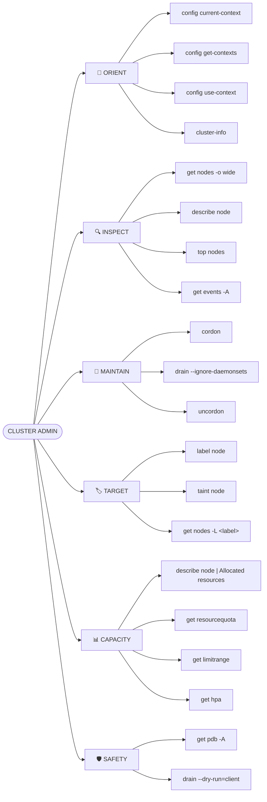
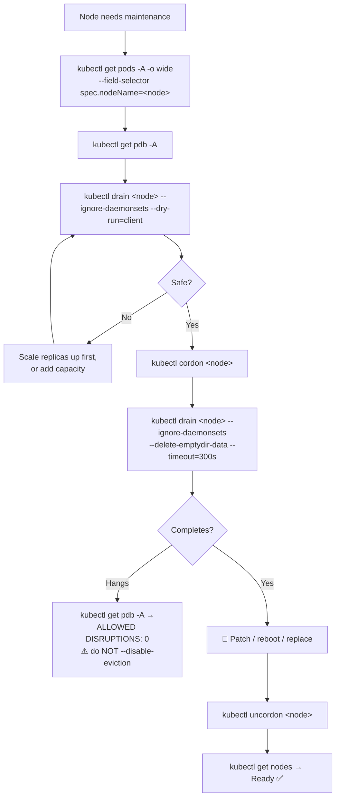

# ⚙️ Cluster Admin Mind Map

**Nodes, contexts, capacity, and maintenance — the operator's view.**

> ⚠️ Everything on this page affects real machines and running workloads. Read [14 · Node Operations](../cheatsheets/14-node-operations.md) before running any of it in production.

---

## 🗺️ The Map



---

## 🔄 The Maintenance Cycle

```text
cordon  →  drain  →  patch  →  uncordon  →  verify
```



---

## 🚦 The Three Verbs

```text
CORDON     stop NEW pods            existing keep running   🟡 safe, reversible
DRAIN      move EXISTING pods off   cordons first           🔴 disruptive
UNCORDON   allow scheduling again                           🟡 safe
```

Plus, different in kind:

```text
TAINT      repel pods unless they carry a matching toleration
           NoSchedule       → new pods blocked
           PreferNoSchedule → soft avoidance
           NoExecute        → ⚠️ evicts running pods IMMEDIATELY
```

> 💡 **Cordon is blanket, taint is selective.** Cordon blocks everything; a taint blocks everything except Pods that tolerate it.

---

## 🩺 Node Health

```bash
kubectl get nodes
kubectl describe node <node-name> | grep -A6 Conditions
```

| Condition | Healthy | If wrong |
| --- | --- | --- |
| `Ready` | `True` | kubelet unhealthy — nothing schedules here |
| `MemoryPressure` | `False` | Pods being evicted |
| `DiskPressure` | `False` | Images and Pods evicted; often log or image sprawl |
| `PIDPressure` | `False` | Process limit exhausted |
| `NetworkUnavailable` | `False` | CNI plugin broken |

**Node states in `kubectl get nodes`:**

```text
Ready                       ✅ normal
Ready,SchedulingDisabled    cordoned
NotReady                    kubelet not reporting — after ~5min, pods migrate automatically
```

---

## 📊 Capacity — requests vs usage

```bash
kubectl describe node <node-name> | grep -A10 "Allocated resources"   # scheduler's view
kubectl top node <node-name>                                          # actual usage
```

> ⚠️ **These measure different things.** Scheduling is decided on **requests**, not usage. A node at 15% real CPU can be completely unschedulable because requests are committed. A large gap between the two is over-requesting — the most common Kubernetes cost problem.

```bash
kubectl get pods -A -o wide --field-selector spec.nodeName=<node-name>   # who's on it
```

---

## 🛡️ PodDisruptionBudgets

```bash
kubectl get pdb -A
```

```text
NAME      MIN AVAILABLE   ALLOWED DISRUPTIONS
web-pdb   2               1
db-pdb    2               0     ← drain will block here
```

> 💡 **A hanging drain is usually a PDB doing its job.** Don't bypass it with `--disable-eviction` — that's how a maintenance window becomes an outage. Find out why the app can't lose another replica.

---

## 🧭 Context Safety

```bash
kubectl config current-context      # ← before ANY destructive command
kubectl config get-contexts
kubectl config use-context <name>
```

> 💡 The cheapest incident prevention available: install `kube-ps1` or configure Starship so your shell prompt always shows the current cluster.

---

## 💡 Memory Trick

```text
cordon → drain → patch → uncordon → verify
```

> **"Closed sign, empty the building, do the work, reopen, check."**

And the pre-flight rule:

> **Always `--dry-run=client` a drain. Always check `kubectl get pdb -A` first.**

---

## 🔗 Related

[14 · Node Operations](../cheatsheets/14-node-operations.md) · [01 · Cluster & Context](../cheatsheets/01-cluster-and-context.md) · [13 · Resource Management](../cheatsheets/13-resource-management.md) · [16 · EKS](../cheatsheets/16-eks-commands.md)

---

<!-- NAV-FOOTER -->
### 🧭 Navigation

| Previous | Up | Next |
| --- | --- | --- |
| [← RBAC Mind Map](rbac-mindmap.md) | [README](../README.md) | [Helm Mind Map →](helm-mindmap.md) |
