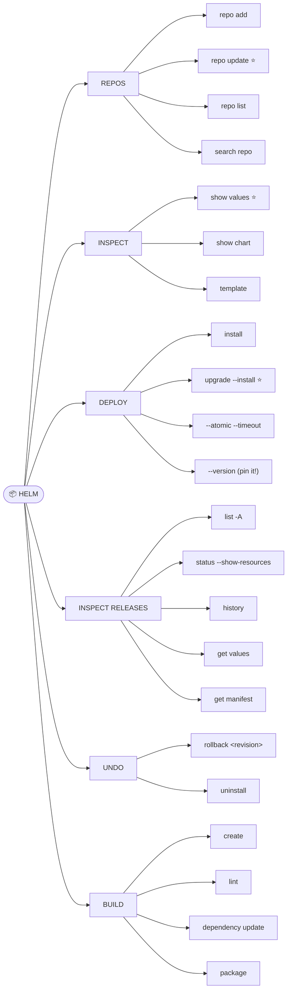
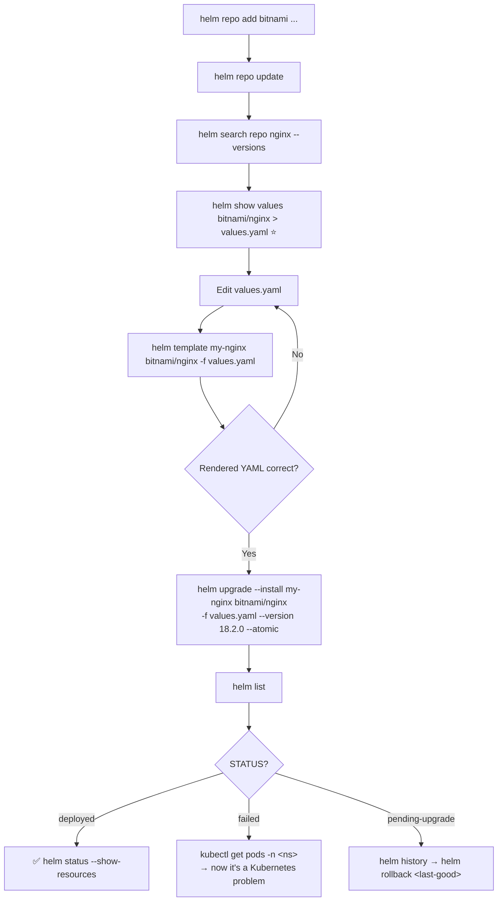

# 📦 Helm Mind Map

**Repository → Chart → Release → Revision.**

---

## 🧠 The Four Nouns

```text
REPOSITORY   where charts are hosted        bitnami, ingress-nginx
    ↓
CHART        the package itself             nginx, postgresql
    ↓
RELEASE      one installation of a chart    my-nginx in namespace web
    ↓
REVISION     a version of that release      1, 2, 3...
```

> 💡 **The release is what makes Helm more than `kubectl apply -f`.** Helm records every revision, so `helm rollback` restores an entire previous state at once.

---

## 🔄 The Rendering Pipeline

```text
CHART TEMPLATES  +  values.yaml
        ↓ render
   Kubernetes YAML        ← exactly what kubectl would apply
        ↓ apply
   RELEASE (revision N)
        ↓
   Kubernetes resources
```

```bash
helm template <release> <chart> -f values.yaml     # see the middle step, change nothing
```

---

## 🗺️ The Command Map



---

## 🌳 The Daily Workflow



> ⭐ **`helm show values` before every install.** It's the chart's real documentation, and it's where you find out the default Service type is `LoadBalancer`.

---

## ⚠️ The Three Traps

**1. Upgrade forgets your values.**

```bash
helm upgrade <release> <chart>                     # ❌ resets to chart defaults
helm upgrade <release> <chart> -f values.yaml      # ✅
helm upgrade <release> <chart> --reuse-values ...  # ✅
```

**2. Unpinned versions.**

```bash
helm install <release> <chart>                     # ❌ whatever's latest today
helm install <release> <chart> --version 18.2.0    # ✅ reproducible
```

**3. `helm list` is namespace-scoped.**

```bash
helm list        # ❌ "my release is gone"
helm list -A     # ✅ there it is
```

---

## 🚦 Release Status

| `STATUS` | Means | Action |
| --- | --- | --- |
| `deployed` | ✅ Healthy | — |
| `failed` | Last operation failed | `kubectl get pods` — it's a K8s problem now |
| `pending-upgrade` | Stuck mid-upgrade | `helm rollback <last-good>` |
| `pending-install` | Stuck mid-install | `helm uninstall`, then reinstall |
| `superseded` | An older revision | Normal in `helm history` |

> ⚠️ **Never delete the Helm release Secret to unstick a release.** It erases Helm's record while the resources keep running — orphans Helm can no longer manage. Roll back instead.

---

## 🐛 Where the Problem Actually Is

```text
helm status says "failed"
        ↓
Helm applied the manifests successfully...
        ↓
...and the Pods didn't come up.
        ↓
kubectl get pods -n <namespace>     ← the real investigation starts here
```

> 💡 **Helm failures are almost always Kubernetes failures.** Once the manifests are applied, everything in [12 · Debugging](../cheatsheets/12-debugging.md) applies.

---

## 🛡️ Safe Production Deploy

```bash
helm diff upgrade <release> <chart> -f values.yaml      # 1. see the change (plugin)
helm upgrade --install <release> <chart> \              # 2. apply it
  --namespace <ns> --create-namespace \
  --version <chart-version> \
  -f values.yaml \
  --atomic --timeout 10m
helm status <release> --show-resources                  # 3. verify
```

```text
--install    → idempotent; works for first deploy and hundredth
--version    → reproducible
-f           → your values survive
--atomic     → auto-rollback on failure
```

Install the diff plugin once:

```bash
helm plugin install https://github.com/databus23/helm-diff
```

---

## 💡 Memory Trick

```text
REPOSITORY → CHART → RELEASE → REVISION
   where      what     yours      when
```

The workflow as a sentence:

> **"Add the shop, find the package, read the label, install it, change it, undo it, remove it."**

And the rule that prevents the most incidents:

> **`helm upgrade` forgets your values unless you pass them again.**

---

## 🔗 Related

[17 · Helm](../cheatsheets/17-helm-commands.md) · [12 · Debugging](../cheatsheets/12-debugging.md) · [09 · Ingress](../cheatsheets/09-ingress.md) · [08 · Storage](../cheatsheets/08-storage.md)

---

<!-- NAV-FOOTER -->
### 🧭 Navigation

| Previous | Up | Next |
| --- | --- | --- |
| [← Cluster Admin Mind Map](cluster-admin-mindmap.md) | [README](../README.md) | [Command Patterns →](../quick-reference/command-patterns.md) |
