# 🗺️ kubectl Master Mind Map

**One page that answers: "Which kubectl command should I use?"**

Start from what you *want*, follow the branch, get the command.

---

## 🧠 Mental Model

Every kubectl command is one of five intents. Find your intent, then walk down.

```text
                              KUBECTL
                                 │
   ┌──────────┬──────────┬───────┴───────┬──────────┬──────────┐
   │          │          │               │          │          │
 SEE IT    CHANGE IT   DEBUG IT      CONNECT IT  ADMIN IT   REMOVE IT
   │          │          │               │          │          │
  get       create     logs           expose     cordon      delete
  describe  apply      exec           port-fwd   drain
  explain   edit       events         endpoints  uncordon
            patch      top            ingress    taint
            scale      debug                     top nodes
            set
            rollout
```

---

## 🌳 The Full Map

```mermaid
flowchart LR
    K(["☸️ kubectl"])

    K --> SEE["🔍 SEE SOMETHING"]
    K --> CHG["🚀 CREATE / CHANGE"]
    K --> DBG["🐛 DEBUG"]
    K --> NET["🌐 NETWORK"]
    K --> SHIP["📦 SHIP / ROLLOUT"]
    K --> SEC["🔐 AUTH"]
    K --> NODE["⚙️ NODE"]
    K --> DEL["🗑️ DELETE"]

    SEE --> S1["get<br/>list objects"]
    SEE --> S2["describe<br/>detail + events"]
    SEE --> S3["explain<br/>field docs"]
    SEE --> S4["api-resources<br/>what exists here"]

    CHG --> C1["create<br/>make it now"]
    CHG --> C2["apply -f<br/>match this file"]
    CHG --> C3["edit<br/>edit live object"]
    CHG --> C4["patch<br/>change one field"]
    CHG --> C5["scale<br/>change replicas"]
    CHG --> C6["set image<br/>change image"]

    DBG --> D1["logs<br/>what app printed"]
    DBG --> D2["exec<br/>shell inside"]
    DBG --> D3["get events<br/>what k8s did"]
    DBG --> D4["top<br/>CPU / memory"]
    DBG --> D5["debug<br/>ephemeral container"]

    NET --> N1["expose<br/>create Service"]
    NET --> N2["get svc<br/>list Services"]
    NET --> N3["get endpoints<br/>is it wired up?"]
    NET --> N4["get ingress<br/>HTTP routing"]
    NET --> N5["port-forward<br/>tunnel to laptop"]

    SHIP --> R1["rollout status<br/>did it finish?"]
    SHIP --> R2["rollout history<br/>what changed?"]
    SHIP --> R3["rollout restart<br/>recreate pods"]
    SHIP --> R4["rollout undo<br/>go back"]

    SEC --> A1["auth can-i<br/>am I allowed?"]
    SEC --> A2["get sa / roles<br/>who and what"]

    NODE --> O1["cordon<br/>no new pods"]
    NODE --> O2["drain<br/>evacuate node"]
    NODE --> O3["uncordon<br/>allow again"]
    NODE --> O4["taint<br/>repel pods"]

    DEL --> X1["delete<br/>⚠️ destroy it"]
```



---

## 📍 Branch Detail

### 🔍 SEE — "What is out there?"

| Question | Command | Level |
| --- | --- | --- |
| What Pods exist? | `kubectl get pods` | 🟢 |
| …with IPs and nodes? | `kubectl get pods -o wide` | 🟢 |
| …everywhere? | `kubectl get pods -A` | 🟢 |
| What happened to this Pod? | `kubectl describe pod <pod-name>` | 🟢 |
| What fields can I set? | `kubectl explain pod.spec` | 🟡 |
| What resources does this cluster have? | `kubectl api-resources` | 🟡 |
| What is the raw object? | `kubectl get pod <pod-name> -o yaml` | 🟡 |

→ [03 Pods](../cheatsheets/03-pods.md) · [15 Productivity](../cheatsheets/15-kubectl-productivity.md)

### 🚀 CREATE / CHANGE — "Make it so"

| Question | Command | Level |
| --- | --- | --- |
| Run something quickly | `kubectl run <pod-name> --image=<image>` | 🟢 |
| Create a Deployment | `kubectl create deployment <name> --image=<image>` | 🟢 |
| Apply a manifest | `kubectl apply -f <file>.yaml` | 🟢 |
| Change replica count | `kubectl scale deployment/<name> --replicas=<n>` | 🟢 |
| Change the image | `kubectl set image deployment/<name> <container>=<image>` | 🟡 |
| Edit the live object | `kubectl edit deployment <name>` | 🟡 |
| Change one field surgically | `kubectl patch ...` | 🔴 |

→ [04 Deployments](../cheatsheets/04-deployments.md)

### 🐛 DEBUG — "Why is it broken?"

```text
GET → DESCRIBE → LOGS → EXEC
```

| Question | Command | Level |
| --- | --- | --- |
| What did the app print? | `kubectl logs <pod-name>` | 🟢 |
| What did the *crashed* container print? | `kubectl logs <pod-name> --previous` | 🟡 |
| Follow live output | `kubectl logs -f <pod-name>` | 🟢 |
| Get a shell inside | `kubectl exec -it <pod-name> -- /bin/sh` | 🟢 |
| What did Kubernetes try to do? | `kubectl get events --sort-by=.lastTimestamp` | 🟡 |
| How much is it using? | `kubectl top pod` `[needs Metrics Server]` | 🟡 |
| No shell in the image? | `kubectl debug -it <pod-name> --image=busybox --target=<container>` | 🔴 |

→ [12 Debugging](../cheatsheets/12-debugging.md) · [Failure States](../quick-reference/failure-states.md)

### 🌐 NETWORK — "Why can't it be reached?"

```text
POD → SERVICE → ENDPOINTS → INGRESS → DNS
```

| Question | Command | Level |
| --- | --- | --- |
| What Services exist? | `kubectl get svc` | 🟢 |
| Is the Service wired to Pods? | `kubectl get endpoints <service-name>` | 🟡 |
| Reach it from my laptop | `kubectl port-forward svc/<service-name> 8080:80` | 🟢 |
| Create a Service for a Deployment | `kubectl expose deployment <name> --port=80` | 🟡 |
| What HTTP routes exist? | `kubectl get ingress` | 🟡 |

→ [06 Services](../cheatsheets/06-services.md) · [09 Ingress](../cheatsheets/09-ingress.md)

### 📦 SHIP — "Did my deploy work?"

| Question | Command | Level |
| --- | --- | --- |
| Did the rollout finish? | `kubectl rollout status deployment/<name>` | 🟢 |
| What versions exist? | `kubectl rollout history deployment/<name>` | 🟡 |
| Restart all Pods cleanly | `kubectl rollout restart deployment/<name>` | 🟡 |
| Undo a bad deploy | `kubectl rollout undo deployment/<name>` | 🟡 |

→ [04 Deployments](../cheatsheets/04-deployments.md)

### 🔐 AUTH — "Am I allowed?"

| Question | Command | Level |
| --- | --- | --- |
| Can I do this? | `kubectl auth can-i create pods` | 🟢 |
| Everything I can do | `kubectl auth can-i --list` | 🟡 |
| Can *that* service account? | `kubectl auth can-i get pods --as=system:serviceaccount:<ns>:<sa>` | 🔴 |

→ [11 RBAC](../cheatsheets/11-rbac.md)

### ⚙️ NODE — "Maintenance time"

| Question | Command | Level |
| --- | --- | --- |
| Stop new Pods landing here | `kubectl cordon <node-name>` | 🟡 |
| Move workloads off safely | `kubectl drain <node-name> --ignore-daemonsets` | 🔴 |
| Allow scheduling again | `kubectl uncordon <node-name>` | 🟡 |
| Repel Pods unless tolerated | `kubectl taint nodes <node-name> <key>=<value>:NoSchedule` | 🔴 |

→ [14 Node Operations](../cheatsheets/14-node-operations.md)

### 🗑️ DELETE — "Make it go away"

> ⚠️ **Production Impact** — `delete` is immediate and has no undo. Deleting a namespace deletes **every object inside it**. Always confirm your context and namespace first: `kubectl config current-context`.

| Question | Command | Level |
| --- | --- | --- |
| Delete one object | `kubectl delete pod <pod-name>` | 🟢 |
| Delete what a file created | `kubectl delete -f <file>.yaml` | 🟡 |
| Delete by label | `kubectl delete pods -l app=<label>` | 🟡 |
| Delete a namespace | `kubectl delete namespace <namespace>` | 🔴 |

---

## 🎯 Reverse Lookup — Intent to Command

| I want to… | Command |
| --- | --- |
| See what's running | `kubectl get pods` |
| See why it isn't running | `kubectl describe pod <pod-name>` |
| Read application output | `kubectl logs <pod-name>` |
| Read output from the crash before this one | `kubectl logs <pod-name> --previous` |
| Get a shell | `kubectl exec -it <pod-name> -- /bin/sh` |
| Restart an app | `kubectl rollout restart deployment/<name>` |
| Change replicas | `kubectl scale deployment/<name> --replicas=<n>` |
| Test locally | `kubectl port-forward svc/<service-name> 8080:80` |
| Deploy a change | `kubectl apply -f <file>.yaml` |
| Roll back | `kubectl rollout undo deployment/<name>` |
| Switch cluster | `kubectl config use-context <context-name>` |
| Switch namespace | `kubectl config set-context --current --namespace=<namespace>` |
| Check permissions | `kubectl auth can-i <verb> <resource>` |
| See resource usage | `kubectl top pods` |
| Learn a field | `kubectl explain <resource>.spec` |

30+ more: **[Scenarios](../quick-reference/scenarios.md)**

---

## 💡 Memory Trick

The map compresses into one sentence:

> **See it, change it, debug it, connect it, ship it, secure it, drain it, delete it.**

Eight verbs of the job. Every kubectl command hangs off one of them.

---

## 🔗 Related Mind Maps

| Map | Use when |
| --- | --- |
| [Troubleshooting](troubleshooting-mindmap.md) | Something is broken |
| [Workloads](workload-mindmap.md) | Choosing a workload type |
| [Networking](networking-mindmap.md) | Traffic isn't reaching your app |
| [Storage](storage-mindmap.md) | A volume won't mount |
| [RBAC](rbac-mindmap.md) | Permission denied |
| [Cluster Admin](cluster-admin-mindmap.md) | Node maintenance |
| [Helm](helm-mindmap.md) | Managing releases |

---

<!-- NAV-FOOTER -->
### 🧭 Navigation

| Previous | Up | Next |
| --- | --- | --- |
| [← README](../README.md) | [README](../README.md) | [01 · Cluster & Context →](../cheatsheets/01-cluster-and-context.md) |
