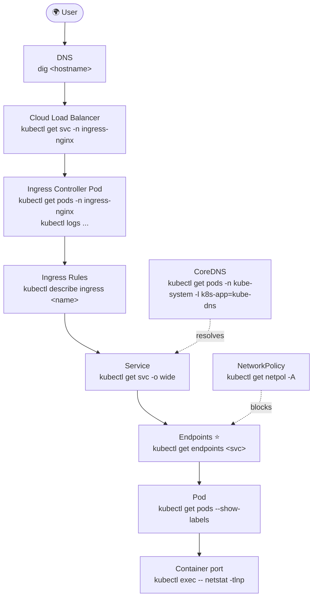
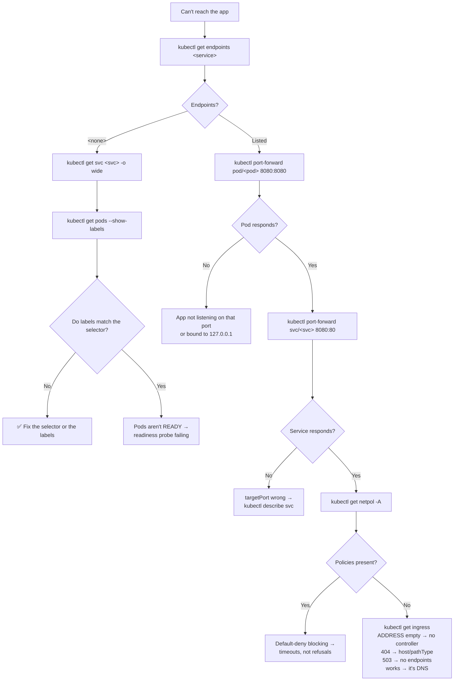

# 🌐 Networking Mind Map

**From a browser to a container, and every place it can break.**

---

## 🧠 The Path

```text
USER
 ↓  DNS resolves shop.example.com
CLOUD LOAD BALANCER
 ↓
INGRESS CONTROLLER      the software doing the routing (a Pod)
 ↓  reads
INGRESS RULES           host + path → service
 ↓
SERVICE                 stable IP, selects by label
 ↓  resolved into
ENDPOINTS               the actual READY Pod IPs
 ↓
POD
 ↓
CONTAINER               listening on targetPort
```

Each arrow can break. Each has one command that checks it.

---

## 🗺️ The Full Map



> ⭐ **`kubectl get endpoints` is the pivot.** `<none>` means the fault is above it (labels, readiness). Populated means it's below (ports, policy, app).

---

## 🔍 Check Each Link

| Link | Command | Broken looks like |
| --- | --- | --- |
| DNS | `dig <hostname>` | NXDOMAIN, or points at the wrong LB |
| Load balancer | `kubectl get svc -n ingress-nginx` | `EXTERNAL-IP: <pending>` |
| Controller | `kubectl get ingressclass` | Empty — none installed |
| Ingress claimed | `kubectl get ingress` | `ADDRESS` empty |
| Rules | `kubectl describe ingress <name>` | Backend shows `<error: endpoints not found>` |
| Service | `kubectl get svc -o wide` | Selector doesn't match Pod labels |
| **Endpoints** | `kubectl get endpoints <svc>` | **`<none>`** |
| Pod ready | `kubectl get pods` | `READY 0/1` |
| Container port | `kubectl exec <pod> -- netstat -tlnp` | Binds `127.0.0.1` not `0.0.0.0` |
| Policy | `kubectl get netpol -A` | Default-deny → timeouts |

---

## 🌳 Decision Tree



---

## 🏷️ Service Types

```text
ClusterIP      inside only                       ← the default, and most Services
NodePort       + a port 30000-32767 on every node
LoadBalancer   + a cloud LB                      💰 one per Service
ExternalName   just a DNS CNAME, no proxying
Headless       clusterIP: None → per-Pod DNS     ← StatefulSets need this
```

They stack: LoadBalancer contains NodePort contains ClusterIP.

---

## 🔤 Service DNS

```text
<service>                              same namespace
<service>.<namespace>                  cross-namespace
<service>.<namespace>.svc.cluster.local   fully qualified — always correct

<pod>.<headless-svc>.<ns>.svc.cluster.local   per-Pod, StatefulSets only
```

```bash
kubectl run tmp --rm -it --image=busybox:1.36 --restart=Never -- /bin/sh
# then: nslookup <service>.<namespace>.svc.cluster.local
```

---

## 🚨 HTTP Status → Cause

| Response | Where it broke |
| --- | --- |
| Connection refused | Nothing listening — check `targetPort` |
| Connection **timeout** | NetworkPolicy, security group, or wrong IP |
| `404` from nginx | No Ingress rule matched — host or `pathType: Exact` |
| `503 Service Unavailable` | Ingress found the Service, Service has no ready endpoints |
| `502 Bad Gateway` | Reached the Pod; the Pod errored or the port is wrong |
| Certificate warning | TLS Secret missing, wrong type, or host mismatch |
| Works by IP, not hostname | DNS |

---

## 🧰 The Toolbox Pod

```bash
kubectl run netshoot --rm -it --image=nicolaka/netshoot --restart=Never -- /bin/bash
```

```sh
nslookup <service>.<namespace>.svc.cluster.local
dig +short <service>.<namespace>.svc.cluster.local
curl -v http://<service>:<port>
nc -zv <pod-ip> <port>
```

Testing from **inside** the cluster is the only meaningful test for cluster networking.

---

## 💡 Memory Trick

```text
POD → SERVICE → ENDPOINTS → INGRESS → DNS
```

> **"Is it running? Is it fronted? Is it wired? Is it routed? Is it named?"**

And the one command that halves the problem:

> **`kubectl get endpoints` — `<none>` means look up, listed means look down.**

---

## 🔗 Related

[06 · Services](../cheatsheets/06-services.md) · [09 · Ingress](../cheatsheets/09-ingress.md) · [12 · Debugging](../cheatsheets/12-debugging.md) · [03 · Pods](../cheatsheets/03-pods.md)

---

<!-- NAV-FOOTER -->
### 🧭 Navigation

| Previous | Up | Next |
| --- | --- | --- |
| [← Workload Mind Map](workload-mindmap.md) | [README](../README.md) | [Storage Mind Map →](storage-mindmap.md) |
