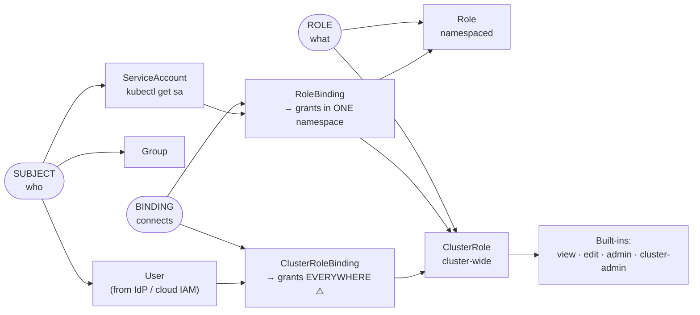
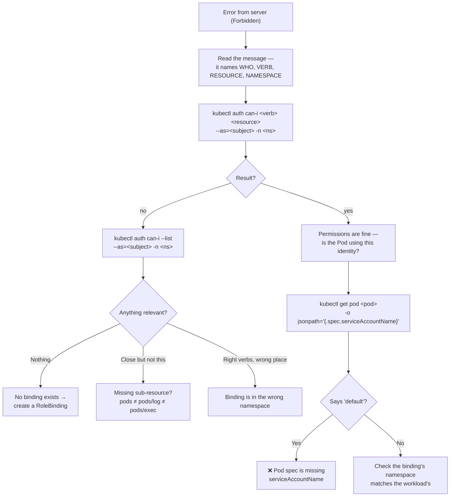

# 🔐 RBAC Mind Map

**Who can do what, and how you prove it.**

---

## 🧠 The Three Questions

```text
WHO?              CAN DO WHAT?            CONNECTED HOW?
  │                    │                        │
User                Role                  RoleBinding
Group        +     (namespaced)      +    (namespaced)
ServiceAccount     ClusterRole             ClusterRoleBinding
                   (cluster-wide)          (cluster-wide)
```

> **A permission only exists when a binding joins a subject to a role.** A Role alone grants nothing.

---

## 🗺️ The Map



---

## 🎯 The Scope Grid — the part people get wrong

|  | **Role** | **ClusterRole** |
| --- | --- | --- |
| **RoleBinding** (namespace X) | Permissions in X | Those permissions, **only in X** ⭐ |
| **ClusterRoleBinding** | ❌ not allowed | Permissions **everywhere** ⚠️ |

> ⭐ **The starred cell is the pattern to learn.** Define a ClusterRole once, bind it per-namespace with RoleBindings. That's how you give ten teams "admin in their own namespace" without writing ten Roles — and it's exactly how the built-in `view`/`edit`/`admin` roles are meant to be used.

---

## 🌳 Debugging "Forbidden"



---

## 🔑 The Commands

```bash
kubectl auth can-i <verb> <resource>                        # can I?
kubectl auth can-i --list                                   # everything I can do
kubectl auth can-i '*' '*'                                  # am I cluster-admin?
kubectl auth whoami                                         # who does the cluster think I am?

kubectl auth can-i <verb> <resource> \
  --as=system:serviceaccount:<namespace>:<sa-name>          # ⭐ check as someone else
kubectl auth can-i --list \
  --as=system:serviceaccount:<namespace>:<sa-name> -n <ns>  # ⭐ their full permission set
```

> ⭐ Impersonation with `--as` is the single most useful RBAC debugging technique. It answers "what can this workload actually do?" without touching the workload.

---

## 📋 Verbs & Sub-Resources

```text
READ      get · list · watch
WRITE     create · update · patch
DELETE    delete · deletecollection
SPECIAL   impersonate · bind · escalate · use
ALL       *   ⚠️
```

**Sub-resources are separate permissions** — the source of the most confusing 403s:

```text
pods              → see Pod objects
pods/log          → kubectl logs          ← NOT included in "pods"
pods/exec         → kubectl exec          ← NOT included in "pods"
pods/portforward  → kubectl port-forward
deployments/scale → kubectl scale
```

---

## 🏛️ Built-in ClusterRoles

| Role | Grants |
| --- | --- |
| `view` | Read-only, **excluding Secrets** |
| `edit` | Read/write most things, no RBAC changes |
| `admin` | `edit` + manage Roles/RoleBindings in the namespace |
| `cluster-admin` | ⚠️ Everything, everywhere |

```bash
kubectl create rolebinding <name> --clusterrole=view --user=<user> -n <namespace>
```

Use these before writing custom roles.

---

## 🔍 Audit Commands

```bash
# who has cluster-admin?
kubectl get clusterrolebindings -o json | jq -r '
  .items[] | select(.roleRef.name == "cluster-admin") |
  "\(.metadata.name): \(.subjects // [] | map(.kind + "/" + .name) | join(", "))"'

# every binding for one subject
kubectl get rolebindings,clusterrolebindings -A -o json | jq -r '
  .items[] | select(.subjects[]?.name == "<subject>") |
  "\(.kind)/\(.metadata.name) → \(.roleRef.kind)/\(.roleRef.name)"'

# custom (non-system) cluster roles
kubectl get clusterroles | grep -v '^system:'
```

---

## 💡 Memory Trick

```text
WHO?         →  ServiceAccount / User / Group
CAN DO WHAT? →  Role / ClusterRole
CONNECTED?   →  RoleBinding / ClusterRoleBinding
VERIFY       →  kubectl auth can-i --as=...
```

> **"A Role without a Binding is a permission nobody has."**

Two rules that explain everything else:

> **RBAC is additive — there are no deny rules.**
> **Everything is denied until a binding allows it.**

---

## 🔗 Related

[11 · RBAC](../cheatsheets/11-rbac.md) · [07 · ServiceAccount tokens](../cheatsheets/07-configmaps-and-secrets.md) · [16 · EKS access entries](../cheatsheets/16-eks-commands.md)

---

<!-- NAV-FOOTER -->
### 🧭 Navigation

| Previous | Up | Next |
| --- | --- | --- |
| [← Storage Mind Map](storage-mindmap.md) | [README](../README.md) | [Cluster Admin Mind Map →](cluster-admin-mindmap.md) |
