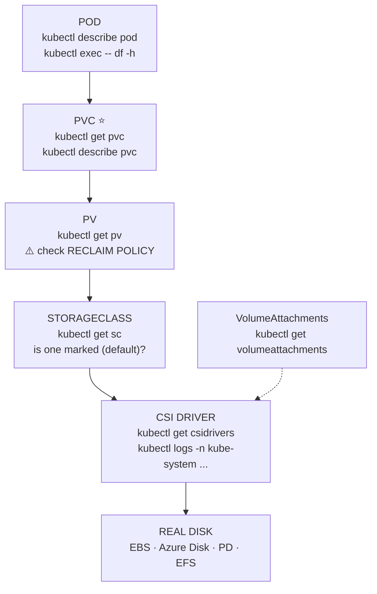
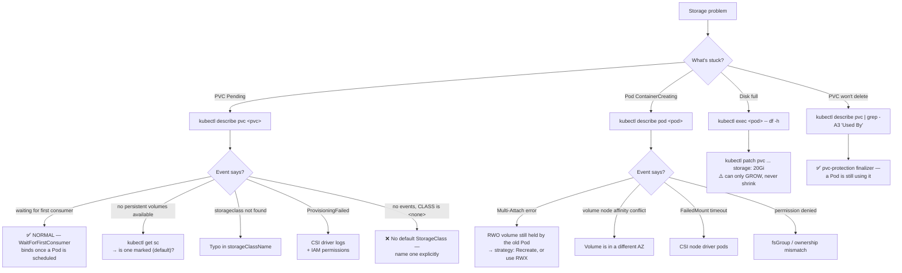

# 💾 Storage Mind Map

**Five links from a container's `/data` to a real disk.**

---

## 🧠 The Chain

```text
POD                  "mount a volume at /data"
 ↓ mounts
PVC                  "I want 10Gi, ReadWriteOnce"      ← you write this
 ↓ binds to
PV                   "here is 10Gi of real storage"    ← usually auto-created
 ↓ provisioned by
STORAGECLASS         "gp3, via the EBS CSI driver"     ← admin sets this up
 ↓ driven by
CSI DRIVER           attaches and mounts it
 ↓ backed by
REAL DISK            AWS EBS · Azure Disk · GCP PD · EFS · NFS
```

Walk it **top-down** when a Pod won't start; **bottom-up** when provisioning fails.

---

## 🗺️ The Map



> ⭐ **`kubectl describe pvc` is where you start.** Its Events section names the cause of nearly every storage problem outright.

---

## 🌳 Decision Tree



---

## ⚠️ The Reclaim Policy — read before deleting anything

```bash
kubectl get pvc <pvc-name> -o jsonpath='{.spec.volumeName}'
kubectl get pv <pv-name> -o jsonpath='{.spec.persistentVolumeReclaimPolicy}'
```

| Policy | Deleting the PVC... |
| --- | --- |
| `Delete` *(cloud default)* | 🔴 **destroys the PV and the real disk. Data gone.** |
| `Retain` | Keeps the PV in `Released`; data intact, reclaim by hand |

**Protect a volume before risky work:**

```bash
kubectl patch pv <pv-name> -p '{"spec":{"persistentVolumeReclaimPolicy":"Retain"}}'
```

---

## 📋 Access Modes

```text
RWO   ReadWriteOnce      one NODE, read-write     ← EBS, Azure Disk, GCP PD
ROX   ReadOnlyMany       many nodes, read-only
RWX   ReadWriteMany      many nodes, read-write   ← EFS, Azure Files, NFS
RWOP  ReadWriteOncePod   exactly one POD
```

> 💡 **RWO means one node, not one Pod.** Several Pods on the same node can share it; a Pod on another node cannot. This is why rolling updates with block storage hit `Multi-Attach` errors.

---

## 🏗️ Static vs Dynamic

```text
STATIC    admin creates PVs by hand → your PVC binds to a matching one
DYNAMIC   your PVC names a StorageClass → a PV is created on demand   ← the normal case
```

```bash
kubectl get sc     # if empty, only static provisioning is possible
```

---

## ☁️ Cloud Mapping

| | Block (RWO) | File (RWX) |
| --- | --- | --- |
| `[EKS]` | EBS · `ebs.csi.aws.com` | EFS · `efs.csi.aws.com` |
| `[AKS]` | Azure Disk | Azure Files |
| `[GKE]` | Persistent Disk | Filestore |
| `[kubeadm]` | local, iSCSI | NFS |
| `[minikube/kind]` | hostPath | hostPath |

> `[EKS]` The EBS CSI driver is **not installed by default** on 1.23+. Its absence is the top cause of `Pending` PVCs on new clusters. → [16 · EKS](../cheatsheets/16-eks-commands.md)

---

## 💡 Memory Trick

```text
POD → PVC → PV → STORAGECLASS → CSI → DISK
```

> **"Pod wants it, Claim asks for it, Volume is it, Class makes it, Driver attaches it, Disk holds it."**

And the one that saves your data:

> **`Delete` reclaim policy means the disk dies with the claim.**

---

## 🔗 Related

[08 · Storage](../cheatsheets/08-storage.md) · [05 · StatefulSets](../cheatsheets/05-replicasets-and-other-workloads.md) · [12 · Debugging](../cheatsheets/12-debugging.md) · [16 · EKS](../cheatsheets/16-eks-commands.md)

---

<!-- NAV-FOOTER -->
### 🧭 Navigation

| Previous | Up | Next |
| --- | --- | --- |
| [← Networking Mind Map](networking-mindmap.md) | [README](../README.md) | [RBAC Mind Map →](rbac-mindmap.md) |
