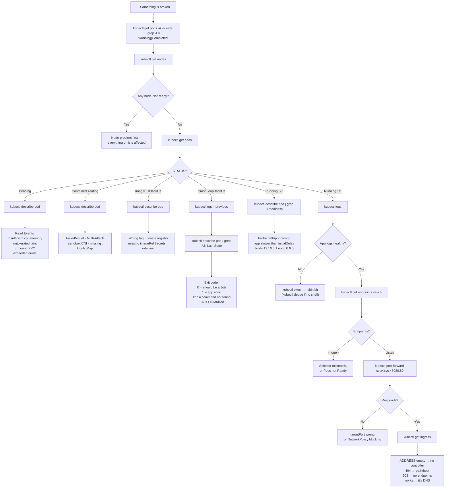
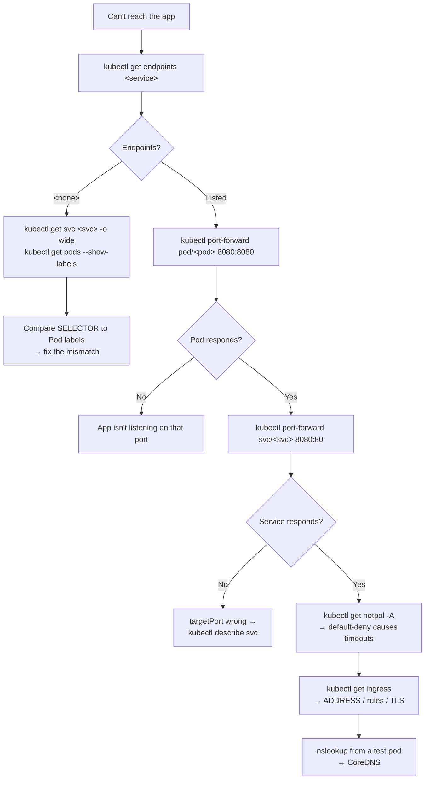
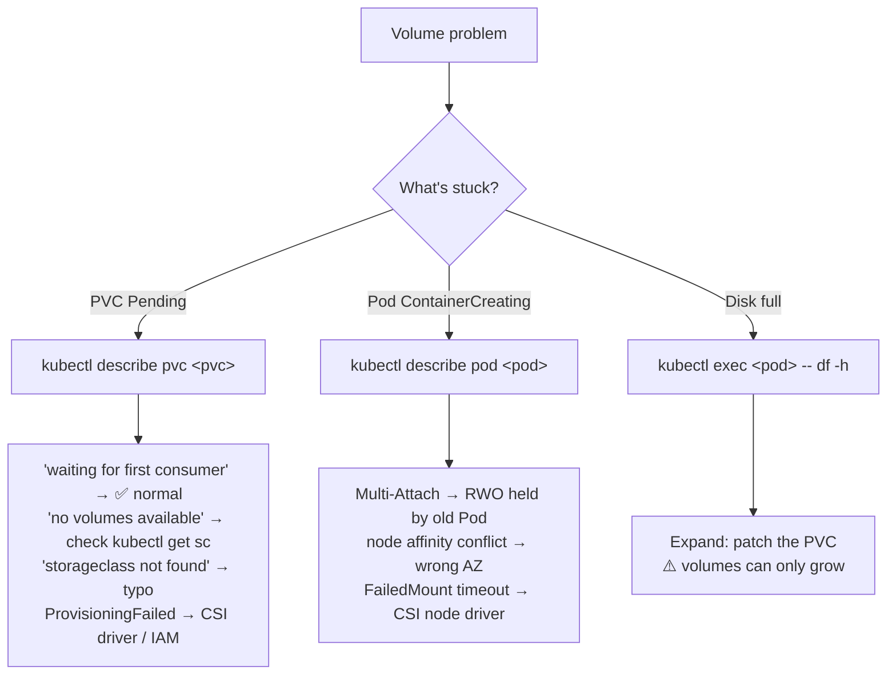
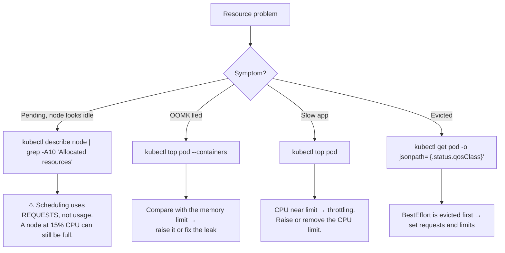
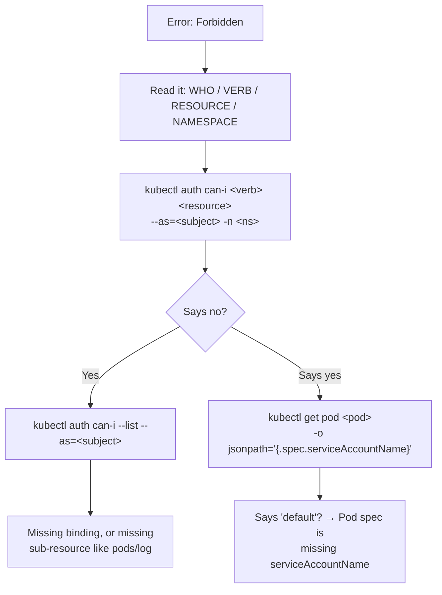

# 🐛 Troubleshooting Mind Map

**One decision tree from "it's broken" to "I know why".**

---

## 🧠 The Method

Don't guess. **Narrow the layer**, one command per layer.

```text
1. THE POD?         Is it scheduled, started, alive, ready?
2. THE APP?         Is the process actually working?
3. THE NETWORK?     Service → Endpoints → Ingress → DNS
4. THE CONFIG?      ConfigMaps, Secrets, env, volumes
5. THE RESOURCES?   CPU, memory, quota, node capacity
6. THE PERMISSIONS? RBAC
```

Stop at the first layer that's broken. Everything below it is a symptom.

---

## 🌳 The Master Decision Tree



---

## ⚡ The 60-Second Triage

Run these four before anything else:

```bash
kubectl get pods -A -o wide | grep -Ev 'Running|Completed'   # everything unhealthy
kubectl get nodes                                            # is the platform OK?
kubectl get events -A --sort-by=.lastTimestamp | tail -30    # what just happened
kubectl top nodes                                            # is anything starved?
```

> ⚠️ Events expire after **~1 hour**. A Pod broken since yesterday has none left — that's why `describe` on an old failure looks empty.

---

## 🎯 Status → First Command

| STATUS | Run this first |
| --- | --- |
| `Pending` | `kubectl describe pod <pod-name>` |
| `ContainerCreating` | `kubectl describe pod <pod-name>` |
| `ImagePullBackOff` | `kubectl describe pod <pod-name>` |
| `CrashLoopBackOff` | `kubectl logs <pod-name> --previous` |
| `Running 0/1` | `kubectl describe pod <pod-name> \| grep -i readiness` |
| `Running 1/1`, still broken | `kubectl get endpoints <service-name>` |
| `OOMKilled` | `kubectl describe pod <pod-name> \| grep -A5 "Last State"` |
| `Evicted` | `kubectl describe node <node-name> \| grep -A5 Conditions` |
| `Terminating` stuck | `kubectl get pod <pod-name> -o jsonpath='{.metadata.finalizers}'` |
| `Error` / `Completed` | `kubectl logs <pod-name> --previous` |

Full causes and fixes: **[Failure States](../quick-reference/failure-states.md)**

---

## 🌐 Network Sub-Tree



```bash
kubectl run netshoot --rm -it --image=nicolaka/netshoot --restart=Never -- /bin/bash
```

Inside: `nslookup <svc>.<ns>.svc.cluster.local` · `curl -v http://<svc>` · `nc -zv <pod-ip> <port>`

---

## 💾 Storage Sub-Tree



---

## 📊 Resource Sub-Tree



---

## 🔐 RBAC Sub-Tree



---

## 🧠 Memory Chains

```text
POD       GET → DESCRIBE → LOGS → EXEC
DEPLOY    GET → DESCRIBE → ROLLOUT STATUS → PODS → LOGS
NETWORK   POD → SERVICE → ENDPOINTS → INGRESS → DNS
STORAGE   POD → PVC → PV → STORAGECLASS → CSI
RBAC      WHO → CAN-I → ROLE → BINDING
CONFIG    EXEC env → CONFIGMAP → SECRET → ROLLOUT RESTART
NODE      GET NODES → DESCRIBE NODE → CONDITIONS → TOP
```

---

## 🔗 Related

| | |
| --- | --- |
| [12 · Debugging](../cheatsheets/12-debugging.md) | The full chapter with every command |
| [Failure States](../quick-reference/failure-states.md) | Lookup table for every Pod status |
| [Troubleshooting Flow](../quick-reference/troubleshooting-flow.md) | Printable one-pager |
| [Master Mind Map](kubectl-master-mindmap.md) | All commands, not just debugging |

---

<!-- NAV-FOOTER -->
### 🧭 Navigation

| Previous | Up | Next |
| --- | --- | --- |
| [← Master Mind Map](kubectl-master-mindmap.md) | [README](../README.md) | [Workload Mind Map →](workload-mindmap.md) |
