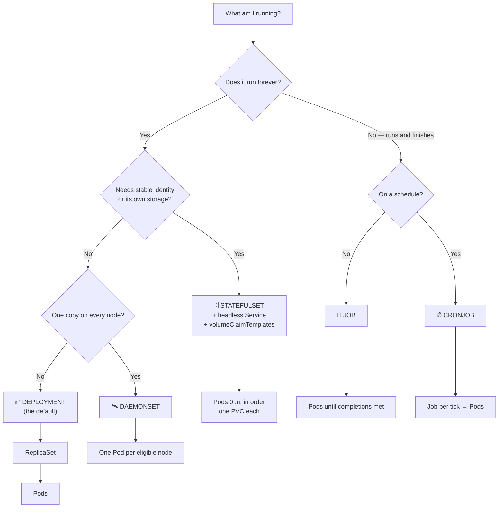
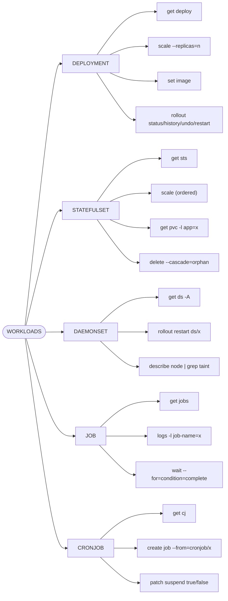
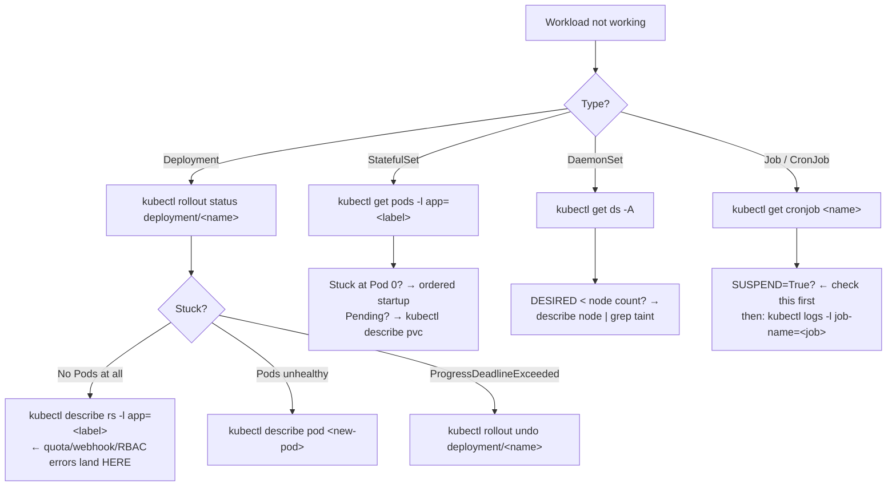

# 🚀 Workload Mind Map

**Which workload type, and what happens underneath it.**

---

## 🌳 Choosing a Workload



---

## 🧬 The Ownership Chain

```text
DEPLOYMENT              you write this
    │ creates one per revision
    ▼
REPLICASET              keeps N Pods alive
    │ creates
    ▼
POD                     you debug this
    │ contains
    ▼
CONTAINER(S)
```

```bash
kubectl get deploy,rs,pods -l app=<label-value>
```

See all three layers at once. During a rollout you'll see two ReplicaSets — the old one at 0 replicas is your rollback.

---

## 🔄 What a Rolling Update Actually Does

```text
Before:  ReplicaSet-v1 [███ 3]     ReplicaSet-v2 [   0]
During:  ReplicaSet-v1 [██  2]     ReplicaSet-v2 [█  1]
After:   ReplicaSet-v1 [    0]     ReplicaSet-v2 [███ 3]
                            ▲
                 kept — this is why rollback is instant
```

```bash
kubectl set image deployment/<name> <container>=<image>   # triggers it
kubectl rollout status deployment/<name>                  # watch it
kubectl rollout undo deployment/<name>                    # scale v1 back up
```

---

## 🗺️ Command Map by Workload



---

## 📊 Comparison

| | Deployment | StatefulSet | DaemonSet | Job / CronJob |
| --- | --- | --- | --- | --- |
| Pod names | random | `<name>-0`, `-1` | random | random |
| Count | you set it | you set it | = eligible nodes | completions |
| Storage | shared / none | one PVC per Pod | usually hostPath | usually none |
| Start order | parallel | ordered `0→n` | per node | parallel |
| Per-Pod DNS | no | yes (headless Svc) | no | no |
| Scale to 0 | yes | yes | no | n/a |
| Use for | web, APIs | databases, Kafka | agents, CNI, CSI | batch, cron |

---

## 🐛 Workload Troubleshooting



> 💡 **The single most useful workload debugging fact:** when a Deployment has zero Pods and no events, the rejection is recorded on the **ReplicaSet**, not the Deployment. `kubectl describe rs -l app=<label>`.

---

## 💡 Memory Trick

```text
DEPLOYMENT   →  "any three of these will do"    (cattle)
STATEFULSET  →  "I need db-0 specifically"      (pets, named)
DAEMONSET    →  "one on every machine"          (agents)
JOB          →  "run it, then stop"             (tasks)
CRONJOB      →  "run it at 2am"                 (scheduled tasks)
```

---

## 🔗 Related

[04 · Deployments](../cheatsheets/04-deployments.md) · [05 · Other Workloads](../cheatsheets/05-replicasets-and-other-workloads.md) · [10 · Jobs & CronJobs](../cheatsheets/10-jobs-and-cronjobs.md) · [03 · Pods](../cheatsheets/03-pods.md)

---

<!-- NAV-FOOTER -->
### 🧭 Navigation

| Previous | Up | Next |
| --- | --- | --- |
| [← Troubleshooting Mind Map](troubleshooting-mindmap.md) | [README](../README.md) | [Networking Mind Map →](networking-mindmap.md) |
