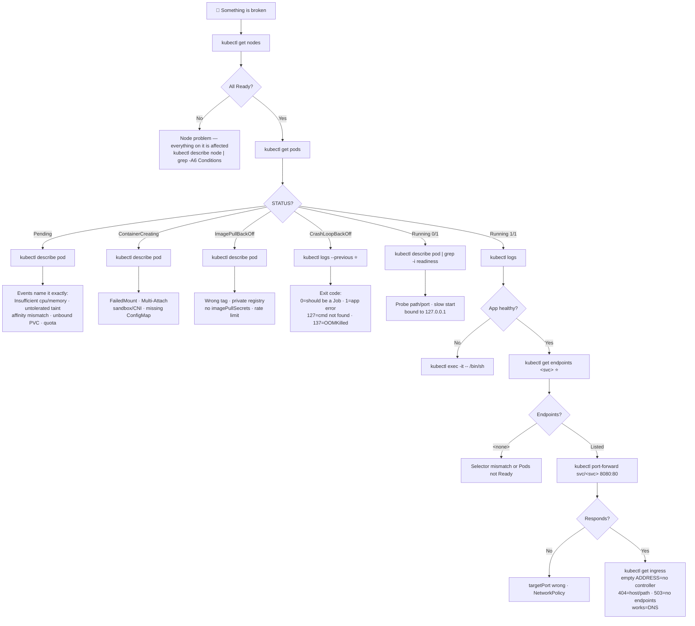

# 🧭 Troubleshooting Flow

**One page. Print it, pin it, follow it top to bottom.**

---

## ⚡ Triage — run these four first

```bash
kubectl config current-context                                # 1. right cluster?
kubectl get nodes                                             # 2. platform healthy?
kubectl get pods -A -o wide | grep -Ev 'Running|Completed'    # 3. what's unhealthy?
kubectl get events -A --sort-by=.lastTimestamp | tail -30     # 4. what just happened?
```

> ⚠️ Events last ~1 hour. If the failure is older, they're gone.

---

## 🌳 The Decision Tree



---

## 📋 Layer Checklist

Work down. Stop at the first break.

### 1️⃣ Cluster

```bash
kubectl config current-context
kubectl cluster-info
kubectl get nodes
kubectl describe node <node-name> | grep -A6 Conditions
```

✅ All nodes `Ready`, no `MemoryPressure` / `DiskPressure`.

### 2️⃣ Pod

```bash
kubectl get pods -o wide
kubectl describe pod <pod-name>
```

✅ `STATUS: Running`, `READY: 1/1`, `RESTARTS: 0`.
→ Anything else: [Failure States](failure-states.md)

### 3️⃣ Application

```bash
kubectl logs <pod-name>
kubectl logs <pod-name> --previous
kubectl exec -it <pod-name> -- /bin/sh
```

✅ Logs show a healthy startup and no repeated errors.

### 4️⃣ Config

```bash
kubectl exec <pod-name> -- env | sort
kubectl exec <pod-name> -- ls -l /etc/config
kubectl get configmap,secret -n <namespace>
```

✅ The container has the values you expect.
> Changed a ConfigMap? `kubectl rollout restart deployment/<name>` — env vars never reload.

### 5️⃣ Network

```bash
kubectl get svc -o wide
kubectl get endpoints <service-name>      # ⭐ the pivot
kubectl port-forward pod/<pod-name> 8080:8080
kubectl port-forward svc/<service-name> 8080:80
kubectl get netpol -A
kubectl get ingress
```

✅ Endpoints populated, both port-forwards respond.

### 6️⃣ Resources

```bash
kubectl top pods --containers
kubectl top nodes
kubectl describe node <node-name> | grep -A10 "Allocated resources"
kubectl describe resourcequota -n <namespace>
```

✅ Under limits, node requests not fully committed.

### 7️⃣ Permissions

```bash
kubectl auth can-i --list --as=system:serviceaccount:<ns>:<sa> -n <ns>
kubectl get pod <pod-name> -o jsonpath='{.spec.serviceAccountName}'
```

✅ The workload's identity has what it needs — and the Pod is actually using it.

---

## 🎯 Symptom → Page

| Symptom | Go to |
| --- | --- |
| Pod won't start | [Failure States](failure-states.md) |
| Pod restarts constantly | [CrashLoopBackOff](failure-states.md#crashloopbackoff) |
| Can't reach the app | [Networking Mind Map](../mindmaps/networking-mindmap.md) |
| Deploy stuck | [04 · Deployments](../cheatsheets/04-deployments.md#-troubleshooting) |
| PVC `Pending` | [Storage Mind Map](../mindmaps/storage-mindmap.md) |
| `Forbidden` errors | [RBAC Mind Map](../mindmaps/rbac-mindmap.md) |
| App slow / OOM | [13 · Resource Management](../cheatsheets/13-resource-management.md) |
| Node `NotReady` | [14 · Node Operations](../cheatsheets/14-node-operations.md) |
| Ingress 404 / 503 | [09 · Ingress](../cheatsheets/09-ingress.md#-troubleshooting) |
| Helm release failed | [17 · Helm](../cheatsheets/17-helm-commands.md#-troubleshooting) |
| Scheduled job didn't run | [10 · Jobs & CronJobs](../cheatsheets/10-jobs-and-cronjobs.md#-troubleshooting) |
| EKS auth failure | [16 · EKS](../cheatsheets/16-eks-commands.md#-troubleshooting) |

---

## 🧩 The Chains

```text
POD       GET → DESCRIBE → LOGS → EXEC
DEPLOY    GET → DESCRIBE → ROLLOUT STATUS → PODS → LOGS
NETWORK   POD → SERVICE → ENDPOINTS → INGRESS → DNS
STORAGE   POD → PVC → PV → STORAGECLASS → CSI
RBAC      WHO → CAN-I → ROLE → BINDING
CONFIG    EXEC env → CONFIGMAP → SECRET → ROLLOUT RESTART
NODE      GET NODES → DESCRIBE NODE → CONDITIONS → TOP
```

---

## 🚑 Emergency Actions

> ⚠️ Confirm your context first: `kubectl config current-context`

```bash
# Roll back a bad deploy
kubectl rollout undo deployment/<deployment-name>

# Restart an app safely (gradual, probe-aware)
kubectl rollout restart deployment/<deployment-name>

# Scale up for load
kubectl scale deployment/<deployment-name> --replicas=<n>

# Stop new Pods landing on a sick node (safe, reversible)
kubectl cordon <node-name>

# Pause a misbehaving scheduled job
kubectl patch cronjob <cronjob-name> -p '{"spec":{"suspend":true}}'

# Capture evidence before it's cleaned up
kubectl logs <pod-name> --previous > incident.log
kubectl describe pod <pod-name> > incident-describe.txt
kubectl get events -A --sort-by=.lastTimestamp > incident-events.txt
```

> 💡 **Capture evidence before you fix.** Deleting the broken Pod makes the problem disappear and the cause unknowable.

---

## 🔗 Related

[12 · Debugging](../cheatsheets/12-debugging.md) · [Failure States](failure-states.md) · [Troubleshooting Mind Map](../mindmaps/troubleshooting-mindmap.md) · [Scenarios](scenarios.md)

---

<!-- NAV-FOOTER -->
### 🧭 Navigation

| Previous | Up | Next |
| --- | --- | --- |
| [← Failure States](failure-states.md) | [README](../README.md) | [Scenarios →](scenarios.md) |
